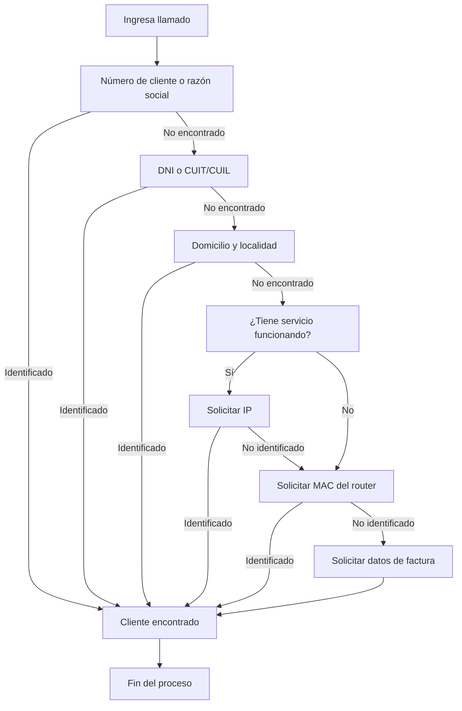

# Identificación de Clientes

## Objetivo

Identificar correctamente al cliente para poder acceder a su información y brindarle soporte.

---

## Orden de búsqueda recomendado

Al recibir un llamado, intentar identificar al cliente siguiendo este orden:

### 1. Número de Cliente o Razón Social

Es la forma más rápida de encontrarlo.

### 2. DNI o CUIT/CUIL

Si no conoce el número de cliente, solicitar alguno de estos datos.

### 3. Domicilio y Localidad

Solicitar la dirección completa donde se encuentra instalado el servicio.

### 4. Dirección IP

Si el cliente tiene acceso a internet, solicitar su IP pública.

### 5. MAC Address del Router

Si no es posible identificarlo por IP, solicitar la MAC del router.

### 6. Datos de la Factura

Como última alternativa, solicitar información presente en una factura del servicio.

---

## Diagrama de Identificación

---

## Cómo buscar en SSAK

### Número de Cliente o Razón Social

Puede buscarse directamente desde la lista de clientes.

### Otros datos

1. Abrir la lista de clientes.
2. Hacer clic derecho.
3. Seleccionar **Buscar**.
4. Ingresar el dato correspondiente.

---

## Búsqueda por IP

Solicitar al cliente que ingrese a:

https://www.cual-es-mi-ip.net/

y comparta el resultado.

### Consideraciones

* La IP puede no aparecer si no pertenece a los prefijos públicos administrados por Eternet.
* El cliente puede estar conectado a otra red.
* Si utiliza una IP Nateada, la búsqueda puede no identificarlo de manera individual.

---

## Búsqueda por MAC Address

Solicitar al cliente que revise la etiqueta ubicada en la parte inferior o trasera del router.

La MAC suele estar identificada como:

* MAC
* WLAN MAC
* WiFi MAC
* MAC Address

---

## Consejo útil

Utilizar asteriscos (*) como comodines durante las búsquedas.

### Ejemplo

Si se busca:

*PEREZ*

El sistema mostrará resultados que contengan la palabra "PEREZ" en cualquier parte del registro.

---

## Resumen Rápido

✅ Número de cliente o razón social.

✅ DNI o CUIT/CUIL.

✅ Domicilio y localidad.

✅ IP pública.

✅ MAC Address.

✅ Datos de factura.

✅ Utilizar comodines (*) para ampliar las búsquedas.
