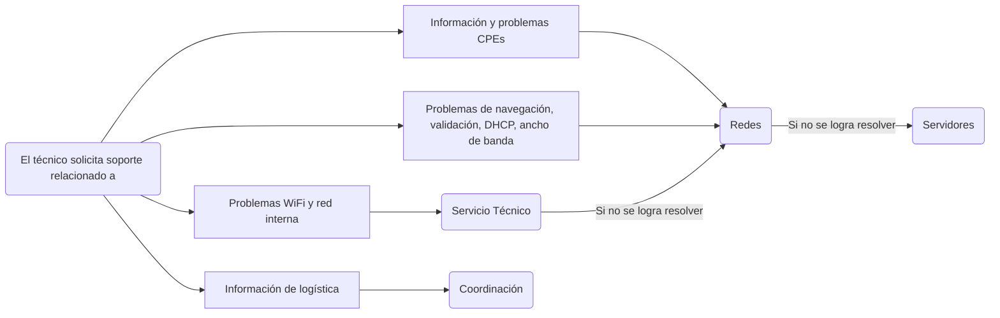

# Procedimiento de Guardias Técnicas de Fin de Semana

# Introducción

Durante los fines de semana existen guardias técnicas en localidades específicas para atender reclamos. En esta documentación vamos a detallar a qué localidad pertenece cada técnico, qué otras localidades atiende y cómo debemos organizar y coordinar los reclamos durante el fin de semana.

Todas las guardias son planificadas por Coordinación y podemos visualizarlas tanto en el listado de tareas asignadas a instaladores como así también en el issue de planificación de guardia.

---

# Planificación de Guardias

Cada viernes, o el último día hábil de la semana en caso de feriados, el sector de Coordinación realiza la planificación de guardias.

En esta planificación se detalla, a través de un issue, los técnicos que estarán disponibles y las localidades que cubrirán durante la guardia.

El issue se genera en el repositorio de Atención al Cliente y tiene el siguiente formato:

### Formulario de planificación

https://github.com/Eternet/Atencion.Clientes/issues/new?assignees=&labels=Guardia&projects=&template=planificacion_guardia.yml&title=Planificaci%C3%B3n+de+guardia+-+dd%2Fmm%2Faaaa

---

# Técnicos Instaladores

Los técnicos instaladores se encargan de realizar visitas técnicas a domicilio, abarcando principalmente:

- Instalación de servicios.
- Resolución de reclamos.
- Asistencia técnica presencial.

A continuación se detalla cada técnico, su lugar de residencia y las localidades que cubre en modalidad de guardia.

| Técnico | Residencia | Localidades de Guardia | Función | Teléfono |
|----------|------------|------------------------|----------|-----------|
| Beaz Andres | Bahía Blanca | Médanos / Pago Chico / Cerri | Instalador / Reclamos | 2983340920 |
| Benitez Fernando | Chaves | San Cayetano / Benito Juárez | Instalador / Reclamos | 2983523628 |
| Carrizo Marcos | Benito Juárez | Benito Juárez / Chaves | Instalador / Reclamos | 2281314501 |
| Carrozzi Francisco | Tres Arroyos | Reta / Claromecó | Instalador / Reclamos | 2983348136 |
| Cazes Ivan | Tres Arroyos | Tres Arroyos | Instalador / Reclamos | 2983463291 |
| Copperi Franco | Claromecó | Claromecó | Instalador / Reclamos | 2983525889 |
| Costen Calderon Joel | Tres Arroyos | Tres Arroyos | Instalador / Reclamos | 2983548637 |
| De Franceso Sebastian H. | Chaves | San Cayetano / Benito Juárez | Instalador / Reclamos | 2983556215 |
| Landa Ignacio | San Cayetano | San Cayetano / Chaves | Instalador / Reclamos | 2983584255 |
| Maza Gabriel Hernan | Balcarce | Balcarce | Instalador / Reclamos | 2983523639 |
| Muñoz Lucas | Bahía Blanca | Médanos / Pago Chico / Cerri | Instalador / Reclamos | 2915129387 |
| Plaza Norberto C. E. | Tres Arroyos | Reta / Claromecó | Instalador / Reclamos | 2983521115 |
| Puhl Cristian | Tres Arroyos | Reta / Claromecó | Instalador / Reclamos | 2983656129 |
| Riva Jesus | Benito Juárez | Benito Juárez / Chaves | Instalador / Reclamos | 2281575988 |
| Villareal Lucas | Bahía Blanca | Médanos / Pago Chico / Cerri | Instalador / Reclamos | 2915785581 |
| Paredes Franco | Tres Arroyos | Tres Arroyos | Retiros | |

---

# Departamento Técnico

El Departamento Técnico está disponible para incidentes en nodos o torres que no requieren coordinar una visita técnica.

Las consultas relacionadas deben canalizarse mediante el grupo de WhatsApp:

`Redes – DT (Incidentes)`

## Técnicos Abocados a Incidencias Generales

| Técnico | Residencia | Localidades de Guardia | Función | Teléfono |
|----------|------------|------------------------|----------|-----------|
| Della Penna Carlos | Tres Arroyos | Tres Arroyos y zona | Redes / Obras | 2983581682 |
| Olsen Alejandro | Tres Arroyos | Tres Arroyos y zona | Redes / Obras | 2983581707 |
| Gonzalez Juan Manuel | Bahía Blanca | Bahía Blanca | Obras | 2914135404 |
| Plaza Jorge Cesar Jose | Tres Arroyos | Tres Arroyos | Obras | 2983344327 |
| Valle Luis | Tres Arroyos | Todas | Redes | 2983581662 |

> [!NOTE]
>
> - Localidades chicas: Cascallares, De la Garma, Dorrego, El Perdido, Indio Rico, Juan N. Fernández, La Unión, Orense, Oriente.
> - Zona Reta: Reta, Copetonas, Oriente.
> - Zona Claromecó: Claromecó, San Francisco de Bellocq, Orense y Balneario Orense.

---

# Criterios para Atender Localidades Cercanas

Durante los fines de semana, especialmente los fines de semana largos, pueden ingresar reclamos desde localidades donde no existe técnico de guardia asignado.

Existe la posibilidad de trasladar un técnico desde otra localidad cuando se cumplan ciertos criterios.

## Cantidad de Reclamos

La cantidad de reclamos debe ser igual o mayor a **3 clientes hogar** para evaluar el viaje.

## Día de Viaje

El viaje a otra localidad deberá realizarse el **domingo por la mañana**.

## Coordinación

Los reclamos deben quedar coordinados el día anterior para asegurar la disponibilidad de los clientes.

El objetivo es que el técnico pueda resolver los reclamos durante la mañana.

> [!IMPORTANT]
>
> Toda situación que implique actuar fuera de la planificación establecida debe quedar documentada por escrito, detallando:
>
> - Situación presentada.
> - Análisis realizado.
> - Resolución adoptada.

---

# Prioridades

Las prioridades de atención durante guardias son:

1. Eventos en Datacenter o Shelters.
2. Clientes Dedicados o Corporativos.
3. Clientes de Fibra Óptica.
4. Clientes Wireless.

---

# Soporte

Si un técnico necesita asistencia para resolver un reclamo, Atención al Cliente recibe el pedido a través del grupo de WhatsApp de reclamistas y documenta la resolución en el issue correspondiente.

Esta tarea es realizada por Atención al Cliente únicamente durante fines de semana.

## Diagrama de Escalamiento

---

# Comunicación

La comunicación entre técnicos y agentes de Atención al Cliente debe realizarse exclusivamente a través del grupo de WhatsApp de reclamistas.

Esto permite que todos los integrantes del equipo estén informados y facilita los cambios de turno y rotación de personal durante las guardias.
