# Procedimiento para Atención de Reclamos de Clientes VIP

## Identificación

Para identificar si un cliente pertenece o no a la categoría VIP:

1. Buscar al cliente en SSAK.
2. Ingresar a **Ver detalles**.
3. Hacer clic en **Clientes**.
4. Acceder a **Datos personales**.
5. Verificar el campo **Categoría**.

---

## Flujo de Atención

Se definió que el flujo de atención de reclamos para este tipo de clientes debe comenzar con el registro del evento mediante un formulario web provisto para tal fin.

El vínculo al formulario será informado a todos los clientes clasificados dentro de esta categoría.

El envío del formulario genera automáticamente un issue en el repositorio de Atención al Cliente para dar seguimiento al reclamo.

### Diagrama de flujo

```mermaid
flowchart LR
    A["Ingresa reclamo"] ---> B("Formulario") & C("Botmaker") & D("Llamado") & E("Mail")
    B ---> F("Atención al Cliente")
    C ---> F
    D ---> F
    E ---> F

    F ---> K["Diagnóstico Nivel 1"]

    K ---> L["Sin conexión"]
    K ---> M["Sin navegación"]

    L ---> H("Redes")
    M ---> G("Servicio Técnico")

    G ---> Ñ{"¿Se resolvió remotamente?"}
    H ---> Ñ

    Ñ -- Sí --> O["Fin del proceso"]
    Ñ -- No --> N{"¿Requiere autorización?"}

    N -- Sí --> J("SSHH")
    N -- No --> I("Coordinación")

    J ---> I
    I ---> P("Visita técnica")
    P ---> O

    style A fill:#FFE0B2,color:#000000,stroke:#000000
    style B fill:#FFE0B2,color:#000000,stroke:#000000
    style C fill:#FFE0B2,color:#000000,stroke:#000000
    style D fill:#FFE0B2,color:#000000,stroke:#000000
    style E fill:#FFE0B2,color:#000000,stroke:#000000

    style F fill:#BBDEFB,color:#000000,stroke:#000000
    style K fill:#BBDEFB,color:#000000,stroke:#000000

    style L fill:#FFCDD2,color:#000000,stroke:#000000
    style H fill:#FFCDD2,color:#000000,stroke:#000000

    style M fill:#C8E6C9,color:#000000,stroke:#000000
    style G fill:#C8E6C9,color:#000000,stroke:#000000

    style N fill:#FFF9C4,color:#000000,stroke:#000000
    style Ñ fill:#FFF9C4,color:#000000,stroke:#000000

    style J fill:#E1BEE7,color:#000000,stroke:#000000
    style I fill:#E1BEE7,color:#000000,stroke:#000000
    style P fill:#E1BEE7,color:#000000,stroke:#000000

    style O fill:#FFCDD2,color:#000000,stroke:#000000
```

---

## 1. Ingreso del Reclamo

El reclamo debe ingresar a través del canal principal, que es GitHub.

En caso contrario, puede ser recibido por:

- Botmaker
- Llamada telefónica
- Correo electrónico
- Consulta web

En estos casos, **debemos completar nosotros el formulario** para generar el issue correspondiente.

### Importante

Siempre debemos brindar una respuesta rápida al cliente indicando:

> Ticket N° #### generado correctamente.

> [!NOTE]
> Es una buena práctica educar al cliente para que en futuras oportunidades utilice directamente el formulario.

---

## 2. Diagnóstico

Es fundamental identificar rápidamente el problema del cliente.

Si no logramos determinar la causa, debemos solicitar colaboración al sector correspondiente.

El cliente debe canalizar el reclamo mediante el formulario y, si no lo hizo, recordarle que es el medio principal de comunicación.

Además, debemos solicitar el contacto de una persona que se encuentre físicamente en el lugar.

### Si el servicio no responde

1. Confirmar que existe suministro eléctrico.
2. Si hay energía:
   - Derivar a visita técnica.
   - Etiquetar a:
     - Redes
     - Coordinación

### Si se trata de un problema de navegación

1. Solicitar un número de contacto de una persona presente en el sitio.
2. Mientras aguardamos respuesta:
   - Mencionar al equipo de Servicio Técnico en el issue.
   - Solicitar revisión de la red interna si es administrada por Eternet.

---

## 3. Seguimiento del Caso

Debemos demostrar predisposición para resolver el inconveniente lo antes posible.

### Buenas prácticas

- Utilizar recordatorios (*reminders*).
- Realizar seguimientos periódicos.
- Consultar al cliente si pudo verificar o resolver el problema.
- Mantener comunicación activa.

Esto permite transmitir compromiso y seguimiento constante del caso.

---

## 4. Derivación y Resolución

Dependiendo del diagnóstico, la solución puede requerir:

- Visita técnica.
- Resolución remota.

### En caso de visita técnica

Informar al cliente:

- Que será necesaria una visita.
- Fecha estimada si corresponde.

Además:

1. Consultar si es necesario presentar documentación para ingresar al establecimiento.
2. Si requiere autorización:
   - Etiquetar a Coordinación.
   - Etiquetar a SSHH.

### En caso de solución remota

1. Contactar a una persona presente en el lugar.
2. Verificar el funcionamiento.
3. Explicar al cliente las tareas realizadas.

### Cierre

Una vez solucionado el problema:

- Informar al cliente que el Ticket N° #### fue finalizado.
- Indicar la resolución aplicada.

---

## Criterios de Clasificación VIP

Si existen múltiples reclamos VIP simultáneos, la prioridad de atención se define según:

1. Facturación mensual.
2. Afinidad comercial.
   - Ejemplo: Torre Juan N. Fernández.
3. Rubro del servicio.
   - Escuelas.
   - Hospitales.
   - Organismos públicos.
4. Entes recaudadores asociados.
5. Empleados.
