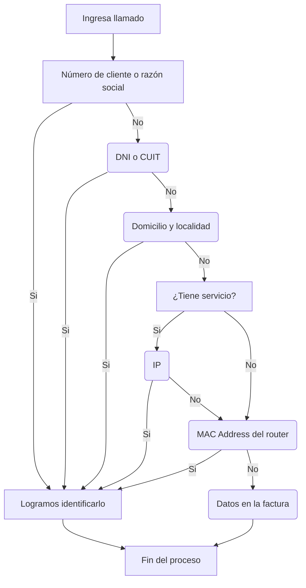

# Parte 1

Presentación

## Bienvenido/a a la empresa

### Servicios

Los [servicios que ofrece Eternet](https://github.com/Eternet/General/blob/main/docs/Comercial%20Actualizado/Servicios/Abonos%20y%20Tarifas%20de%20Servicios.md#-servicios-de-internet-) están documentados junto con las tarifas actualizadas desde el sector Comercial.
A su vez, también se actualiza desde el [sitio web](https://eternet.com.ar/) donde los clientes pueden consultar por servicios y abonos disponibles y autogestionarse.

### Información general sobre Atención al Cliente

Este Departamento funciona como el rostro de la empresa, y así es percibido por los usuarios. Al interactuar con los clientes, esta área tiene también la función de brindar un adecuado asesoramiento al usuario, que asegure el uso correcto de los productos o servicios que la empresa ofrece.

Nuestra área de Atención al Cliente es la encargada de recepcionar, procesar y resolver o derivar todos los reclamos/consultas de servicio que la empresa recibe, para dar solución a ellos.

**Tareas que realizamos:**
- Recepción de consulta / reclamo.
- Sondeo y diagnóstico.
- Resolución / derivación según corresponda.

Los horarios de atención van desde las 7:00hs hasta las 23:00hs, durante todos los días del año.

## Medios de comunicación internos

Actualmente, los [medios de comunicación](https://github.com/Eternet/General/blob/ffa9185b10427ea146ccf9fb0dfe350d17f144db/docs/Procesos/Metodolog%C3%ADa%20de%20comunicaci%C3%B3n%20interna/Readme.md) de la empresa, resumidamente son:
- **GitHub**: canal principal de comunicación de la organización.
- **Teams**: canal alternativo de comunicación.
- **Urgencias y emergencias**: grupos de WhatsApp 
- **Discord**: canal de contacto directo con el área técnica y fundamental en las guardias.

 

GitHub: proyectos y repositorios

PENDIENTE

 

SSAK

## Identificación de clientes 

Acceso a la pantalla de Atención al Cliente

 

## Indentificación de un cliente

Los clientes pueden identificarse por número de cliente, razón social, DNI, CUIT/CUIL, IP, MAC, domicilio.

> [!NOTE]
> Podemos buscar directamente número de cliente o razón social desde la lista de clientes de SSAK 
Para los demás datos, sobre la lista de clientes > click derecho > buscar

## Formas de búsqueda en SSAK

- Para que el cliente busque por **IP**, debemos solicitarle que ingrese a https://www.cual-es-mi-ip.net/ y nos comparta el resultado.
En caso de que no figure, puede tanto ser porque no está dentro de los prefijos públicos [documentados](https://github.com/Eternet/General/blob/b7699d258621d1d4adb55b66a6f819c91aa34fa6/docs/IPv4/README.md). En este caso, puede no ser cliente de Eternet o estar conectado a otra red.
Además, si el cliente cuenta con una [IP Nateada](https://github.com/Eternet/General/blob/main/docs/Atencion%20al%20Cliente/Clientes/Nateados/readme.md), puede que no figure ya que se comparte entre varios clientes y no sería posible identificar al usuario de manera individual.
- Para identificarlo por la **MAC**, el cliente debe revisar la etiqueta en la parte trasera del router.

> [!TIP]
> Buscar algo entre asteriscos, es una forma tipo comodín para obtener información que **contenga** la información ingresada.

Ejemplo

  

---- 

En el resto de los ítems, va linkeada la docu original sobre solapas y botones.

 
