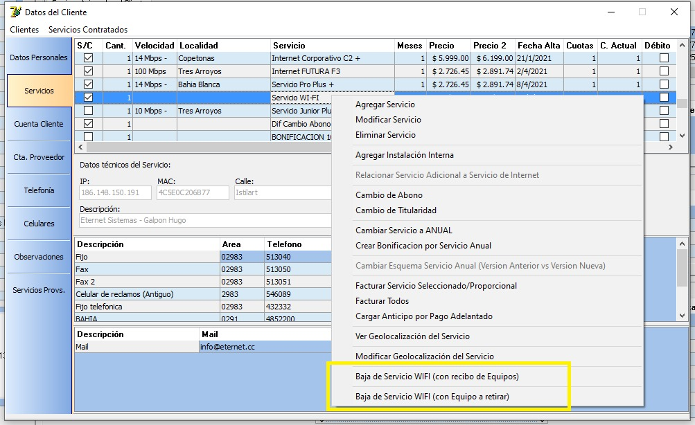
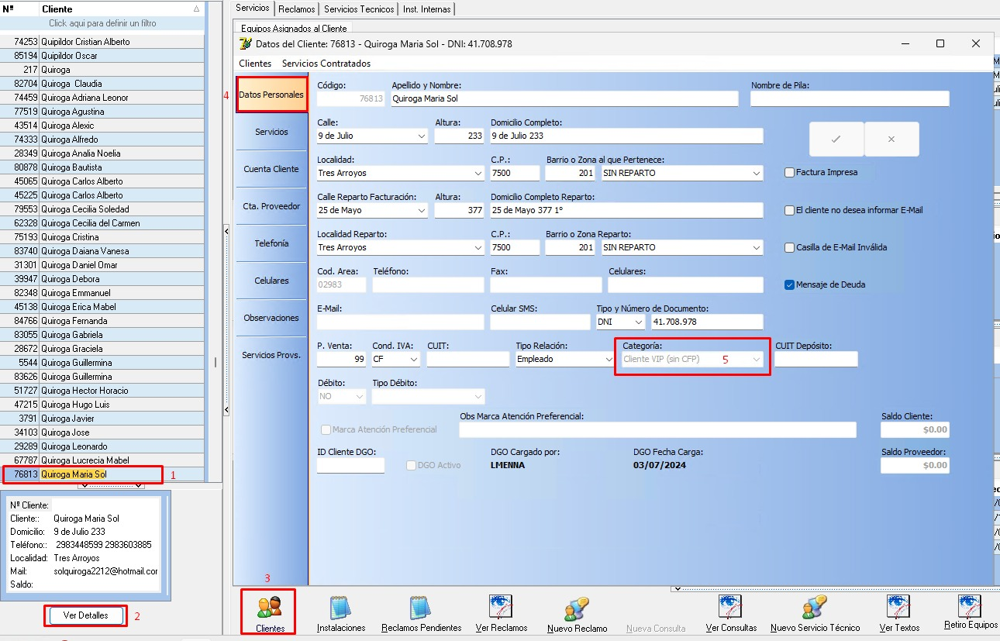
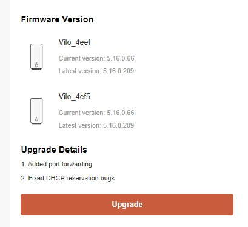
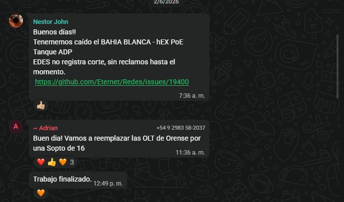

# Prueba de ancho de banda en MikroTik: TCP vs UDP

En las pruebas de ancho de banda en MikroTik, la diferencia principal entre TCP y UDP está en la forma en la que cada protocolo transmite los datos.

---

## TCP (Transmission Control Protocol)

TCP es un protocolo orientado a conexión.

### Características:
- Establece una conexión antes de transmitir datos
- Garantiza la entrega de paquetes
- Asegura el orden correcto de los datos
- Realiza retransmisiones en caso de pérdida

### Ventajas:
- Resultados más precisos y confiables
- Ideal para medir estabilidad real del enlace

### Desventajas:
- Mayor sobrecarga por control de errores
- Puede mostrar menor velocidad máxima debido a retransmisiones

---

## UDP (User Datagram Protocol)

UDP es un protocolo sin conexión.

### Características:
- No establece conexión previa
- No garantiza entrega de paquetes
- No asegura orden de llegada
- No realiza retransmisiones

### Ventajas:
- Menor sobrecarga
- Mayor velocidad en pruebas
- Útil para medir capacidad máxima teórica del enlace

### Desventajas:
- Puede perder paquetes
- Menos precisión en condiciones reales de red

---

## Conclusión práctica

- TCP → mide estabilidad real y rendimiento confiable
- UDP → mide capacidad máxima del enlace

Una regla importante:

Si una prueba UDP no da buenos resultados, es altamente probable que TCP tampoco los mejore.

---

## TX y RX en pruebas

- TX (Transmit) = velocidad de envío
- RX (Receive) = velocidad de recepción

### Interpretación:

- Buen TX pero mal RX:
  - Problema en retorno de tráfico
  - Posibles interferencias
  - Problemas de señal o saturación
  - Problemas en el enlace inalámbrico o ruta de retorno

### Impacto:
- Baja velocidad real de navegación
- Alta latencia
- Pérdida de paquetes
- Posibles microcortes o desconexiones

Para una conexión estable se requiere:
- Buen TX
- Buen RX

---

## Regla de firewall en MikroTik (sin desactivar firewall)

```rsc
/ip firewall address-list add address=10.0.0.0/8 list=REDES_ETHERNET

/ip firewall filter set [find where chain=input and src-address-list="REDES_ETHERNET" and protocol="tcp"] dst-port=21,22,8291,8728,80,2000
```
# Pruebas de ancho de banda en routers MikroTik (hacia Internet)

Existen diferentes formas de verificar el ancho de banda real que está llegando a un router MikroTik desde Internet. A continuación se describen los métodos más utilizados.

---

## Método 1: Tool Fetch (descarga de archivo)

Este método consiste en forzar una descarga desde Internet directamente en el router, y observar la velocidad alcanzada.

### Pasos:

1. Abrir **New Terminal** en MikroTik
2. Ejecutar:
```
/tool fetch url="LINK"
```

Donde:
- `LINK` es un archivo de descarga directa desde Internet

---

### Interpretación

Durante la descarga se puede observar:

- Velocidad en **RX (Receive / Recepción)** en la interfaz WAN
- Consumo real de ancho de banda de bajada

---

### Importante

- Este método mide principalmente **descarga**
- El resultado depende del servidor desde donde se descarga el archivo
- Si el servidor es lento, el resultado será menor aunque la conexión esté bien

---

## Método 2: Bandwidth Test (herramienta MikroTik)

Esta herramienta permite medir el rendimiento real entre dos puntos MikroTik.

### Ejecución por terminal:

```
/tool bandwidth-test address=87.121.0.45 direction=both duration=15s user="neterra" password="neterra"
```

---

### Parámetros importantes:

- `address`: IP del servidor de prueba
- `direction=both`: mide subida y bajada
- `duration=15s`: duración de la prueba
- `user/password`: credenciales del servidor

---

### Ejecución desde Winbox:

1. Ir a **Tools**
2. Seleccionar **Bandwidth Test**
3. Completar:
   - Dirección del servidor (Desde Hotspot a IP Router Cliente)
   - Usuario y contraseña 
   - Dirección (Ambos/Both)
4. Iniciar prueba


---

## Interpretación de resultados

- TX: velocidad de subida
- RX: velocidad de bajada

---

## Consideraciones importantes

- El Bandwidth Test puede consumir muchos recursos del router
- Debe usarse con cuidado en equipos de baja potencia
- Los resultados pueden variar según carga del equipo y red

---

## Conclusión

- **Fetch**: útil para medir descarga real desde Internet (RX)
- **Bandwidth Test**: útil para medir capacidad total de enlace (TX/RX)

Ambos métodos deben interpretarse considerando que:
- La calidad del servidor influye en el resultado
- El estado del enlace y del router también impacta en la medición

# Verificar el consumo de Internet desde una PC con Windows

## Objetivo

Permitir verificar si una computadora está utilizando ancho de banda y determinar qué aplicaciones están consumiendo la conexión a Internet.

---

# Opción 1. Administrador de tareas (consumo en tiempo real)

Permite visualizar la velocidad de envío y recepción de datos de la interfaz de red.

### Procedimiento

1. Presionar **Ctrl + Shift + Esc** para abrir el **Administrador de tareas**.
2. Seleccionar la pestaña **Rendimiento**.
3. Elegir la interfaz utilizada (**Ethernet** o **Wi-Fi**).
4. Observar los valores de:

   * **Envío (Send)**
   * **Recepción (Receive)**

Estos valores muestran el consumo de Internet en tiempo real.


---

# Opción 2. Monitor de recursos (identificar qué programa consume Internet)

Permite conocer qué aplicaciones están utilizando la conexión y cuánto ancho de banda consume cada una.

### Procedimiento

1. Presionar **Win + R**.
2. Escribir:

   ```
   resmon
   ```
3. Presionar **Enter**.
4. Abrir la pestaña **Red**.

En esta sección es posible visualizar:

* Procesos con actividad de red.
* Cantidad de datos enviados y recibidos por cada aplicación.
* Conexiones TCP activas.
* Actividad general de la red.

Esta herramienta resulta útil para identificar programas que estén realizando descargas, actualizaciones o consumiendo ancho de banda de forma inesperada.


---

# Opción 3. Uso de datos de Windows (consumo acumulado)

Permite consultar el consumo total de datos registrado por Windows durante los últimos 30 días.

### Procedimiento

1. Abrir **Configuración**.
2. Ingresar en **Red e Internet**.
3. Seleccionar **Uso de datos**.

En esta pantalla se muestra:

* Consumo total de datos.
* Consumo individual por aplicación.
* Período correspondiente a los últimos 30 días.


---

# ¿Cuándo utilizar estas herramientas?

Se recomienda realizar esta verificación cuando:

* El cliente informa lentitud en la navegación.
* Se sospecha que una aplicación está consumiendo gran parte del ancho de banda.
* Se desea comprobar si una descarga o actualización está utilizando toda la velocidad disponible.
* Es necesario descartar consumo interno antes de continuar con el diagnóstico del servicio.
