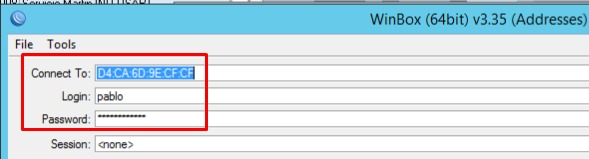
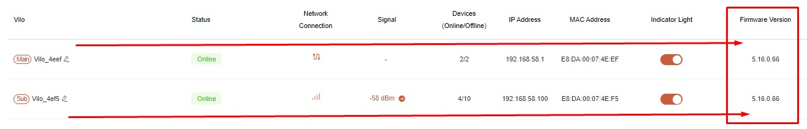
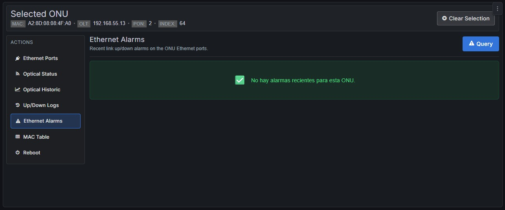
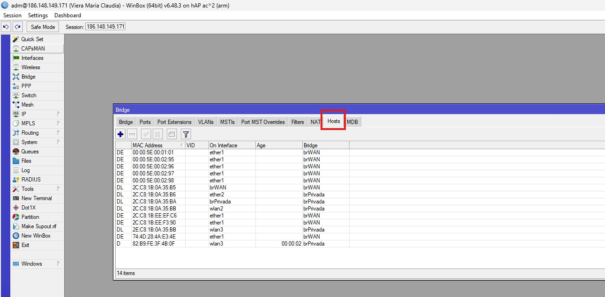
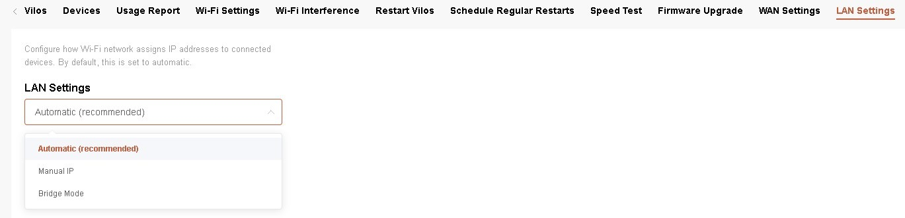
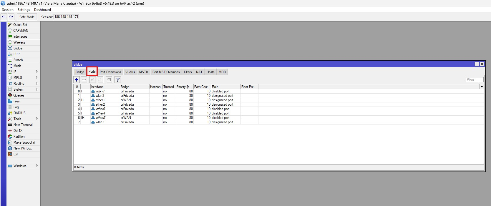
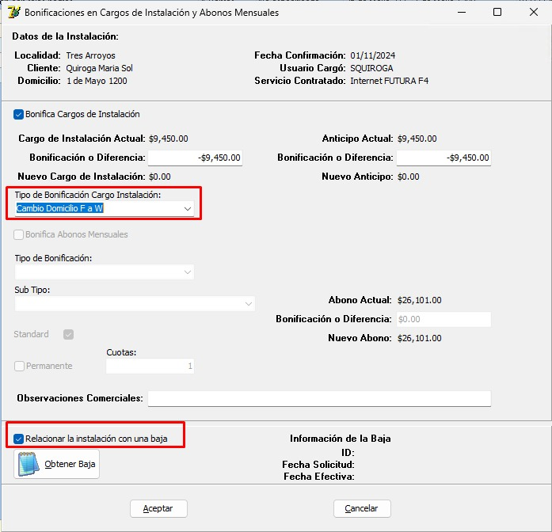

# Cambio de domicilio (CADOM) 

Este es el procedimiento que debemos realizar cuando un cliente nos informa que se mudará a otro domicilio.

Siempre debemos verificar si contamos con cobertura en el nuevo domicilio. Existen 4 escenarios posibles:

1. CADOM misma localidad y misma tecnología.
2. CADOM misma localidad con cambio de tecnología (Fibra/Wireless).
3. CADOM cambio de localidad y tecnología (Fibra/Wireless).
4. Sin cobertura → se procesa la baja.

---

# Proceso de carga

# 1. 🔴 CADOM misma localidad y misma tecnología

## 🔴 Paso 1

En SSAK vamos a:

`Instalaciones` → `Asistente de Instalaciones`

Se abrirá la ventana **Nueva instalación**.

- Seleccionar la localidad.
- En **Tipo de instalación** elegir `Cambio de domicilio`.
- Presionar `Obtener usuario`.

---

## 🔴 Paso 2

Dentro de la ventana **Obtener Usuario de Internet**:

- Buscar al cliente por número de cliente o apellido y nombre.
- Hacer doble clic sobre el servicio correspondiente.

Se abrirá una nueva ventana donde se visualizará el CPE del cliente (ONU o equipo Wireless).

Verificar:

- Datos del domicilio actual.
- Equipo asociado.

Luego presionar **Aceptar**.

---

## 🔴 Paso 3

Una vez obtenido el usuario, seleccionar **Siguiente**.

Configurar:

- Cargo de instalación.
- Tildar **Sujeto a bonificación**.
- Seleccionar la tarifa correspondiente.

Si el cliente mantiene el mismo plan, dejar la tarifa actual.

Si solicita un cambio de plan, seleccionar la nueva tarifa.

---

## 🔴 Paso 4

Completar:

- Dirección.
- Altura.
- Latitud y longitud.
- Observaciones comerciales.
- Observaciones para técnicos (agregar el link de la issue).
- Celular de contacto.
- Disponibilidad horaria.

Tildar la opción de notificación.

Finalmente seleccionar **Finalizar**.

---

# 2. 🔵 CADOM misma localidad con cambio de tecnología (Fibra/Wireless)

El procedimiento es igual al caso anterior.

La única diferencia es que, en la pantalla **Nueva instalación**, debemos:

- Seleccionar **Se instala futura**.
- Elegir la nueva tarifa correspondiente a la tecnología destino.

---

# 3. 🟢 CADOM cambio de localidad y tecnología (Fibra/Wireless)

Este proceso es diferente.

Para poder realizar este cambio se debe:

1. Dar de baja el servicio actual.
2. Cargar una nueva instalación con bonificación.

## Procedimiento

### Baja del servicio actual

Consultar:

👉 [Documentación de Solicitud de Baja](https://github.com/AbutMatias/Manual-Operativo-Atencion-al-Cliente/blob/main/doc/Solicitud%20de%20Baja%20de%20Servicios.md)

### Nueva instalación

Consultar:

👉 [Documentación de Carga de Instalación](https://github.com/AbutMatias/Manual-Operativo-Atencion-al-Cliente/blob/main/doc/Carga%20de%20Instalación%20de%20Internet.md)

---

> [!NOTE]
> Al cargar la bonificación se debe seleccionar:
>
> `Cambio Domicilio F a W`
>
> y tildar la opción:
>
> `Relacionar la instalación con una baja`.

---

# 4. 🟠 Sin cobertura → Se procesa la baja

Si no contamos con cobertura en el nuevo domicilio, corresponde gestionar la baja del servicio.

Consultar:

👉 Documentación de Solicitud de Baja

---

# Consideraciones Importantes

> [!IMPORTANT]
> Siempre verificar cobertura antes de iniciar cualquier gestión de cambio de domicilio.

> [!IMPORTANT]
> En todos los casos debe cargarse la issue correspondiente para garantizar la trazabilidad del proceso.

> [!NOTE]
> Cuando exista bonificación asociada al cambio de domicilio, debe quedar correctamente registrada en SSAK al momento de generar la instalación.
