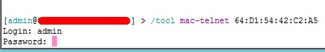

# Carga de Bonificación Especial por Retención

De acuerdo a las políticas de Retención y Fidelización, documentadas aquí:
https://github.com/Eternet/General/blob/main/docs/Comercial%20Actualizado/Enfoque%20comercial/Estrategias%20de%20Retenci%C3%B3n.md

procedemos a detallar el proceso de carga.

---

# Procedimiento de carga

## 🔹 Paso 1: Búsqueda del cliente

Ingresar al sistema SSAK y dirigirse a:

`Servicios → Listado de Tarifas y Servicios de Internet`

Desde allí buscamos al cliente y la línea correspondiente.

---

## 🔹 Paso 2: Acceso al ABM

Sobre el cliente:

- Clic derecho
- Ingresar al ABM del cliente

---

## 🔹 Paso 3: Bonificaciones

Dentro del ABM:

- Ir a `Servicios Contratados → Bonificaciones`

---

## 🔹 Paso 4: Selección de líneas

- Seleccionar la(s) línea(s) a bonificar

---

## 🔹 Paso 5: Configuración de bonificación

Completar:

- **Tipo de bonificación:** `BONIFICACION X RETENCION`
- **Sub tipo:** porcentaje acordado con el cliente (%)
- **Observaciones:** detallar motivo y condiciones del acuerdo

---

## ⚠️ Importante

> [!IMPORTANT]
> Nunca debe quedar tildada la opción **"Permanente"**.

---

## 📷 Ejemplo visual

