# Carga de Instalación de Internet

# Introducción

En este documento se detalla el proceso completo de carga de una instalación de Internet, desde la identificación del cliente hasta la aplicación de bonificaciones o cobros correspondientes.

---

# Identificación del Cliente

Antes de cargar una instalación debemos verificar si el cliente ya existe en el sistema.

## Cliente Nuevo

Si se trata de un cliente nuevo, debemos crearlo previamente.

### Paso 1

Desde SSAK seleccionamos el botón `Nuevo Cliente`.

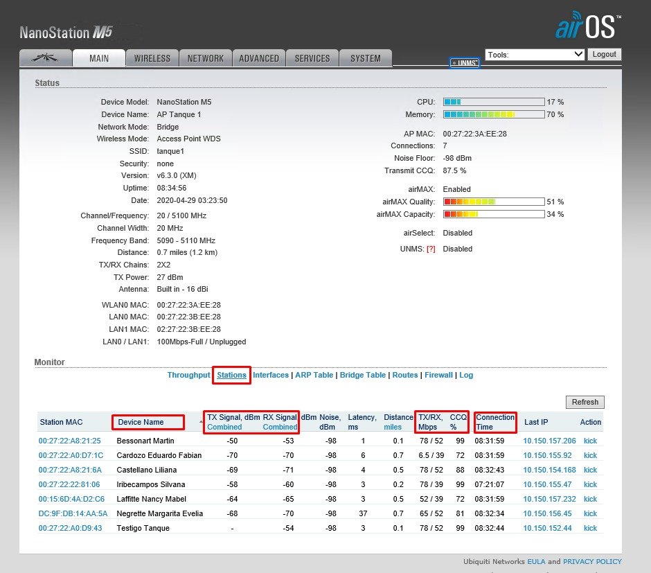

---

### Paso 2

Completamos los datos básicos:

* DNI / CUIT
* Localidad
* Domicilio

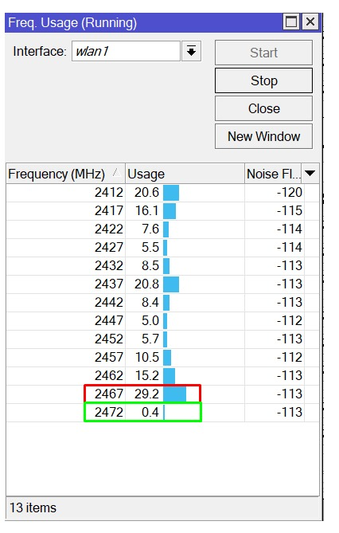

---

### Paso 3

Dentro de **Mantenimiento de Relaciones Comerciales**, luego de completar los datos, presionamos el botón `+`.

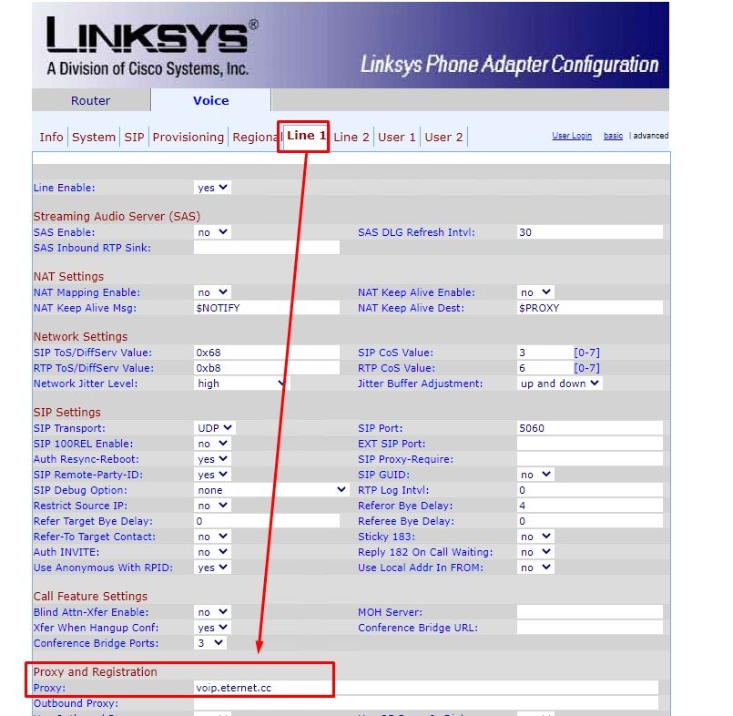

---

> [!IMPORTANT]
> Solo podremos continuar si el cliente no posee deuda pendiente ni equipos pendientes de retiro.

---

# Proceso de Carga de la Instalación

## 🔸 Paso 1

En SSAK dirigirse a:

`Instalaciones` → `Asistente de Instalaciones`

Completar:

* Localidad
* Tipo: `Instalación Domiciliaria`

Luego seleccionar **Siguiente**.

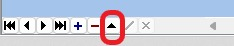

---

## 🔸 Paso 2

Completar:

* Cargo de instalación.
* Tildar la opción `Sujeto a bonificación`.
* Seleccionar la tarifa.

El router en comodato se asigna automáticamente según la tarifa elegida.

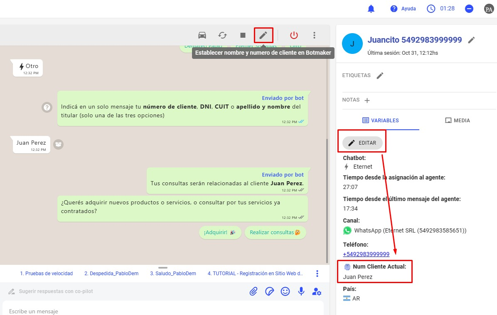

---

## 🔸 Paso 3

Seleccionar el botón `Recuperar`.

En la ventana de búsqueda:

* Filtrar por DNI, CUIT o Razón Social.
* Localizar al cliente.
* Realizar doble clic para seleccionarlo.

Los datos se completarán automáticamente.

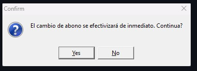

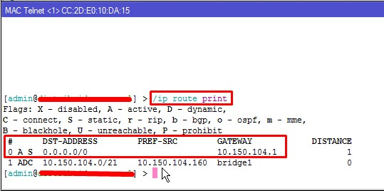

---

## 🔸 Paso 4

### Obtención de Nodo Cercano

Ir a:

`Equipos de Red` → `Nodos` → `Nodos cercanos a un punto`

### Procedimiento

1. Ingresar la latitud y longitud del cliente.
2. Presionar el botón de búsqueda.
3. Identificar la CD más cercana.
4. Copiar los datos correspondientes.

### Completar la instalación

Cargar:

* Dirección.
* Altura.
* Latitud.
* Longitud.
* Observaciones para instaladores.
* Observaciones para técnicos.
* Datos de la CD más cercana.
* Cantidad de puertos totales y ocupados.
* Celular del cliente.
* Disponibilidad horaria.

Finalmente seleccionar **Finalizar**.

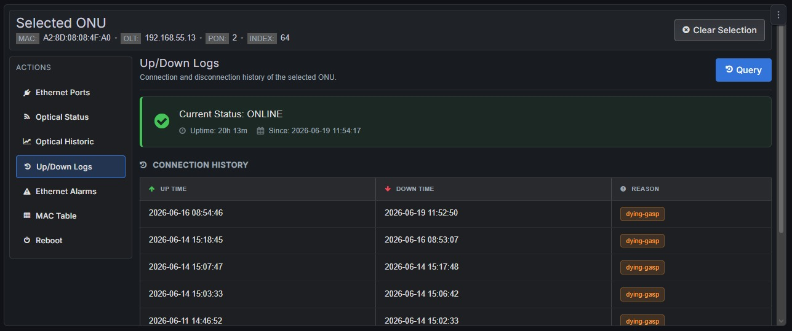

---

# Cobro o Bonificación de la Instalación

## 🔹 Paso 1

Buscar al cliente.

Ingresar al listado de instalaciones.

La instalación recién creada aparecerá con estado:

`Ventas`

---

## 🔹 Paso 2

Hacer clic derecho sobre la instalación.

Seleccionar:

`Bonificaciones en cargos de instalación y/o abonos`

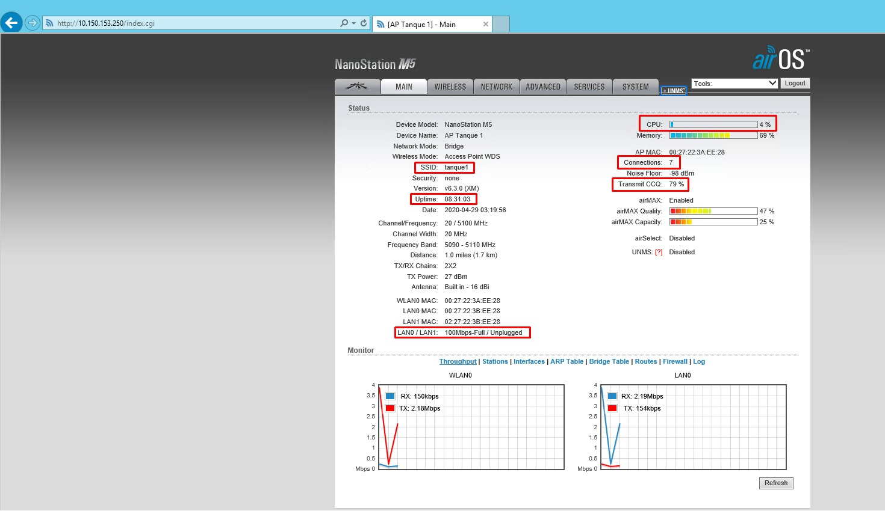

---

## 🔹 Paso 3

Según lo acordado con el cliente, existen tres escenarios posibles.

### Bonificación Total del Cargo de Instalación

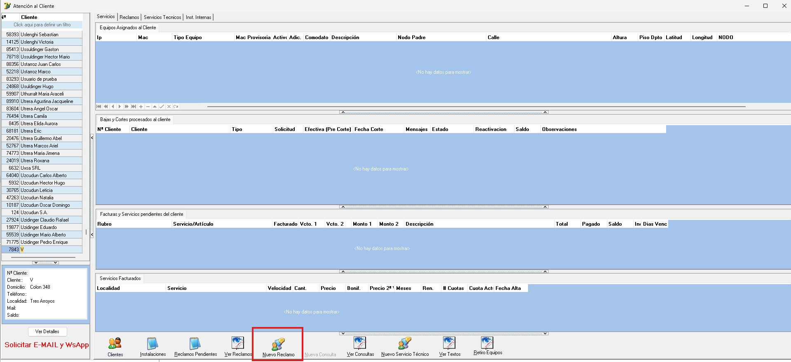

---

### Bonificación del 50% del Cargo de Instalación

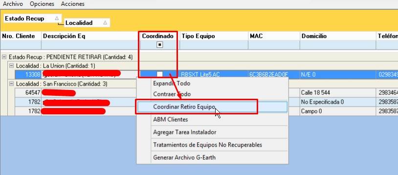

---

### Cobro Total de la Instalación

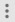

---

> [!NOTE]
> Si el cliente posee una deuda anterior, el proceso de carga es exactamente el mismo.
>
> Al momento de aplicar la bonificación se definirá si:
>
> * Se incorpora la deuda al cargo de instalación.
> * Se bonifica totalmente.
> * Se cobra parcialmente.

---

# Conceptos Importantes

> [!IMPORTANT]
> Es fundamental comprender la diferencia entre los campos **Nuevo Cargo de Instalación** y **Nuevo Anticipo**.

### Nuevo Cargo de Instalación

Corresponde al importe que el cliente abonará luego de realizada la instalación.

### Nuevo Anticipo

Corresponde al importe que el cliente debería abonar antes de la instalación.

> [!NOTE]
> En nuestro proceso actual primero se instala y luego se factura.
>
> Por este motivo el campo **Nuevo Anticipo** debe permanecer siempre en **0**.

---

# Resultado Esperado

Una vez aplicada la bonificación o el cobro correspondiente:

* La instalación debe cambiar su estado.
* Debe pasar de `Ventas` a `Sin Iniciar`.
* Quedará disponible para la gestión operativa y coordinación técnica.
