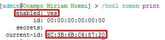
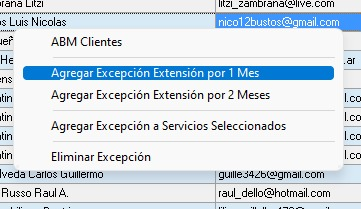
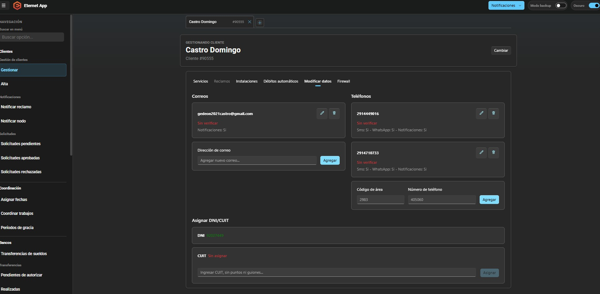
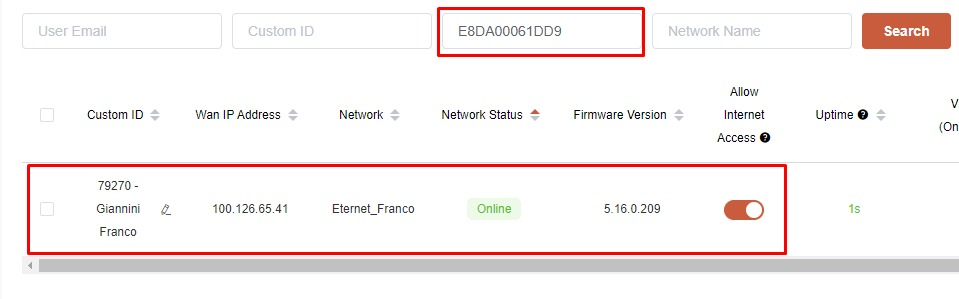
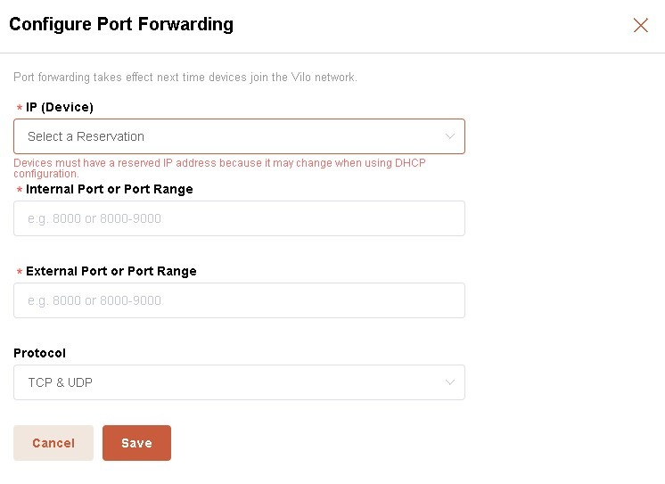

# Carga de Instalación para Prestadores de Servicios

## Convenios Vigentes

Actualmente el convenio aplica para los siguientes prestadores:

- Misión Digital
- Cooperativa Eléctrica El Perdido
- Cooperativa Eléctrica de Indio Rico

---

# Explicación del Proceso para Prestadores

## Origen del Pedido de Instalación

Los prestadores generan la orden de instalación desde:

https://eternetonline.eternet.cc/Login.aspx

### Paso 1: Iniciar sesión

Ingresar con las credenciales correspondientes.

### Paso 2: Completar los datos de la solicitud

Se visualizará la pantalla de carga de datos.



<br><br><br>

### Paso 3: Generar la solicitud

Al seleccionar **Siguiente**, se genera la solicitud de instalación.

Como resultado:

- Se envía una notificación por correo electrónico.
- Se genera automáticamente el pedido de instalación en SSAK para su procesamiento.

La solicitud llega al correo:

`ventas@eternet.cc`

Mostrando el nombre y apellido o razón social del cliente.




---

# Proceso de Carga en SSAK

## Paso 1 - Buscar la instalación

En SSAK ingresar a:

`Instalaciones → Instalaciones confirmadas en Entidades`




Al ingresar se visualizará un listado con:

- Instalaciones pendientes.
- Instalaciones confirmadas.
- Número de ID de cada solicitud.

### Recomendación

Ordenar el listado por ID de instalación en forma descendente para localizar rápidamente la solicitud más reciente.

---

## Paso 2 - Confirmar instalación

Ingresar a:

`Acciones → Confirmar Instalación`

Se mostrará la información cargada por el prestador.

### Completar únicamente:

- Latitud
- Longitud

Luego presionar **Aceptar**.



<br><br><br>



<br><br><br>

> [!NOTE]
> No es necesario dar de alta al cliente manualmente en el sistema. El alta se genera automáticamente al confirmar la instalación.

---

## Paso 3 - Crear la Issue en GitHub

Una vez confirmada la instalación en SSAK, se debe cargar la Issue correspondiente utilizando el formulario de instalación.

### Formulario

- Tipo: **Nueva Instalación**
- Repositorio: **Coordinación**
- Etiqueta: **Instalación**

Ejemplo de título:

```text
Cliente #XXX - Razón Social - Instalación
