# Carga de instalación

En este documento se detalla de principio a fin el proceso de carga de una instalación de internet. 

---

# Identificación

Si es un cliente nuevo primero tenemos que cargar el cliente, los pasos a seguir son: 

---

1. Desde SSAK seleccionamos el botón `Nuevo Cliente`

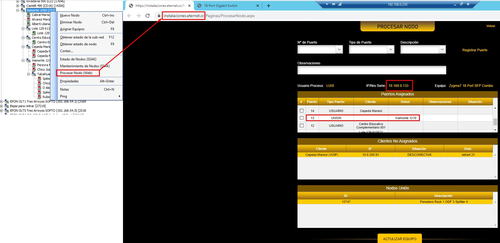

---

2. Completamos los datos del nuevo cliente: `DNI/CUIT, Localidad y Domicilio`

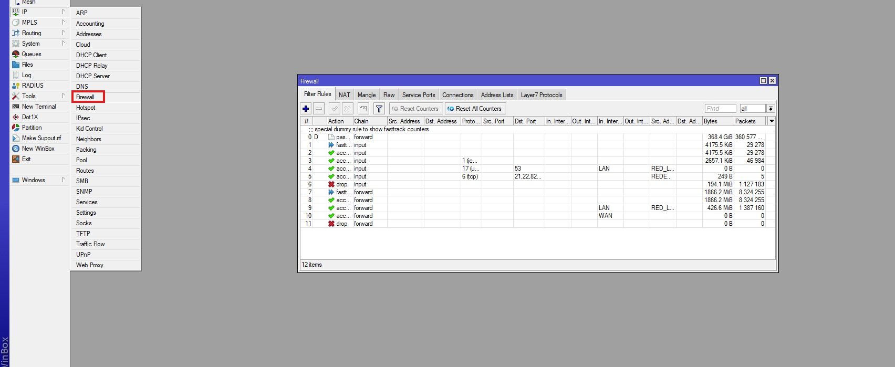

---

3. Dentro de Mantenimiento de relaciones comerciales luego de completar los datos debemos pulsar en el `botón +`

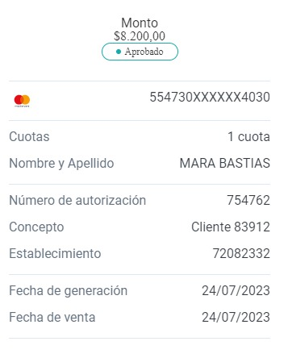

---

Cuando ya tenemos el nuevo cliente o el cliente existe `sin deuda y sin equipos pendientes de retiro` procedemos a cargar la instalación 

---

# Proceso de carga

## 🔸 Paso 1 

En SSAK vamos a la columna `Instalaciones` y seleccionamos `Asistente instalaciones`.

Se abre una pestaña donde completamos la `localidad` y en tipo elegimos `instalación domiciliaria`, luego seleccionamos `siguiente`. 

---

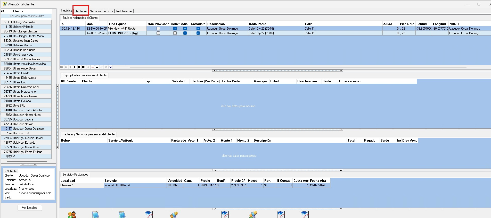

---

## 🔸 Paso 2

En la siguiente pestaña cargamos el `cargo de instalación`, tildamos la opción `sujeto a bonificación siempre` y seleccionamos la tarifa.  
El tipo de router en comodato se carga automáticamente según la tarifa seleccionada.

---

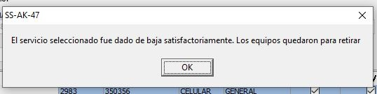

---

## 🔸 Paso 3

En la pestaña que se abre seleccionamos `recuperar` y filtramos por `DNI o Razón Social`.

Cuando encontramos al cliente realizamos doble clic para cargar los datos automáticamente.

---

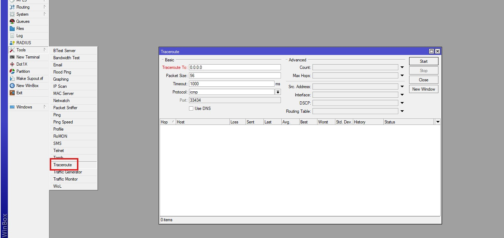

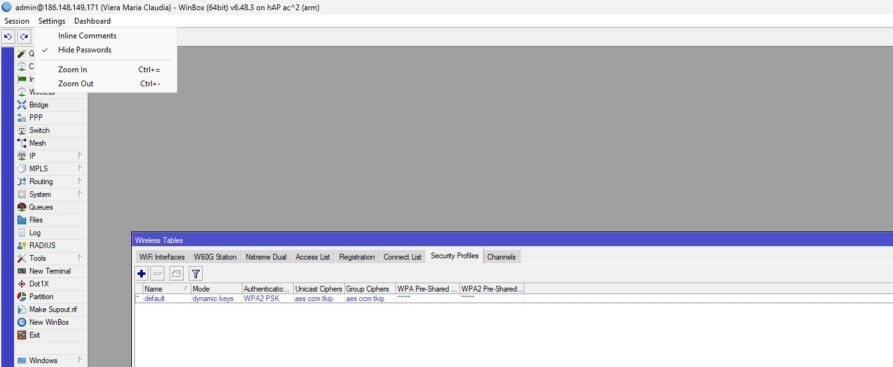

---

## 🔸 Paso 4

🔴 Ir a `Equipos de red` > `Nodos` > `Nodos cercanos a un punto` para obtener el nodo más cercano.

🔵 Con las coordenadas del cliente buscamos el nodo correspondiente y completamos `latitud y longitud`.

🟢 Luego completamos:

- Domicilio y altura  
- Coordenadas  
- Observaciones técnicas (CD más cercana + puertos)  
- Notificación vía texto  
- Celular del cliente  
- Disponibilidad horaria  

Finalmente seleccionamos **Finalizar**.

---

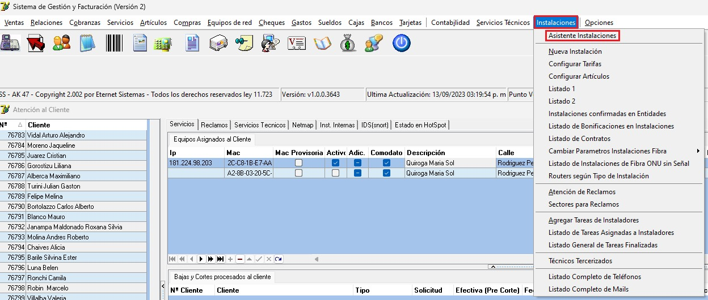

---

# Cobro / Bonificación de la instalación 

## 🔹 Paso 1 

Buscamos al cliente y entramos en `Instalaciones`.  
Ubicamos la instalación con estado `ventas`.

---

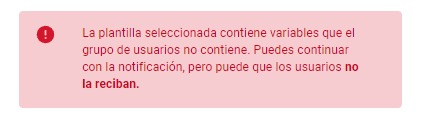

---

## 🔹 Paso 2

Hacemos clic derecho sobre la instalación y seleccionamos:  
`Bonificaciones en Cargos de instalación y/o abonos`.

---

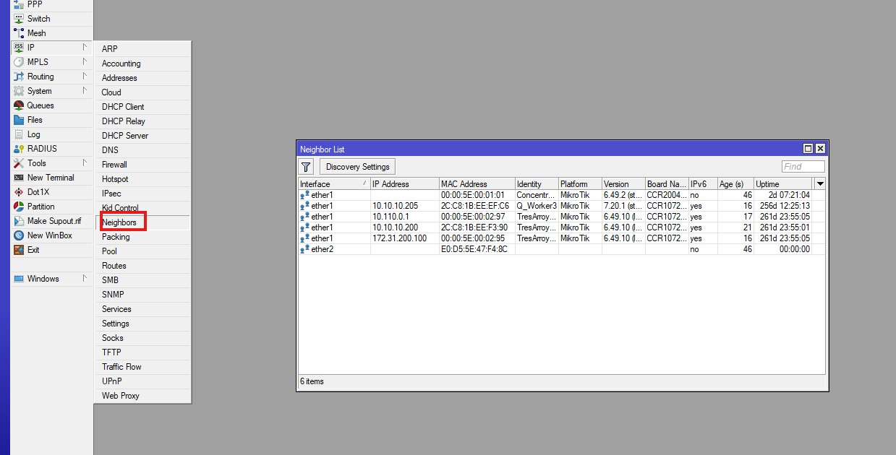

---

## 🔹 Paso 3

Se pueden dar 3 situaciones:

### ✔ Bonificación total del cargo de instalación
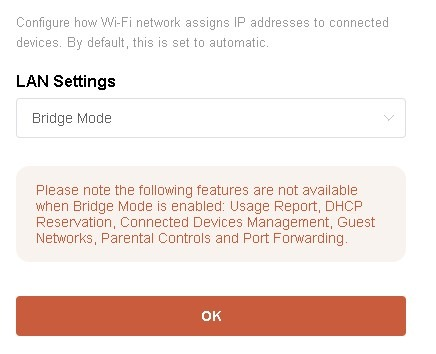

---

### ✔ Bonificación 50% del cargo de instalación
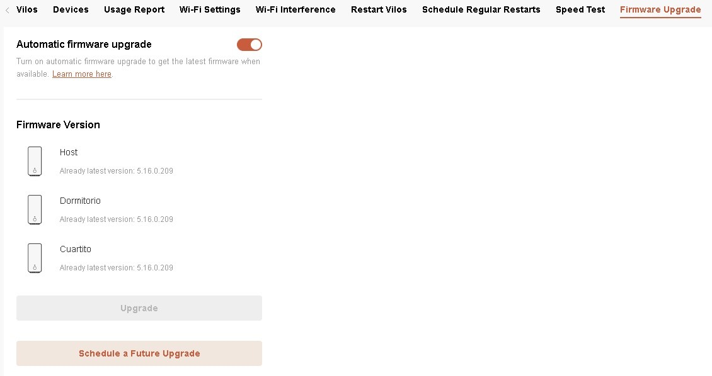

---

### ✔ Cobro total de la instalación
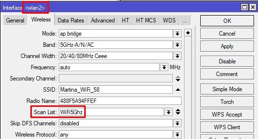

---

> [!NOTE]  
> Si el cliente tenía una deuda anterior, el proceso es el mismo.  
> Al bonificar se decide si se suma la deuda al cargo de instalación, se bonifica o se cobra parcialmente.
