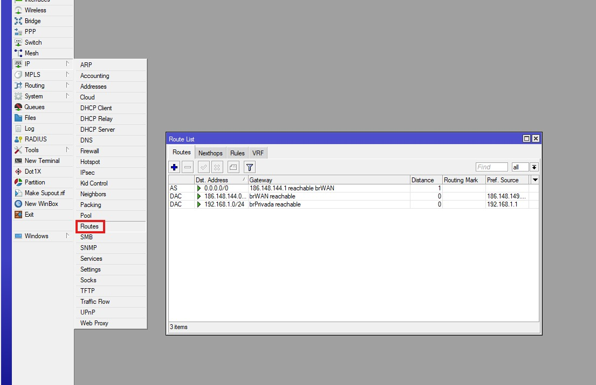
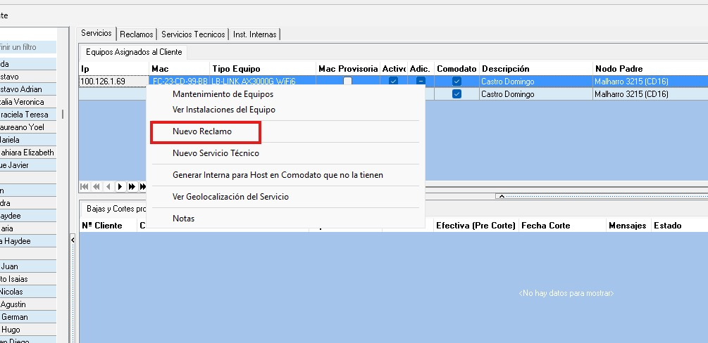
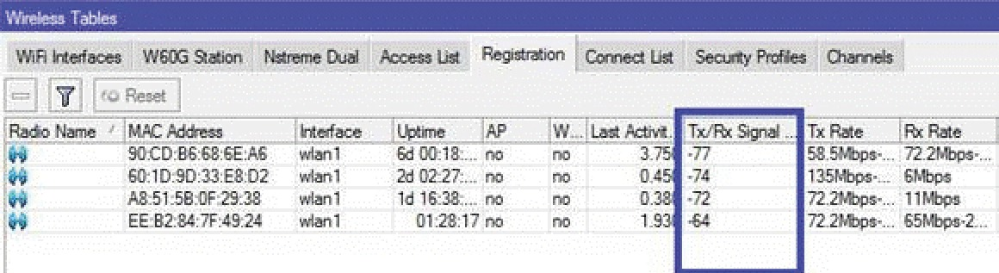
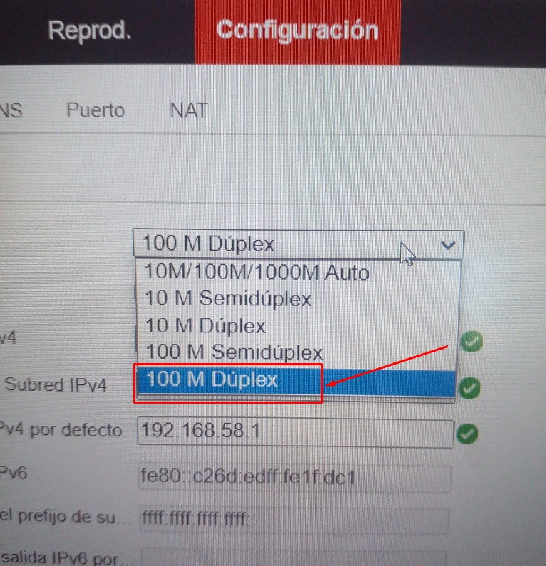
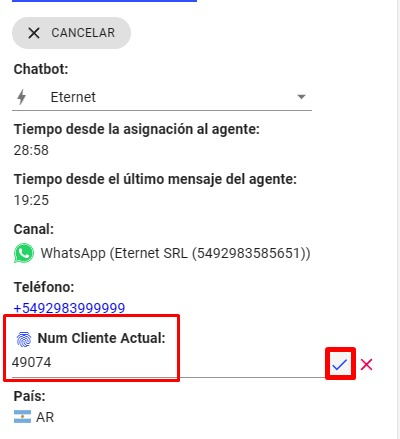
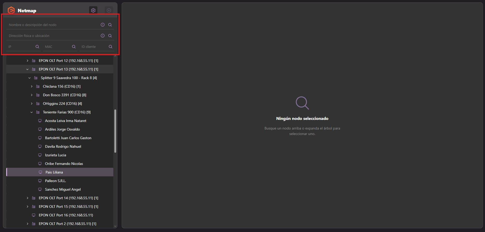
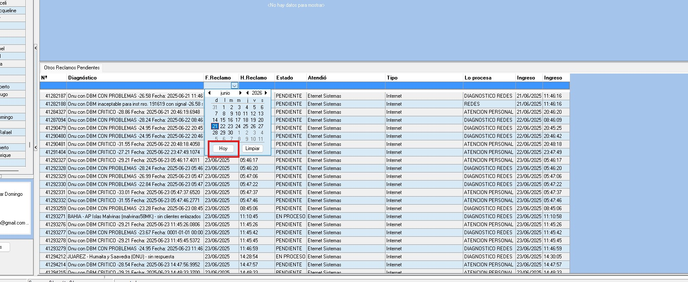
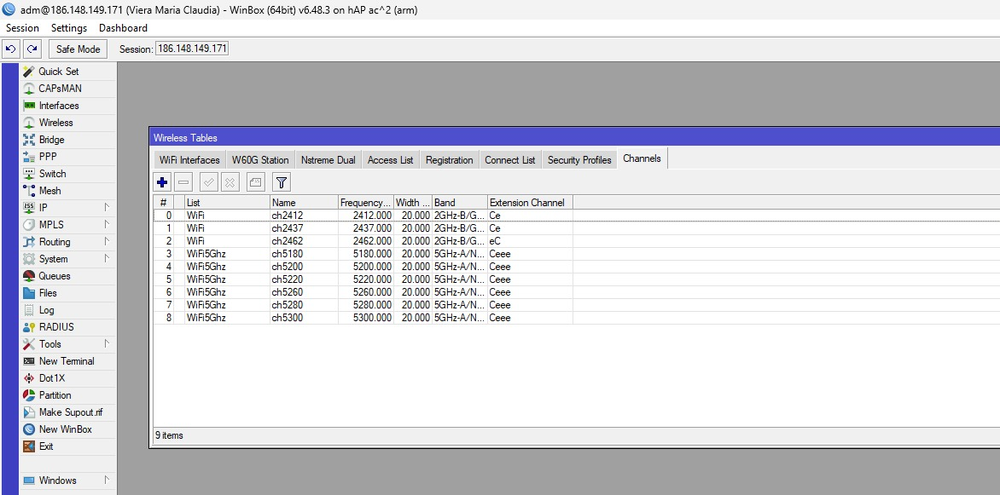

# Carga de una instalación de Internet

## Paso 1. Verificar el cliente

Antes de comenzar, verificar si el cliente ya existe.

# Carga de la instalación

## Paso 2. Crear la instalación

1. Ir a **Instalaciones** → **Asistente de instalaciones**.
2. Seleccionar:
   - Localidad.
   - Tipo: **Instalación domiciliaria**.
3. Hacer clic en **Siguiente**.

> 

---

## Paso 3. Configurar la instalación

Completar:

- Cargo de instalación.
- Marcar **Sujeto a bonificación siempre**.
- Seleccionar la tarifa.

> El router en comodato se asigna automáticamente según la tarifa elegida.

> 

---

## Paso 4. Asociar el cliente

1. Seleccionar **Recuperar**.
2. Buscar al cliente por **DNI** o **Razón Social**.
3. Hacer doble clic sobre el cliente para cargar sus datos automáticamente.

> 

> 

---

## Paso 5. Completar los datos de la instalación

1. Ir a **Equipos de red** → **Nodos** → **Nodos cercanos a un punto**.
2. Ingresar la **latitud** y **longitud** del domicilio.
3. Seleccionar **Buscar (✓)**.
4. Copiar los datos del nodo más cercano.

Luego completar:

- Domicilio.
- Altura.
- Latitud.
- Longitud.
- Observaciones para instaladores y técnicos (pegar el issue que se creó en el repo de coordinación).
- Notificar vía SMS.
- Celular del cliente.
- Disponibilidad horaria.

Por último, seleccionar **Finalizar**.

> 

---

# Bonificación o cobro de la instalación

## Paso 6. Buscar la instalación

1. Buscar al cliente.
2. Abrir **Instalaciones**.
3. Seleccionar la instalación con estado **Ventas**.

> 

---

## Paso 7. Configurar la bonificación

1. Hacer clic derecho sobre la instalación.
2. Seleccionar **Bonificaciones en cargos de instalación y/o abonos**.

> 

Aplicar la opción acordada con el cliente:

- Bonificación del 100 %.
- Bonificación del 50 %.
- Cobro total de la instalación.
  
---
 - Bonificación del 100 %.
> 

 - Bonificación del 50 %

> 

 - Cobro total

> 

> Al finalizar, la instalación debe quedar con estado **Sin iniciar**.

---

## Importante

Si el cliente posee una deuda anterior, el procedimiento de carga es el mismo.

Al aplicar la bonificación se podrá:

- Sumar la deuda al cargo de instalación.
- Bonificar la deuda.
- Cobrar un porcentaje de la deuda.
