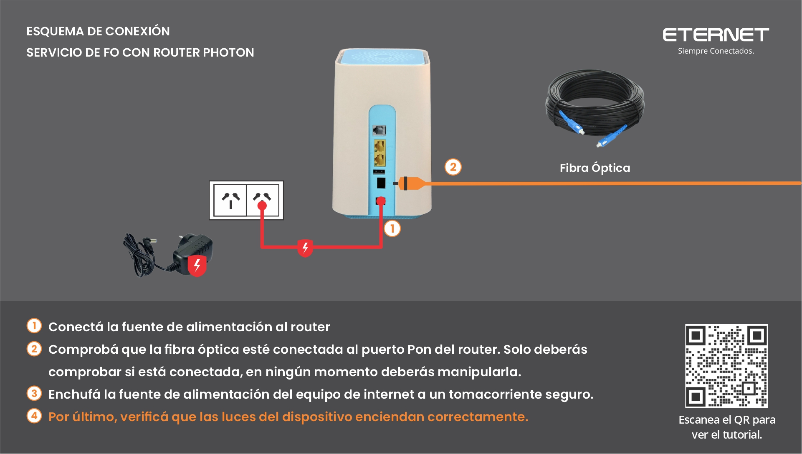
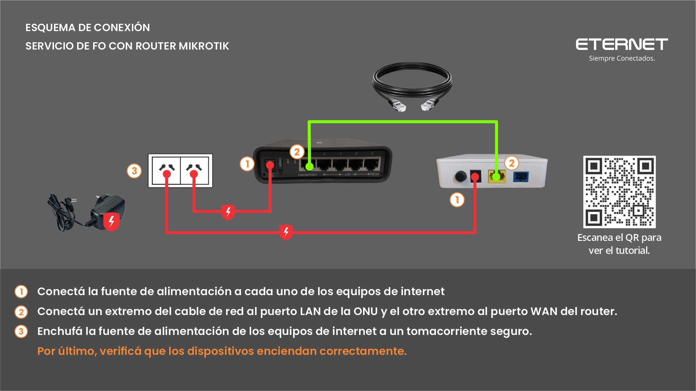
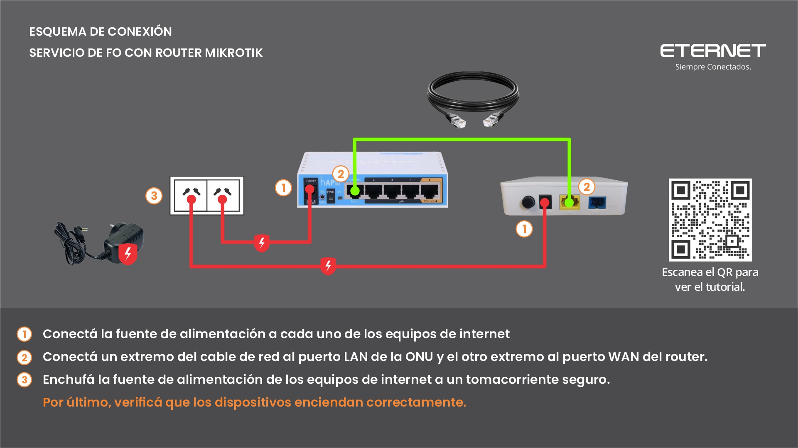
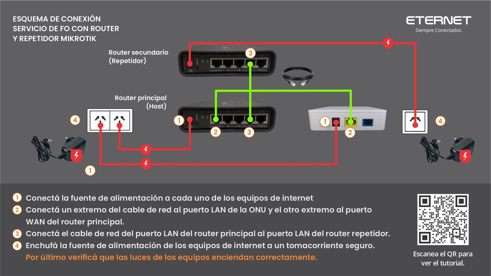
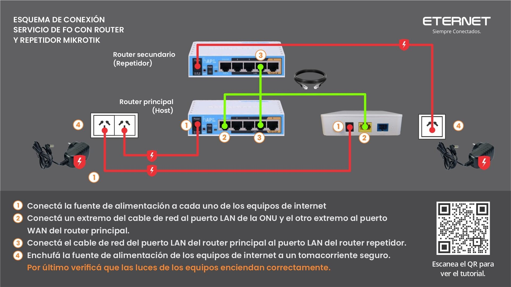
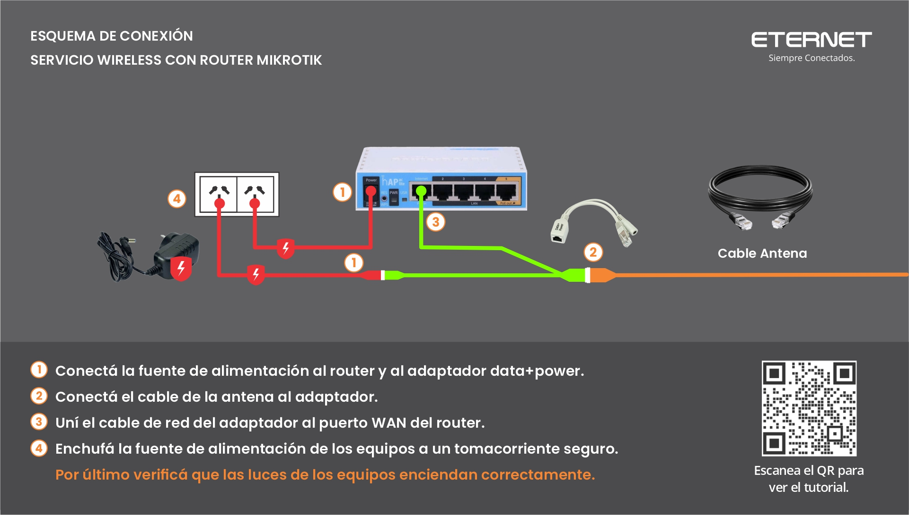
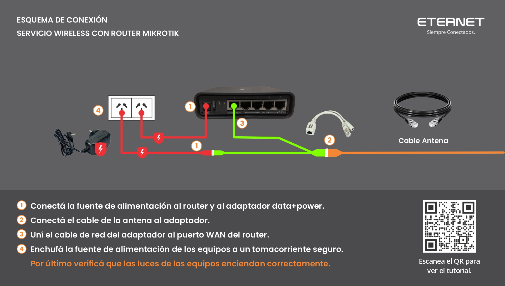
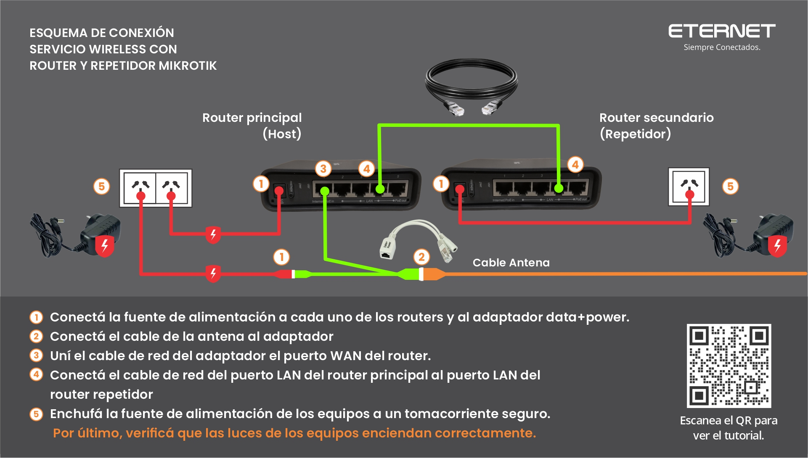
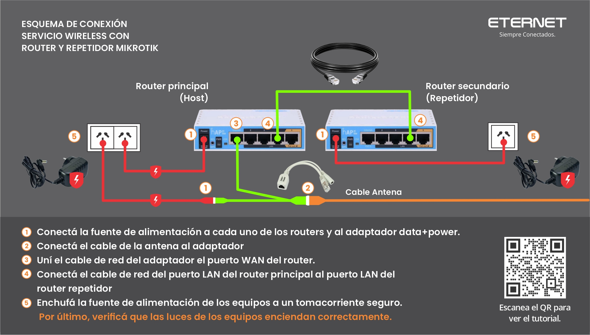
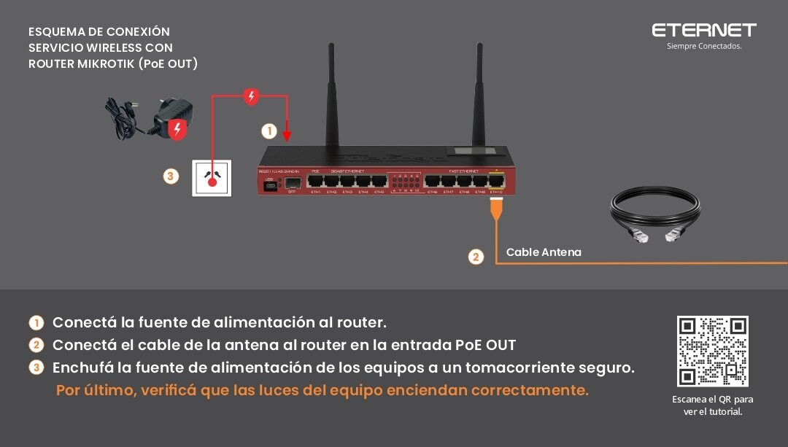

# 📦 Alta de equipo individualizado como artículo en SSAK

---

## 🧭 Descripción

Además de los lineamientos generales para la creación de artículos establecidos en:

👉 [Carga de Artículos y Gastos](https://github.com/AbutMatias/Manual-Operativo-Atencion-al-Cliente/blob/main/doc/Carga%20de%20artículos%20y%20gastos.md)

Cuando el artículo es **individualizado (con MAC)**, se deben seguir los pasos adicionales detallados a continuación.

---

# ⚙️ Proceso de alta de equipo individualizado

---

## 1️⃣ Alta de Tipo de Equipo en Redes

Se debe crear el **Tipo de Equipo** en el área de Redes con la nomenclatura correspondiente.

- Responsable: **@Eternet/redes**
- Objetivo: identificar el equipo dentro del sistema de inventario y redes

---

## 2️⃣ Alta del artículo en SSAK

Una vez creado el Tipo de Equipo:

- Se da de alta el artículo en SSAK
- Se lo debe **relacionar con el Tipo de Equipo creado en Redes**

- Responsable: **@Eternet/compras-y-logistica**

---

## 3️⃣ Incorporación para equipos Host

En caso de tratarse de un **equipo Host**:

- Se debe agregar como un nuevo tipo de equipo disponible para internas
- Esto habilita su uso dentro de la operación técnica

- Responsable: **@Eternet/servicio-tecnico**

---

## 🖼️ Referencia visual

---

# ✅ Finalización del proceso

Una vez completados los pasos anteriores:

- El artículo queda habilitado para su uso en el sistema
- Se debe confirmar el alta haciendo clic en el **✔️ Check de “Mantenimiento de Artículos y Servicios”**

---

## ⚠️ Importante

- Sin el **Tipo de Equipo en Redes**, el artículo no puede ser correctamente individualizado
- La correcta vinculación entre SSAK y Redes es obligatoria para trazabilidad de MACs
- Cualquier error en esta relación afecta inventario y asignación de equipos

---

# Proceso para configurar articulos como "Individualizados" o "No individualizados"

## Dentro del sistema, ingresamos en:

- 1 - "Artículos"
- 2 - "Listado de..."

Y aparecera la siguiente pantalla:

## Continuamos buscando el artículo el cual necesitamos modificar:

### continuamos haciendo doble click sobre la descripción del artículo y aparecerá la siguiente pantalla:

## A continuación hacemos click derecho en cualquier parte de la pantalla y seleccionamos "configurar Artículo con stock Individualizado" o "Configurar Artículo con stock no Individualizado" según necesitemos:

## En caso que la opción seleccionada sea "Configurar Artículo con stock Individualizado" aparecerá la siguiente pantalla:

## Campos a Completar:

- `Tipo de Equipo`:
   - Routers Cliente y Repetidores: Si es un equipo Host.
   - Equipos No Host: Si es un equipo no host.
   - Otros (Sin Mac): Si queremos individualizar un artículo que no posee MAC.
 - `Sitio`:
   - Sitio donde se encuentra el artículo el cual queremos modificar.
- `Almacén`
   - Almacén del sitio al cual corresponde el artículo que queremos modificar.

### De este modo, un artículo cargado correctamente quedaría de la siguiente forma:

## Una vez completados los campos damos click en aceptar para completar la operación:

## En caso de que seleccionemos la opción "Configurar Artículo con Stock no Individualizado" aparecerá el siguiente mensaje:

### A continuación damos click en "Yes" para finalizar la operación

