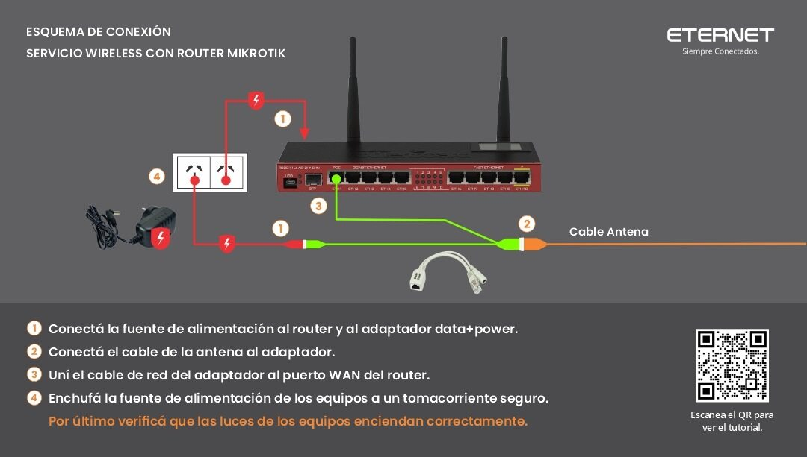
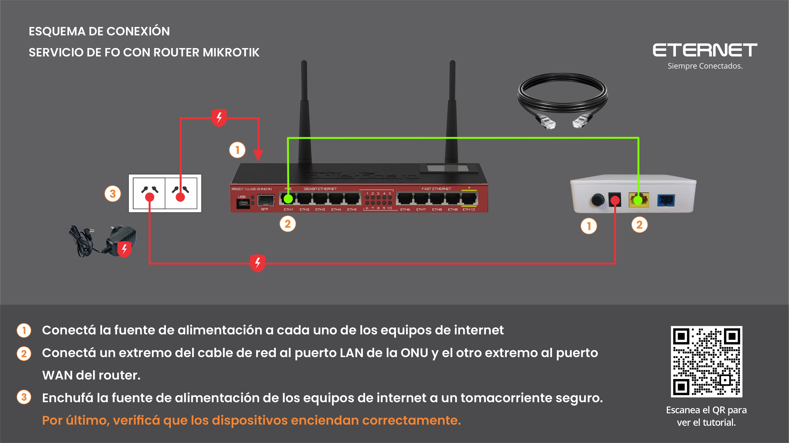
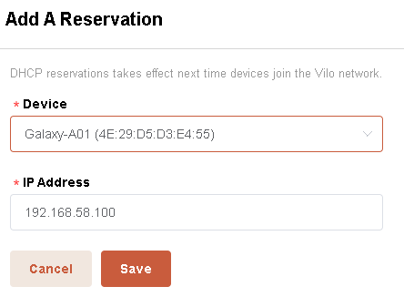

# Proceso para creación de Sitios y Almacenes

Dirigirse a `Artículos` > `Sitios y Almacenes de Stock`:

Se desplegará la pantalla con los `Sitios y Almacenes` creados:

### 1 - Para crear un nuevo `Sitio`:

* Completar los campos indicados (`Descripción`, `Domicilio`, `Localidad`, `Alias`).
* Hacemos clic en `Descripción` como se muestra en la imagen.

---

### 2 - Creación de un nuevo `Almacén`:

#### Nos posicionamos sobre el `Sitio` donde vamos a crear el almacén:

* Completar los campos ( `Calculo de Consumo`, `Destino`, `Condición`, `Tipo`, `Alias`, `Email Notificaciones`) indicados en la imagen anterior.
* Por ultimo hacemos click en `ID`.

---

### Personas autorizadas para utilizar `Almacenes` dentro de los `Sitios`:

* Hacemos clic en el campo "`Click aquí para Agregar un nuevo Usuario`" dentro de la ventana `Usuarios Autorizados` 

* Escribimos el usuario al que deseamos agregar como en este ejemplo: 

* Por último hacemos clic en `Usuario` y agrega al Almacen asignando el ID correspondiente.
