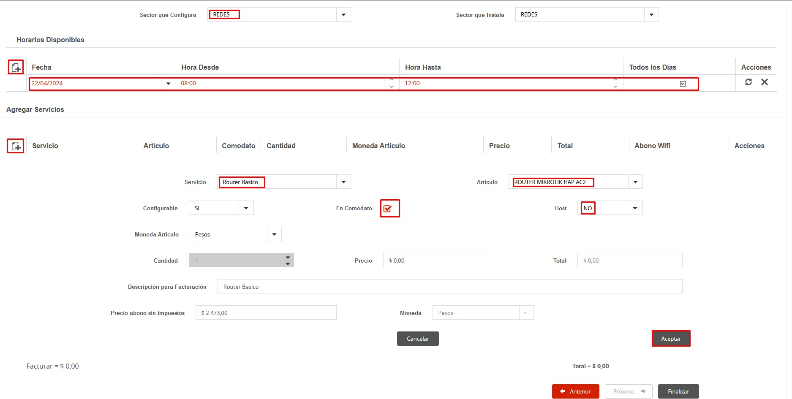
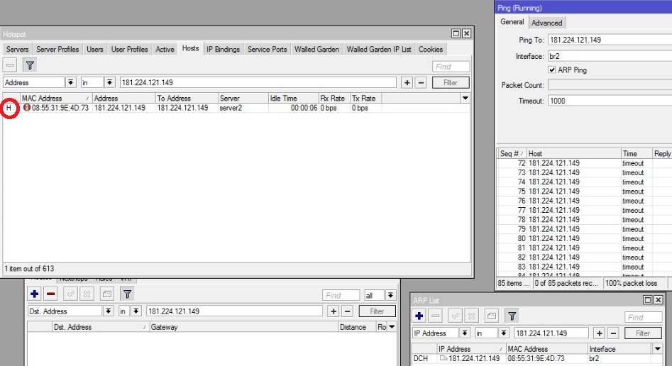

## Guía para Diagnóstico de Problemas de Cobertura Wi-Fi

---

# 1. Identificación del router

- Identificar qué equipo tiene instalado el cliente:
  - Router 2.4 GHz
  - Dual Band (2.4 GHz / 5 GHz)
  - Wi-Fi 6

---

# 2. Identificación del problema

- Consultar en qué dispositivos ocurre la falla:
  - Celular
  - Notebook
  - TV / Smart TV
  - Otros

- Determinar:
  - Distancia aproximada al router donde comienza la falla.
  - Si ocurre en una sola habitación o en varias.

---

# 3. Relevamiento de cobertura remoto

- Solicitar al cliente información del domicilio.

### Opciones

- Plano a mano alzada indicando:
  - Ubicación del router.
  - Ambientes de la casa.
  - Distancias aproximadas.

---

- Alternativa:
  - Enviar un video recorriendo la vivienda.
  - Mostrar la distribución de los ambientes y las distancias aproximadas.

---

# 4. Verificación de la señal

Desde el router del cliente es posible verificar de forma remota la intensidad de la señal Wi-Fi que recibe cada dispositivo conectado.

### Paso 1

Ingresar al router. 
- **MikroTik** → WinBox
- Vilo → Desde el siguiente [link](https://isp.viloliving.com/networks).

### Paso 2

Ir a:

- **Wireless → Registration → Signal Strength** 
- **Vilo → Devices → Signal** 

### Paso 3

Seleccionar el dispositivo que presenta inconvenientes.

### Paso 4

Verificar el valor **Signal Strength (RSSI)**.

### Referencia de calidad de señal

| Señal (RSSI) | Calidad | Interpretación |
|--------------|---------|----------------|
| -35 a -50 dBm | Excelente | Muy cerca del router. |
| -50 a -60 dBm | Muy buena | Cobertura óptima. |
| -60 a -67 dBm | Buena | Funcionamiento normal. |
| -67 a -75 dBm | Aceptable | Puede comenzar a disminuir el rendimiento. |
| -75 a -80 dBm | Baja | Posible lentitud o microcortes. |
| Menor a -80 dBm | Muy mala | Alta probabilidad de desconexiones o baja velocidad. |

> [!NOTE]
> WinBox no permite conocer la distancia exacta entre el router y el dispositivo. El valor **RSSI** sirve como referencia para estimar la calidad de la cobertura Wi-Fi.

---

# 5. Pruebas de cobertura

- Seleccionar un dispositivo del cliente para realizar las pruebas.
- Medir el rendimiento en distintos puntos de la vivienda.

### Pasos

- Junto al router:
  - Medir velocidad.
  - Verificar estabilidad.

- En otros ambientes:
  - Repetir las mediciones.
  - Comparar los resultados obtenidos.

---

# 6. Análisis y recomendaciones

## Si la pérdida de señal es esperable

(Según la distancia al router o los materiales de construcción)

### Sugerir

- Reubicar el router en un punto más central.
- Incorporar un repetidor (Eternet Plus) o un sistema Mesh.
- Optimizar la configuración:
  - Cambio de canal Wi-Fi.
  - Revisión de la banda 2.4 GHz / 5 GHz.
  - Separación de redes cuando el Band Steering no funcione correctamente.
