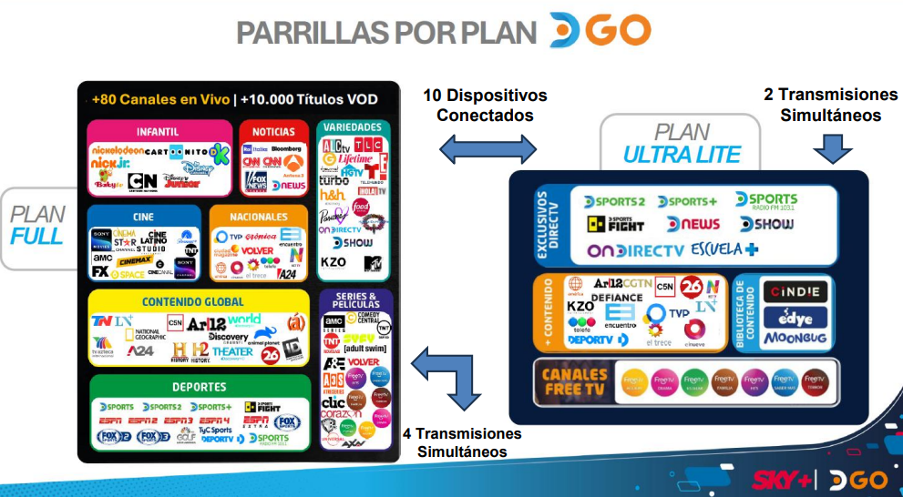
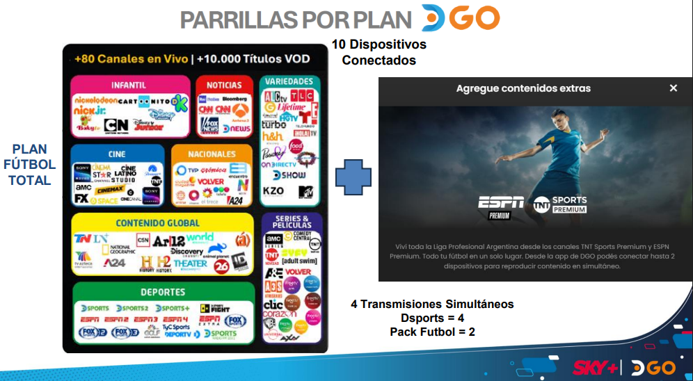
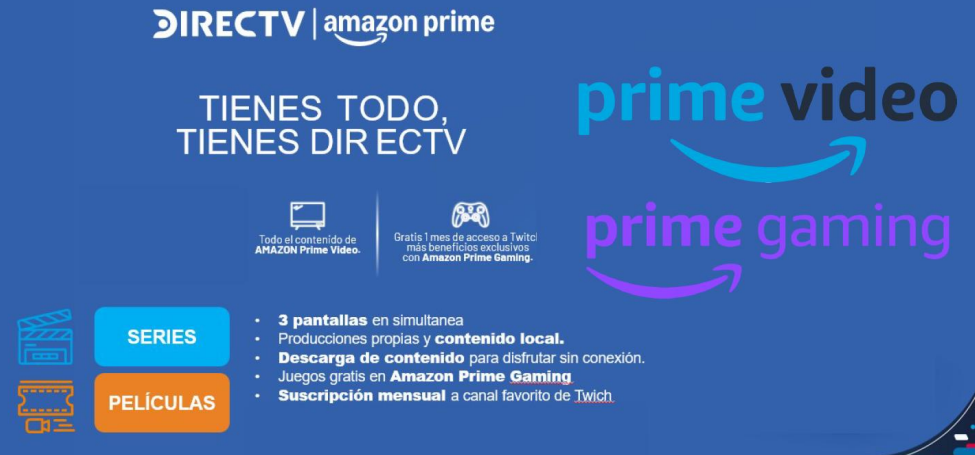
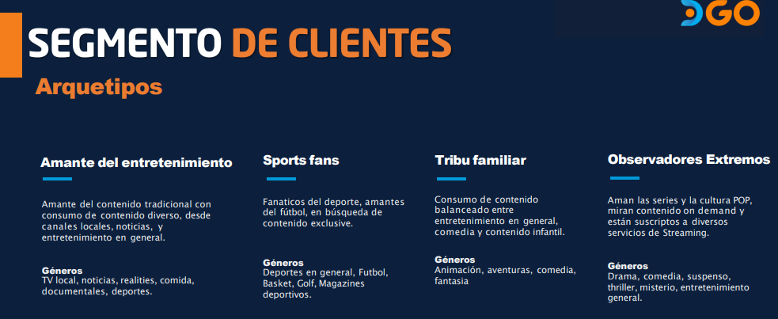

# Inducción DGO

## 1. ¿Qué es DGO?

DGO es una plataforma de streaming que permite ver:

- TV en vivo.
- Películas y series.
- Deportes.
- Contenido infantil.
- Contenido On Demand.
- Recomendaciones personalizadas.

### Conceptos básicos

**Streaming:** permite reproducir contenido sin descargarlo completamente antes.

**On Demand:** permite elegir qué película, serie o contenido ver cuando el cliente quiera, según lo disponible en su plan.

> **Idea principal:** DGO permite consumir entretenimiento desde diferentes dispositivos y en distintos momentos.


---

# 2. ¿Por qué DGO?

DGO ofrece una forma flexible de consumir entretenimiento.

Para una venta, **no hay que enfocarse solamente en el precio**.

Primero hay que conocer qué busca el cliente:

- ¿Le interesa el fútbol?
- ¿Mira muchas series?
- ¿Tiene hijos?
- ¿Mira TV tradicional?
- ¿Busca contenido On Demand?

Según la respuesta, se puede explicar qué plan se adapta mejor a sus necesidades.

---

# 3. Secciones principales de DGO

## Inicio

Es la pantalla principal.

Muestra contenido en vivo y contenido recomendado según los gustos del usuario.

También permite:

- Guardar favoritos.
- Retomar contenido.
- Utilizar diferentes perfiles.

---

## En vivo

Permite ver los canales disponibles y consultar la programación.

También puede permitir:

- Ver la programación próxima.
- Retroceder contenido en vivo.
- Cambiar el idioma, cuando esté disponible.
- Retroceder hasta 1 hora, siempre que el contenido haya comenzado dentro de ese período.


---

## On Demand / Catálogo

Permite elegir películas, series y otros contenidos.

El catálogo mencionado en la capacitación cuenta con **más de 10.000 títulos**.

Funciones principales:

- Subtítulos.
- Diferentes audios, según disponibilidad.
- Continuar viendo desde otro dispositivo.
- Favoritos.
- Recomendaciones.
- Reproducción automática del siguiente episodio.


---

## Deportes

Incluye contenido deportivo y transmisiones en vivo.

Puede incluir:

- Fútbol.
- Competencias locales.
- Competencias regionales.
- Competencias mundiales.
- D Sports.
- Eventos especiales.
- Resúmenes.
- Videos destacados.

También pueden existir funciones como:

- **Comenzar de nuevo.**
- **Lookback:** volver hacia atrás en una transmisión.


---

## Kids / Infantil

Sección destinada a contenido infantil.

Incluye:

- Series.
- Películas.
- Canales en vivo.
- Contenido seleccionado para niños.


---

# 4. Dispositivos compatibles

DGO puede utilizarse desde:

- Navegadores.
- Smart TV.
- Celulares.
- Tablets.
- Otros dispositivos compatibles.

> **Importante:** si el dispositivo no está homologado, puede presentar errores o problemas que no tengan soporte oficial.

Cada paquete permite vincular hasta **10 dispositivos**.

Esto **no significa que se puedan reproducir 10 contenidos al mismo tiempo**.

La cantidad de reproducciones simultáneas depende del plan contratado y de las restricciones de determinados contenidos.


---

# 5. Planes

## Plan Full

- Más de 80 canales en vivo.
- Más de 10.000 títulos VOD.
- Hasta 10 dispositivos vinculados.
- Hasta 4 transmisiones simultáneas.

## Plan Ultra Light

- Plan de entrada.
- Grilla más limitada.
- Hasta 10 dispositivos vinculados.
- Hasta 2 transmisiones simultáneas.

## Plan Fútbol Total

Incluye contenido deportivo premium.

Agrega:

- ESPN Premium.
- TNT Sports Premium.

Según la capacitación:

- D Sports: hasta 4 transmisiones simultáneas.
- Pack Fútbol: hasta 2 transmisiones simultáneas.

> **Importante:** el Pack Fútbol **no se puede contratar solo**. Debe combinarse con uno de los planes disponibles.




---

# 6. Amazon Prime

DGO también presentó una alianza con Amazon Prime.

Entre los beneficios mencionados se encuentran:

- Prime Video.
- Prime Gaming.
- Hasta 3 pantallas simultáneas en Prime Video.
- Producciones propias.
- Contenido local.
- Descarga de contenido para verlo sin conexión.
- Juegos gratuitos y beneficios de Prime Gaming.
- Suscripción mensual a un canal de Twitch.

> **Importante:** Amazon Prime funciona como una plataforma independiente. No hay que confundir la administración de Amazon con la administración de DGO.




---

# 7. Tipos de clientes

Para vender DGO es importante conocer qué busca el cliente.

## Amante del entretenimiento

Busca:

- TV tradicional.
- Noticias.
- Entretenimiento general.
- Contenido variado.

## Sports Fans

Principalmente busca:

- Fútbol.
- Deportes.
- Contenido deportivo exclusivo.

## Tribu familiar

Busca contenido para diferentes integrantes de la familia:

- Entretenimiento.
- Comedia.
- Contenido infantil.

## Observadores extremos

Consume principalmente:

- Series.
- Cultura pop.
- Contenido On Demand.
- Diferentes plataformas de streaming.
  
  


---

# 8. Atención al cliente

Cuando el cliente contrató DGO mediante **Eternet**, debemos actuar como intermediarios.

### ¿Qué debemos hacer?

1. Escuchar el problema.
2. Identificar qué tipo de inconveniente tiene.
3. Revisar la cuenta.
4. Revisar el paquete contratado.
5. Validar credenciales y acceso.
6. Revisar dispositivos y reproducciones.
7. Verificar si existe un error conocido.
8. Resolverlo si corresponde a Eternet.
9. Derivarlo a DGO si corresponde a la plataforma.

> **No se debe enviar directamente al cliente a DGO sin realizar las validaciones correspondientes.**

---

# 9. ¿Qué atiende Eternet?

Corresponde a **Eternet** cuando el problema está relacionado con:

- Facturación.
- Precios.
- Descuentos.
- Promociones.
- Administración de cuenta.
- Cambios de paquete.
- Cancelaciones.
- Cambios de credenciales.
- Problemas de credenciales.
- Problemas de acceso relacionados con la cuenta.
- Problemas relacionados con el paquete contratado.

---

# 10. ¿Qué atiende DGO?

Corresponde principalmente a **DGO** cuando se trata de:

- Problemas propios de la plataforma.
- Fallas de la aplicación.
- Problemas de usabilidad.
- Consultas generales sobre la plataforma.
- Programación.
- Mensajes de error.

---

# 11. Problemas compartidos

Los problemas de **acceso** pueden corresponder tanto a Eternet como a DGO.

Primero Eternet debe revisar:

**Cuenta → Credenciales → Paquete → Dispositivos**

Si todo está correcto y el problema parece ser propio de la plataforma:

**→ Derivar / escalar a DGO.**

---

# 12. Centro de Soluciones

El Centro de Soluciones permite consultar información sobre:

- Configuración.
- Dispositivos compatibles.
- Marcas compatibles.
- Reproducción.
- Descarga de DGO.
- Contenido.
- Canales.
- Perfiles.
- Grabación.
- Rebobinado.
- Mensajes de error.
  
>!IMPORTANT
>
> [**Centro de Soluciones**](https://www.directvgo.com/ar/faq)
---

# 13. Chatbot y redes sociales

DGO cuenta con:

- Chatbot.
- Redes sociales.
- Centro de Soluciones.

Son herramientas útiles para problemas propios de DGO.

> **Pero primero debemos realizar las validaciones correspondientes cuando el cliente contrató mediante Eternet.**

---

# 14. Toolbox

Toolbox permite consultar información de la cuenta.

Principalmente sirve para:

- Validar el estado de la cuenta.
- Revisar los paquetes contratados.
- Confirmar información asociada.
>!IMPORTANT
>
> [**Toolbox**](https://toolbox-id-admin.tbxnet.com/login)
 
---

# 15. Dispositivos vinculados

Una cuenta puede tener hasta **10 dispositivos vinculados**.

Si el cliente alcanza ese límite o no recuerda dónde tiene iniciada la sesión, puede ser necesario revisar los dispositivos vinculados y gestionar su desconexión según el procedimiento correspondiente.

> **Importante:** tener 10 dispositivos vinculados no significa poder reproducir contenido en 10 dispositivos al mismo tiempo.
> [Instructivo](https://github.com/user-attachments/files/28792644/Administracion.dispositivos.conectados_DGO.pdf)
---

# 16. Validación antes de derivar

Antes de escalar un caso a DGO, revisar:

- [ ] Paquete activo.
- [ ] Credenciales correctas.
- [ ] No hubo cambios recientes en la cuenta.
- [ ] El contenido está incluido en el plan.
- [ ] El problema ocurre en uno o varios dispositivos.
- [ ] El cliente puede ingresar a DGO.
- [ ] Se verificó el mensaje de error.
- [ ] Se revisaron los dispositivos vinculados.
- [ ] No se superó el límite de reproducciones.
- [ ] El problema no corresponde a facturación o administración.

---

# 17. Flujo rápido de atención

```text
CLIENTE INFORMA UN PROBLEMA
          ↓
¿TIENE EL PAQUETE ACTIVO?
          ↓
¿PUEDE INGRESAR?
          ↓
¿CREDENCIALES CORRECTAS?
          ↓
¿QUÉ DISPOSITIVO UTILIZA?
          ↓
¿OCURRE EN UNO O VARIOS?
          ↓
¿HAY MENSAJE DE ERROR?
          ↓
¿EL CONTENIDO ESTÁ INCLUIDO?
          ↓
¿SE SUPERÓ ALGÚN LÍMITE?
          ↓
¿ES UN PROBLEMA DE ETERNET?
     ↓              ↓
   SÍ               NO
   ↓                ↓
GESTIONAR       ¿ES DE LA PLATAFORMA?
                   ↓
                  SÍ
                   ↓
              DERIVAR A DGO
