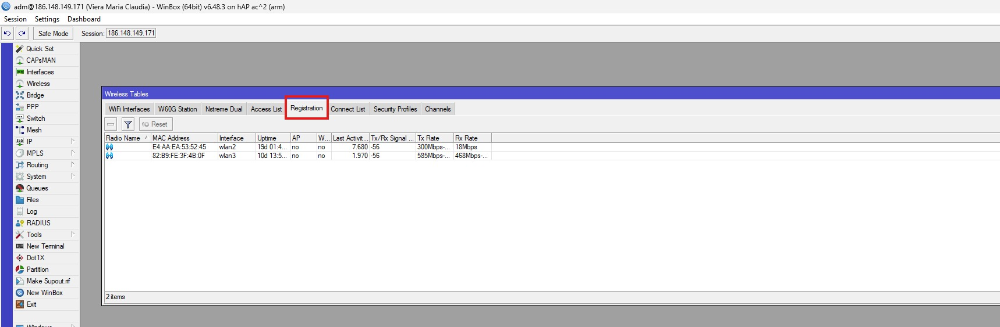
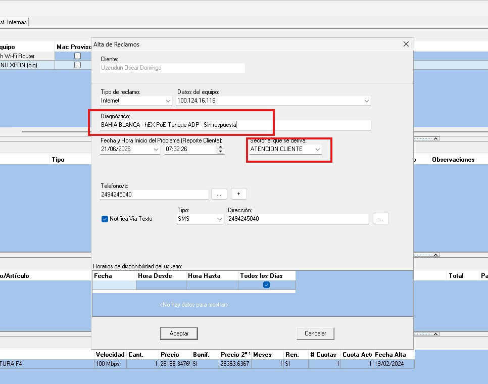
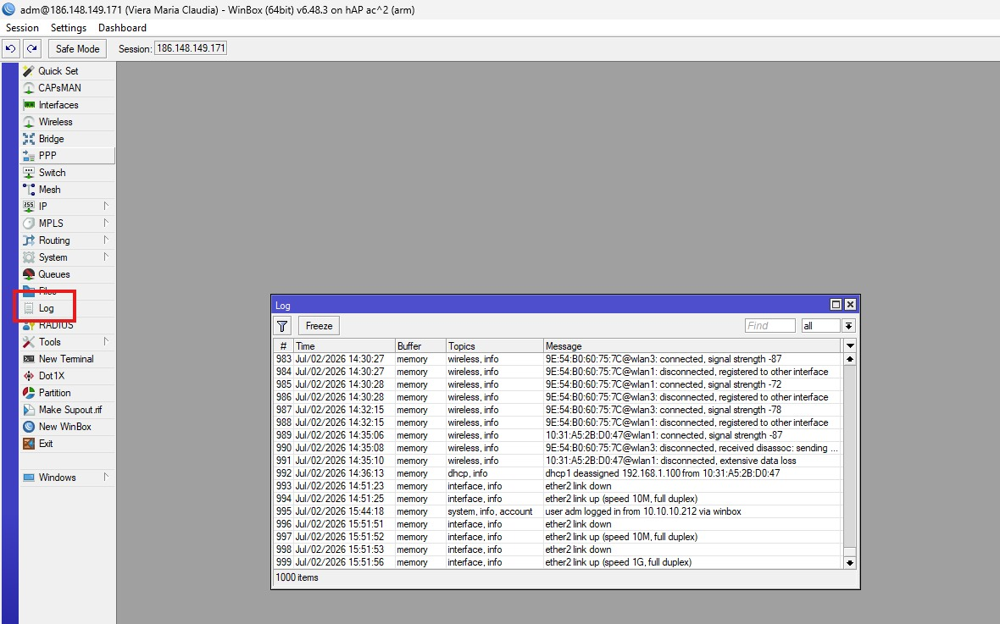
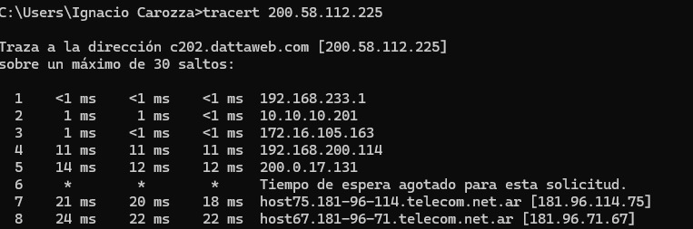

# Verificar cortes de energía en EDES

La plataforma de **EDES** permite consultar si existen cortes de energía en Bahía Blanca y otras localidades de la región, además del estado de los suministros utilizados por la empresa.

## 1. Ingresar al portal

Acceder al sitio web de EDES e iniciar sesión con las siguientes credenciales:

- **Usuario:** `atcliente@eternet.cc`
- **Contraseña:** `ATpass_8247`

> 

---

## 2. Consultar un suministro

Una vez dentro del portal, ingresar a la sección **Suministros**.

> 

---

## 3. Buscar el sitio

Ingresar el **NIS** correspondiente al sitio que se desea consultar.

Los NIS de cada ubicación se encuentran en la siguiente documentación:

- [**Suministros EDES**](https://github.com/Eternet/Atencion.Clientes/blob/main/Documentacion/Manual-Operativo-Atencion-al-Cliente/doc/Suministros%20EDES.md)

> 

---

## 4. Verificar el estado

Al realizar la búsqueda se mostrará el estado actual del suministro.

Si existe un corte de energía, el sistema indicará:

- Estado del suministro.
- Motivo del corte (si está disponible).
- Hora estimada de normalización del servicio.

