# Esquema de conexión con servicio FTTH y router Photon Dual

# Tutorial: [Link](https://www.youtube.com/watch?v=JZIR1azMiXA) 

# Esquema de conexión con servicio FTTH y router Photon

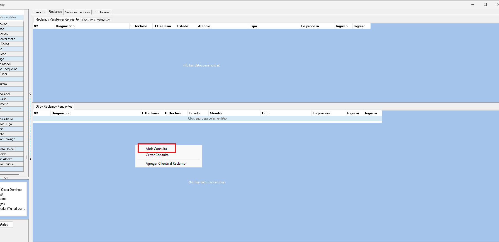

# Tutorial: [Link](https://www.youtube.com/watch?v=kiiyXDmYEoY) 

# Esquemas de conexión con servicio Wireless y router Photon

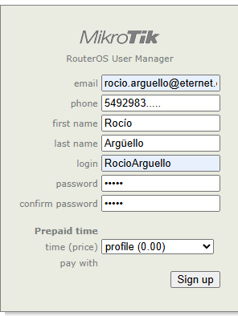

# Tutorial: [Link](https://www.youtube.com/watch?v=kiiyXDmYEoY) 
---

# Esquema de conexión con servicio FTTH y routers MikroTIk

## Mikrotik AC2 + ONU
- ### Esquema:

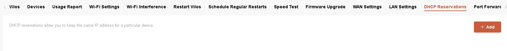

- ### Tutorial: [Link](https://www.youtube.com/watch?v=xhFWoQJ-S7w)

## Mikrotik 951/952 + ONU

- ### Esquema:

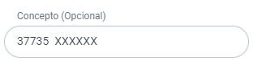

- ### Tutorial: [Link](https://www.youtube.com/watch?v=dq8nk7vlU1c)

## Mikrotik AC2 + ONU + Repetidor

- ### Esquema:

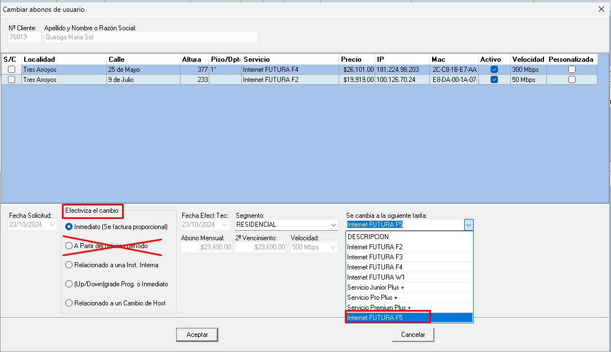

- ### Tutorial: [Link](https://www.youtube.com/watch?v=2ar_3evqd9A)

## Mikrotik 951/952 + ONU + Repetidor

- ### Esquema:

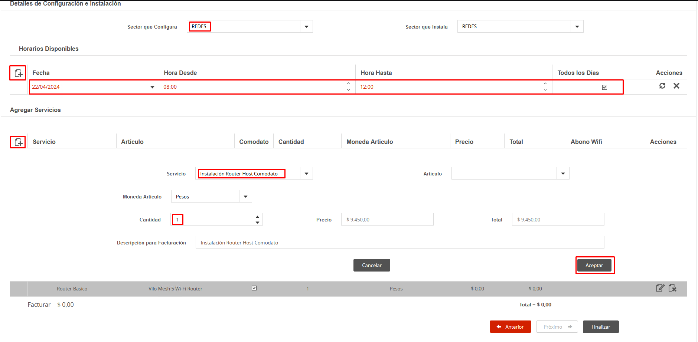

- ###  Tutorial: [Link](https://www.youtube.com/watch?v=PlAXccVVQfc)

## Mikrotik 2011 + ONU

- ### Esquema:

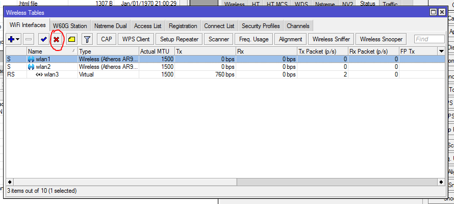

- ### Tutorial: [Link](https://www.youtube.com/watch?v=RguLdaiYpME)

# Esquemas de conexión con servicio Wireless y router Mikrotik 

## Equipo Wireless MK por POE OUT

- ### Esquema:

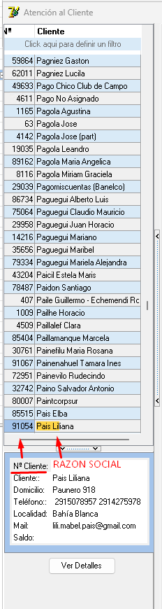

- ### Tutorial: [Link]()

## Equipo Wireless MK 951/952 con data+power.

- ### Esquema:

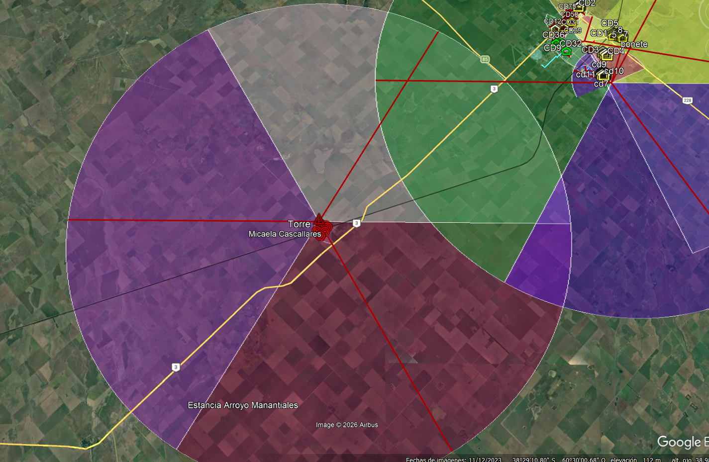

- ### Tutorial: [Link](https://www.youtube.com/watch?v=3dCX8RAM0rY)

## Equipo Wireless MK AC2 con data+power.

- ### Esquema:

- ### Tutorial: [Link](https://www.youtube.com/watch?v=dp-0fEAS2Rs)

## Equipo Wireless MK AC2 con data+power + Repetidor

- ### Esquema:

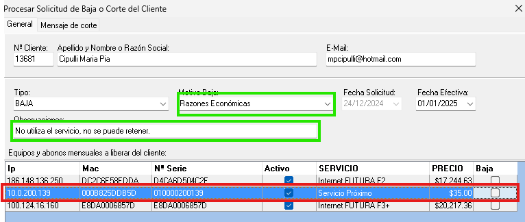

- ### Tutorial: [Link](https://www.youtube.com/watch?v=KQ2pCQoGcRI)

## Equipo Wireless MK 951/952 con data+power + Repetidor

- ### Esquema:

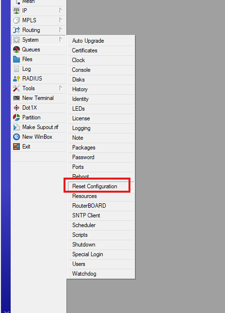

- ### Tutorial: [Link](https://www.youtube.com/watch?v=pi3QedMvAho)

## Equipo Wireless MK 2011 por POE OUT

- ### Esquema:

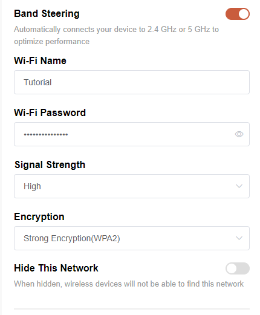

- ### Tutorial: [Link](https://www.youtube.com/watch?v=sHoyIJ8TRUQ)

## Equipo Wireless MK 2011 con data+power.

- ### Esquema:

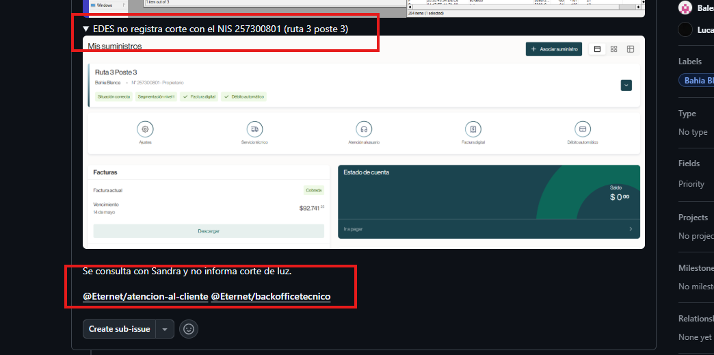

- ### Tutorial: [Link](https://www.youtube.com/watch?v=YkUoS2sRPCs)
---

## Equipo Wireless con PowerActive

- ### Esquema:

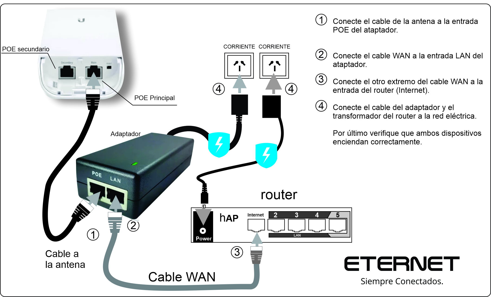

---

# Esquemas de conexión con servicio FTTH y router Vilo

## ONU con router Vilo

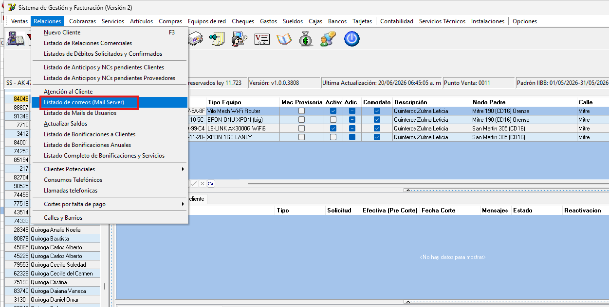

## ONU con router Vilo + Repetidor (Sub Vilo)

---

# Esquemas de conexión con servicio Wireless y router Vilo

## Wireless - Router Vilo con data + power

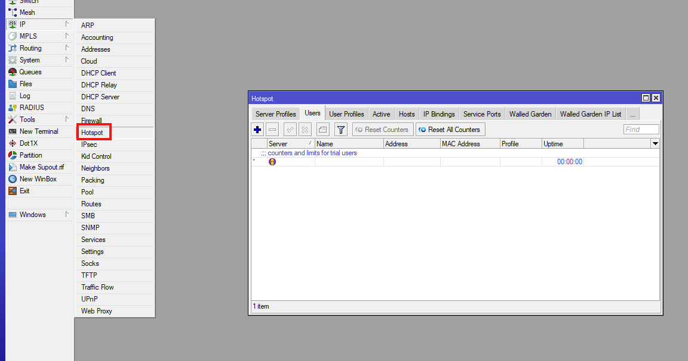

## Wireless - Router Vilo con data + power + Repetidor (Sub Vilo)

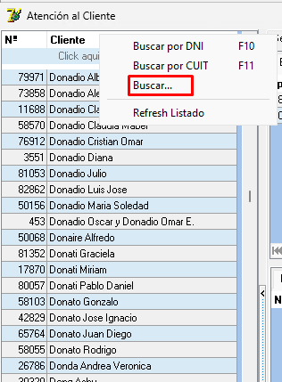

---
# Esquemas de conexión con servicio FTTH y router LB-Link

## ONU con router LB-Link

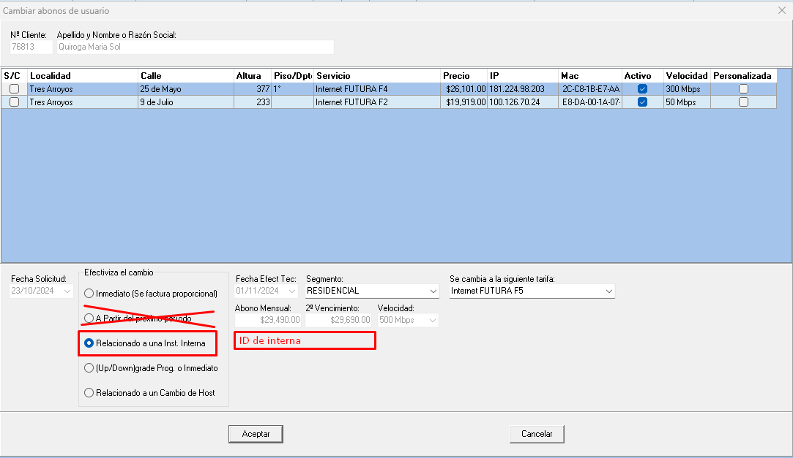

---
## ONU con router LB-Link + Repetidor (Sub LB-Link)

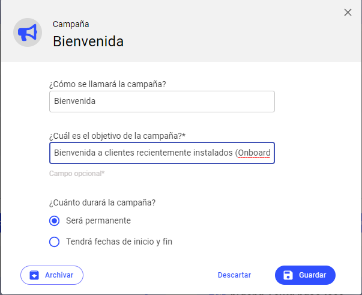

## Wireless - Router LB-Link con data + power

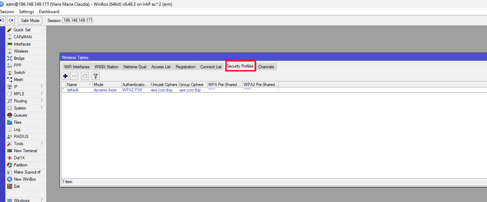

## Wireless - Router LB-Link con data + power + Repetidor (Sub LB-Link)

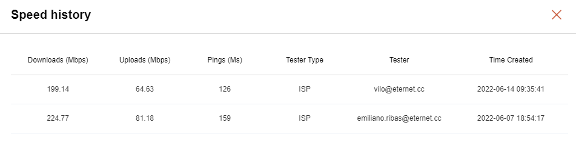

---

## ONU con router GLC-Apolo
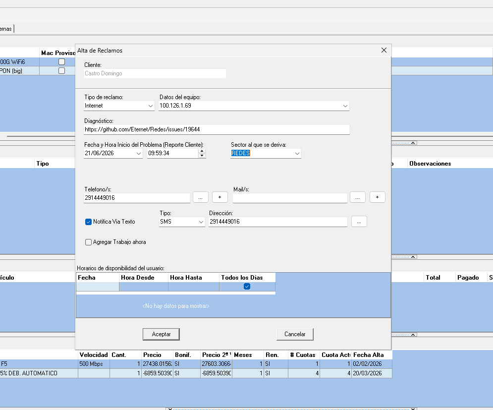

## ONU con router GLC-Apolo + Repetidor (Sub GLC-Apolo)
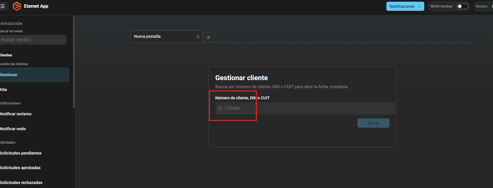

## Wireless - Router GLC-Apolo con data + power
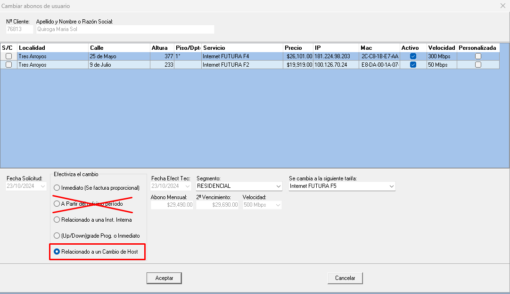

## Wireless - Router GLC-Apolo con data + power + Repetidor (Sub GLC-Apolo)
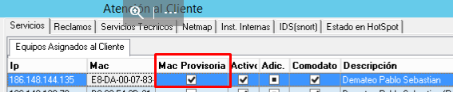

