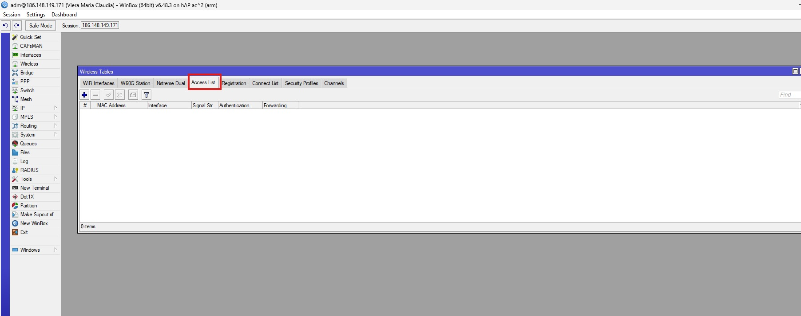
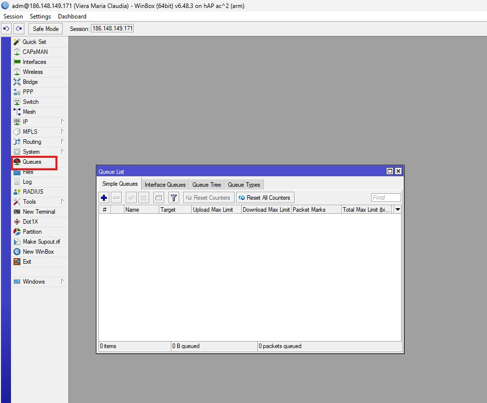
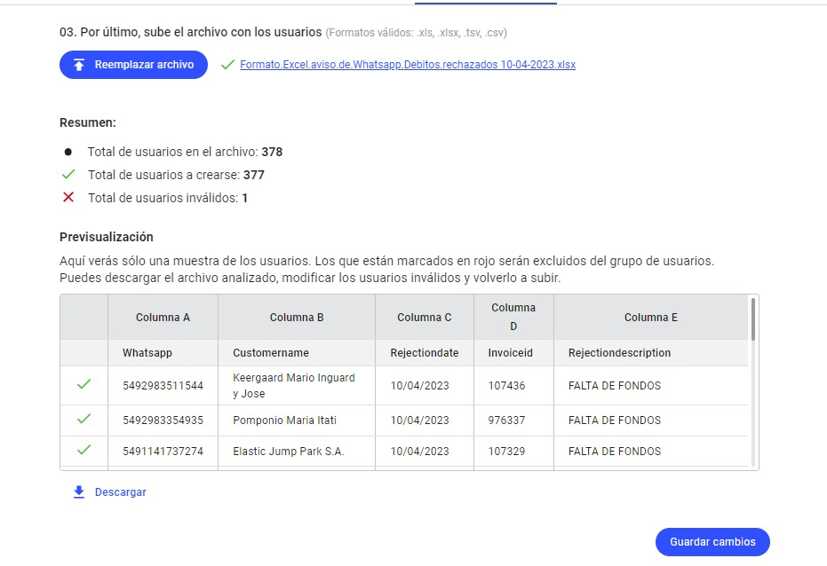
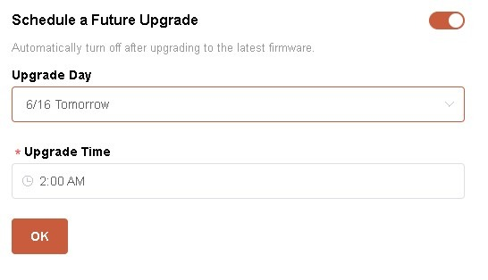

# 🧾 Proceso para facturar un remito a cliente

---

## 🔄 Paso previo obligatorio

Una vez finalizado el proceso de:

👉 [Realizar un remito a cliente](https://github.com/AbutMatias/Manual-Operativo-Atencion-al-Cliente/blob/main/doc/Pase%20de%20Stock%20a%20Cliente.md)

El sistema preguntará si se desea facturar el remito en ese momento.

---

## ⚠️ Confirmación inicial

Aparece el siguiente mensaje:

### ✔️ Acción:
- Hacer clic en **“Yes”**

---

## 📄 Pantalla de facturación

Luego se abre la siguiente pantalla:

---

## 🧩 Campos a completar

---

### 💰 Unitario

- Se debe ingresar el **precio unitario del artículo**
- El sistema calcula automáticamente el resto de los valores

---

### 🧾 Punto de venta

- Indicar el punto de venta correspondiente
- Si es **mayor a 99**, se aplica automáticamente:
  - IVA 0%

---

### 🏷️ Facturar como Bien de Uso

- ❌ Por defecto desactivado
- ✔️ Si se activa:
  - No se aplican percepciones de IIBB

---

### 📅 Fecha de vencimiento

- Por defecto: fecha actual
- Puede modificarse manualmente

---

### ➕ Recargo neto

- Se utiliza si existe recargo por pago fuera de término
- Por defecto: **0**

---

## ✅ Finalización

Una vez completados los campos:

- Hacer clic en **“Aceptar”**
- Se genera la factura asociada al remito

---

# 📦 Facturación de remitos pendientes

---

## 📍 Acceso al sistema

Ingresar a:

- **1 - Artículos**
- **2 - Listado de envíos pendientes de facturación**

---

## 📋 Selección del envío

---

### ✔️ Acción

1. Tildar el envío a facturar  
2. Ir a **“Acciones”**  
3. Seleccionar:

👉 **Facturar items y cantidades seleccionadas**

---

## 🧾 Pantalla de facturación

---

## 🔁 Continuación del proceso

A partir de esta pantalla:

- Se siguen los mismos pasos del proceso:
  👉 **“Facturar remito a cliente”**

---

## ⚠️ Consideraciones

- No se puede facturar un remito si no fue previamente generado correctamente
- Verificar punto de venta antes de confirmar
- Revisar unitarios para evitar diferencias de facturación
