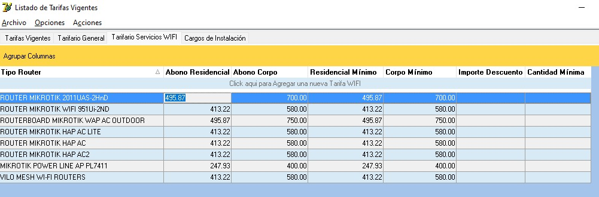
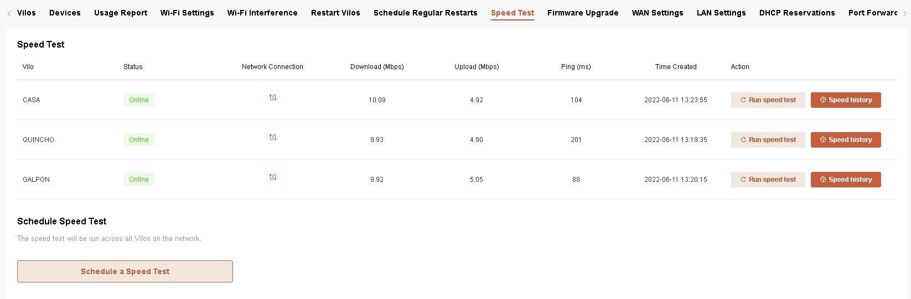
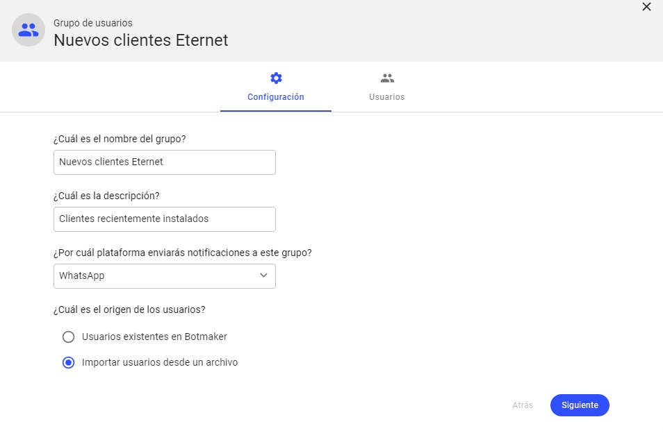

# 🧾 Proceso para facturar parcialmente un remito

---

## 📍 Acceso al sistema

Dentro del sistema ingresar a:

- **1 - Artículos**
- **2 - Listado de Envios Pendientes de Facturación**

---

## 📋 Pantalla principal

Se visualizará la siguiente pantalla:

---

## 🔎 Visualización de pendientes

Desde esta pantalla se puede:

- Ver todos los envíos pendientes de facturación
- Filtrar por distintos campos disponibles

---

## 🔢 Facturación parcial

### 📌 Campo: Cantidad a facturar

- Tildar las líneas que se desean facturar
- Ingresar la **cantidad parcial** de artículos a facturar

---

## ⚙️ Generar factura

- Hacer clic en **“Acciones”**
- Seleccionar la opción:
  - **“Facturar items y cantidades seleccionadas”**

---

## 🧾 Finalización del proceso

Luego de esto, seguir el mismo procedimiento que:

👉 [Facturar un Remito Seleccionado](https://github.com/AbutMatias/Manual-Operativo-Atencion-al-Cliente/blob/main/doc/Facturar%20Remito%20Seleccionado.md)

---

## ⚠️ Resultado

- Se genera una factura parcial del remito
- Las cantidades restantes quedan pendientes de facturación
