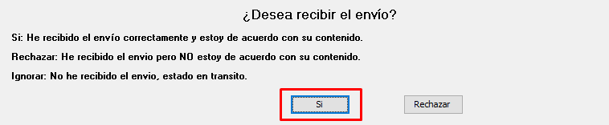
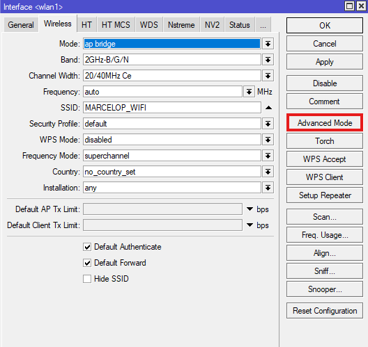
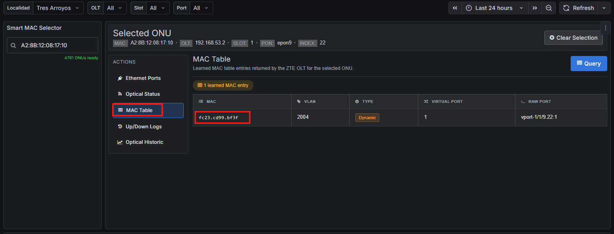
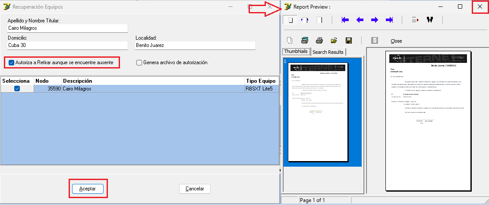
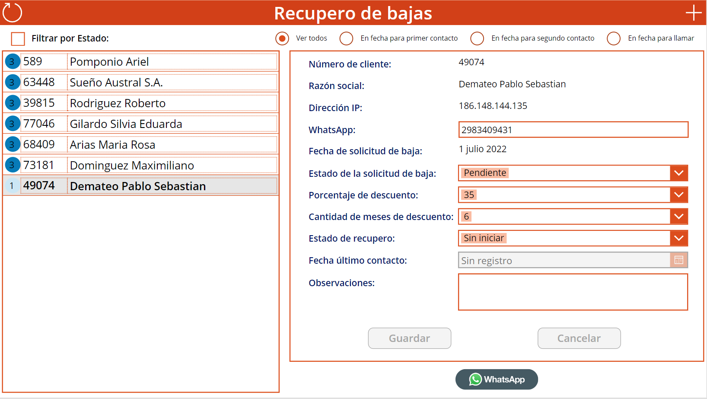
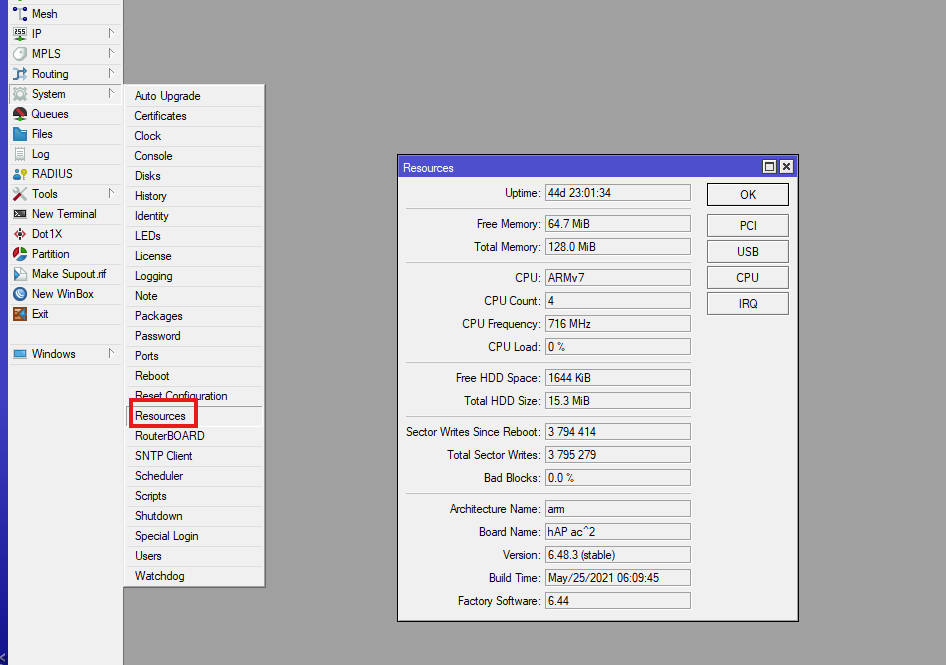
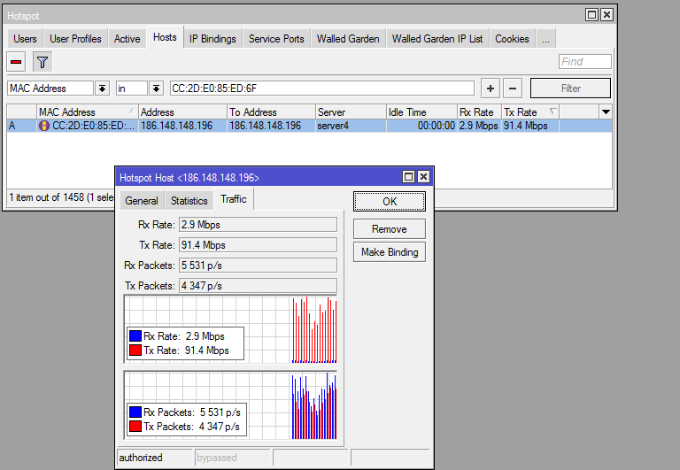
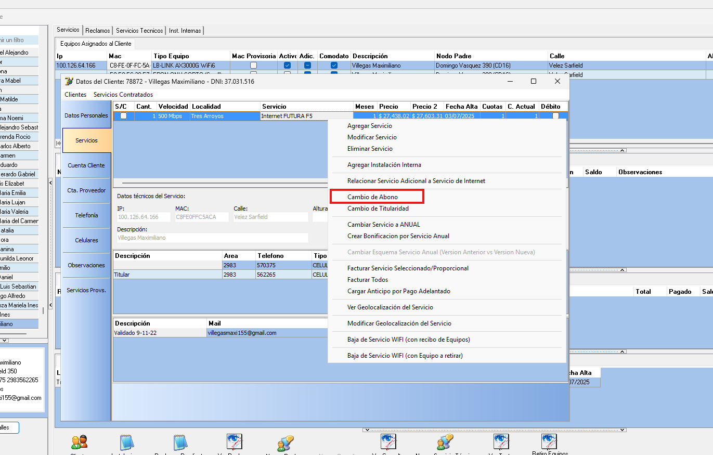
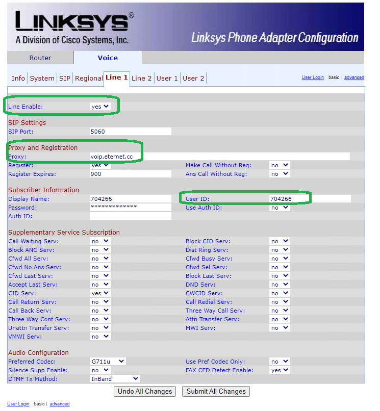
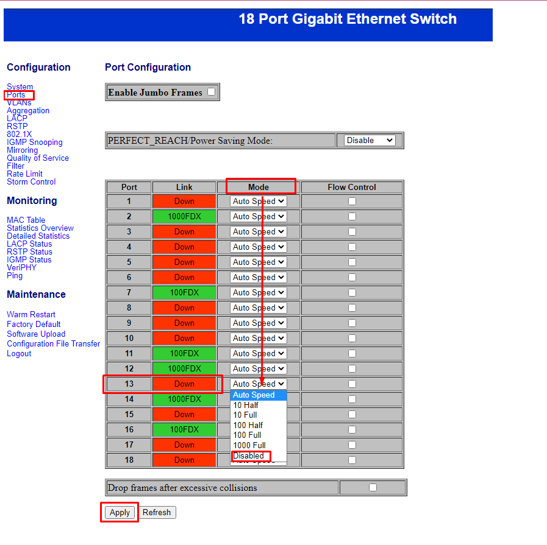

# Características generales

## Conectividad

- 1 Puerto **WAN** 10/100/1000 Mbps
- 3 Puertos **LAN** 10/100/1000 Mbps

## Dirección IP de fábrica

- `192.168.1.254`

---

# 1. Configuración inicial

> [!NOTE]
> Para ingresar al router, la computadora debe estar conectada por cable y cumplir una de estas condiciones:
>
> - Tener una IP del rango `192.168.1.x`.
> - Estar configurada en **DHCP**, para que el router asigne una IP automáticamente.

## Paso 1. Ingresar al router

1. Abrir un navegador.
2. Ingresar a:

```
http://192.168.1.254
```

3. Se abrirá el asistente de configuración inicial.




<!-- Captura del asistente inicial -->

---

## Paso 2. Configurar el acceso a Internet

Completar los siguientes campos:

- **Internet Access:** `DHCP`
- **Time Zone:** `GMT-03`

Luego seleccionar **Next**.




<!-- Configuración Broadband Access -->

---

## Paso 3. Configurar una contraseña temporal

Crear una contraseña para continuar con la configuración.

Se recomienda utilizar temporalmente:

```
12345678
```

en el campo **Wireless Password**.

Esperar aproximadamente **15 segundos** hasta que el equipo guarde la configuración.




<!-- Configuración inicial WiFi -->




<!-- Pantalla de guardado -->

---

## Paso 4. Iniciar sesión

Una vez finalizado el asistente, ingresar nuevamente.

**Dirección**

```
http://192.168.1.254
```

**Usuario**

```
useradmin
```

**Contraseña**

La creada en el paso anterior.




<!-- Pantalla de inicio de sesión -->

---

# 2. Importar la configuración

## Paso 1

Descargar el archivo de configuración:  

[**GLC_Apolo-WiFi6.gz**](https://eternet.sharepoint.com/:u:/s/ServicioTecnico/IQC_P2XWGuKnT5HznQSYsTvsAc2kny1TlMMVEYBX-JKdaCI?e=1CqVpL)

---

## Paso 2

Ingresar a:

**Tools → Parameter Backup**



<!-- Menú Parameter Backup -->

---

## Paso 3

En **Restore Parameter** seleccionar el archivo:

```
GLC_Apolo-WiFi6.gz
```

Luego hacer clic en **Restore**.




<!-- Restaurar configuración -->

---

# 3. Ingresar nuevamente

Después de restaurar la configuración, ingresar utilizando:

```
http://192.168.1.1
```

### Usuario

```
useradmin
```

### Contraseña

```
Etnrouter2022
```




<!-- Login luego de importar configuración -->

---

# 4. Configurar la red Wi-Fi

Modificar:

- Nombre de la red (SSID).
- Contraseña Wi-Fi.

Verificar que ambas bandas Wi-Fi utilicen la misma configuración.




<!-- Configuración WiFi -->




<!-- Configuración SSID -->

---

# 5. Verificar funcionamiento

Comprobar:

- Navegación por Internet.
- Funcionamiento de la red Wi-Fi.
- Conexión desde un dispositivo.

---

# 6. Acceso remoto

Para acceder remotamente al router utilizar:

**Dirección**

```
http://IP_DEL_CLIENTE:5580/
```

**Usuario**

```
useradmin
```

**Contraseña**

```
Etnrouter2022
```

> **Ejemplo**
>
> ```
> http://181.224.123.123:5580/
> ```

> [!NOTE]
> Reemplazar **IP_DEL_CLIENTE** por la IP pública del cliente.

---

# Credenciales finales

| Parámetro | Valor |
|-----------|-------|
| IP local | `192.168.1.1` |
| Acceso remoto | `http://IP_DEL_CLIENTE:5580/` |
| Usuario | `useradmin` |
| Contraseña | `Etnrouter2022` |
`http://181.224.123.123:5580`
