# Diagnóstico de equipos LB-Link

---

## 1. Identificación del equipo

Para identificar el equipo en sistema:

- Se ingresa al router colocando la IP del router en el explorador con el puerto **:5580**. En caso de Eternet Plus **:5581**
- Contraseña **Etnrouter2022**

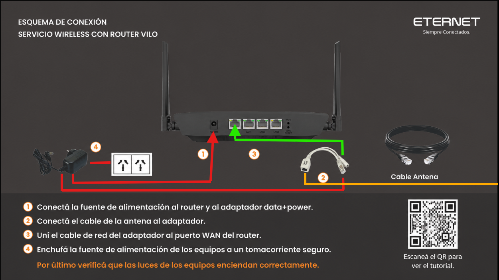

---
## 2. Indicadores de luces

Las luces del equipo indican su estado.

### Estado general:

- 🔵 Azul fija:
  - Equipo funcionando correctamente con internet

- 🔴 Rojo:
  - Problema de conexión o inicio del sistema
 
## Dispositivos conectados

Permite ver:

- Name/Nombre del dispositivo
- Online Time: Tiempo conectado a la red.
- Tipo de conexión (2.4G Device / 5G Device/ Wired Device): Lista de dispositivos conectados a cada red. En caso de Wired Device, seria cableado al router.
- IP y MAC de cada dispositivo conectado
- Recepcion y Transmicion de cada dispositivo

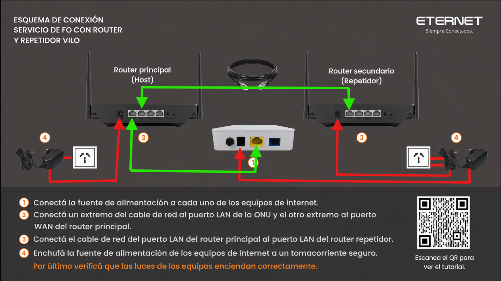

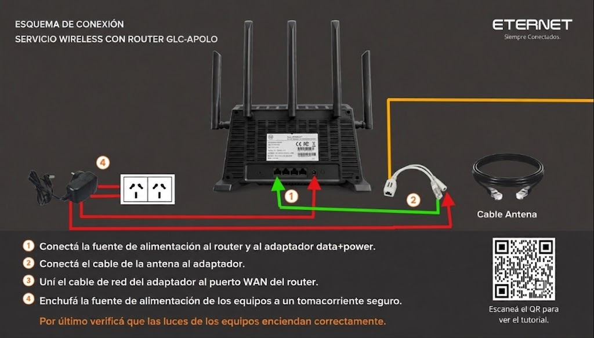

---

## WiFi Settings

Aquí tienes el detalle de lo que puedes gestionar en esta pantalla:

- Dual Switch y Switch: Son interruptores para activar o desactivar las bandas o funciones inalámbricas del router.

- WiFi Name (SSID): Es el nombre de tu red que aparecerá cuando busques Wi-Fi desde tus dispositivos. Actualmente está configurado como Eternet_PANALERA.

- Hide WiFi name from being discovered: Si marcas esta casilla, tu red se volverá "oculta" (no aparecerá automáticamente en las listas de Wi-Fi de tus dispositivos; tendrás que escribir el nombre manualmente para conectarte).

- Encryption: Muestra el método de seguridad actual, que es WPA-PSK/WPA2-PSK. Este es un estándar de seguridad recomendado para proteger tu red con contraseña.

- WiFi Password: Aquí puedes ver o cambiar la contraseña para conectarte a tu Wi-Fi. Actualmente es 00429572461.

- Signal: Probablemente ajuste la potencia de transmisión o el modo de alcance. Actualmente está configurado en Wall (generalmente pensado para atravesar paredes).

Nota importante: Si realizas algún cambio en el nombre (WiFi Name) o en la contraseña, deberás presionar el botón Apply para guardar. Ten en cuenta que, al hacer esto, todos los dispositivos que estén conectados actualmente se desconectarán y tendrás que volver a conectarlos usando los nuevos datos.

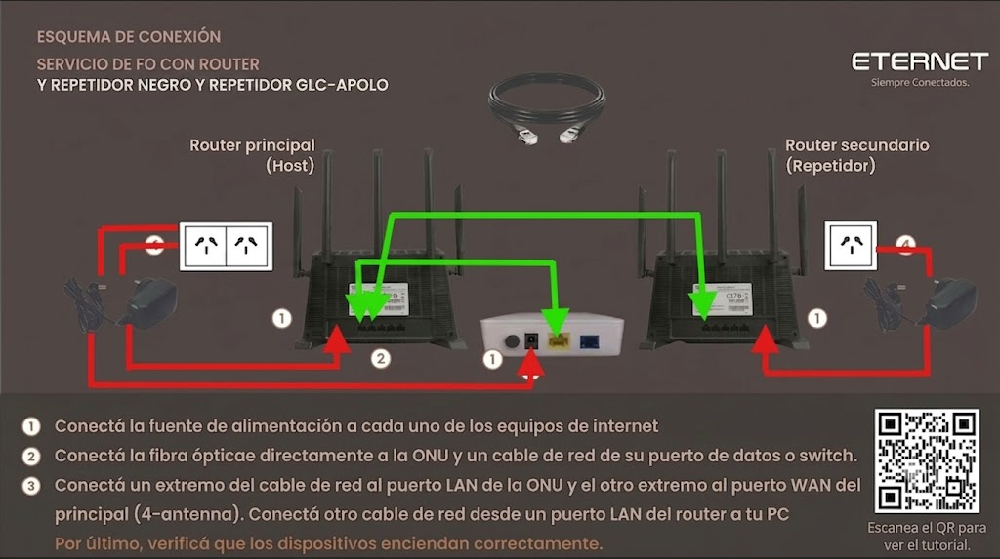

---

## Prueba de velocidad interna

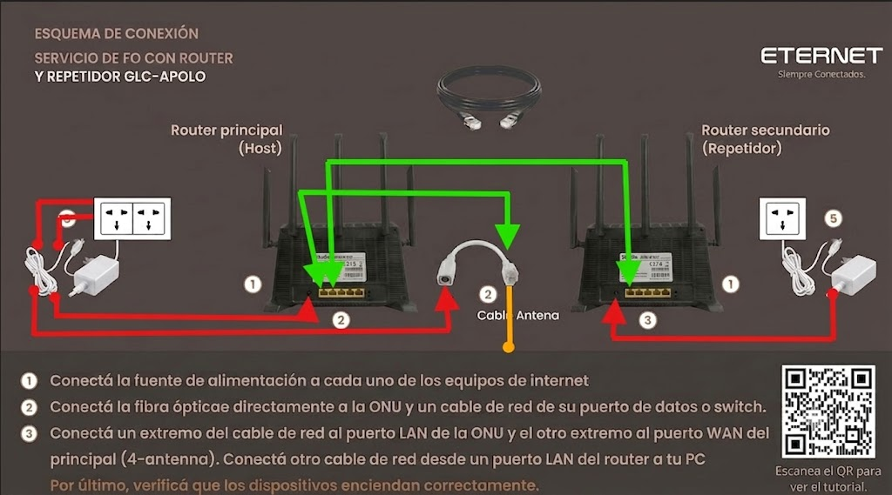
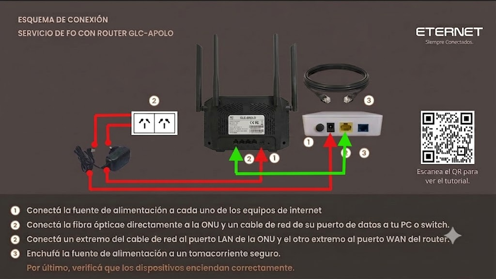

### Consideraciones:

- Es una prueba de referencia interna
- No siempre refleja resultados reales externos

### Importante:

- No se puede garantizar velocidad máxima por WiFi
- La velocidad depende de:
  - Dispositivo
  - Distancia
  - Interferencia
  - Estado del enlace

---

## Redes WiFi

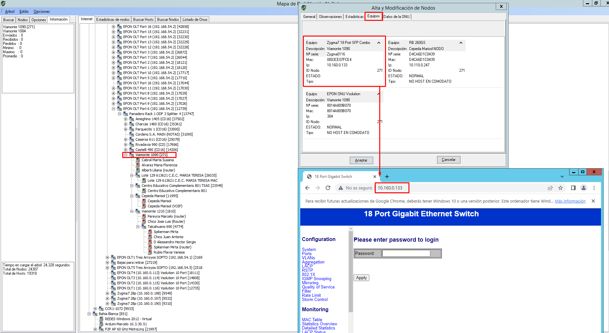

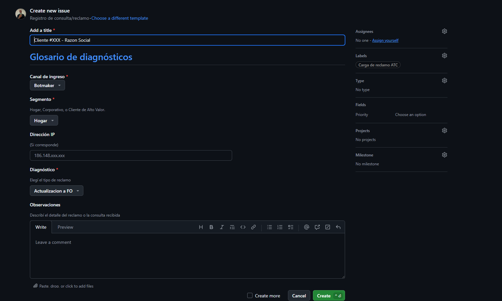

### Característica principal:

- El cliente ve un solo SSID
- El sistema maneja roaming automático

### Funcionamiento:

- Cambia entre 2.4 GHz y 5 GHz automáticamente
- Depende de señal y calidad del enlace

---

## Canales WiFi

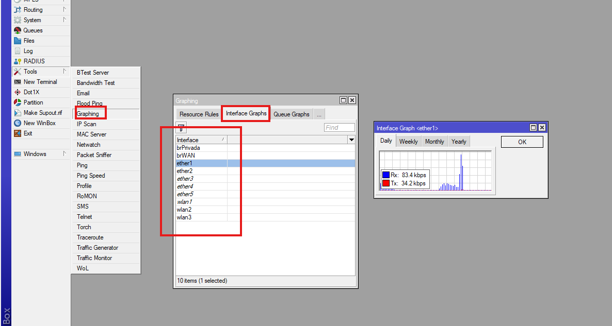

### 2.4 GHz:

- Canales recomendados:
  - 1
  - 6
  - 11

### 5 GHz:

- Canales recomendados:
  - 36
  - 40
  - 44
  - 48

### Nota:

- El equipo optimiza canales automáticamente
- No siempre el cambio manual mejora el rendimiento. En caso de no ser necesario, **recomendable dejar en Automatico**

---

## Modo Wi-Fi (Wireless Mode)

Permite seleccionar el estándar Wi-Fi que utilizará el router en las bandas de **2.4 GHz** y **5.8 GHz**. La configuración elegida influye en la compatibilidad de los dispositivos y el rendimiento de la red.

## Banda 2.4 GHz

### AX

Utiliza únicamente el estándar **Wi-Fi 6 (802.11ax)**.

**Se recomienda cuando:**
- Todos los dispositivos son compatibles con Wi-Fi 6.
- Se busca el mejor rendimiento y estabilidad.

### B/G/GN

Modo de compatibilidad que permite conectar dispositivos con los estándares:

- **B (802.11b):** equipos muy antiguos.
- **G (802.11g):** equipos antiguos.
- **N (802.11n / Wi-Fi 4):** equipos de generaciones más recientes.

**Se recomienda cuando:**
- Algún dispositivo no puede conectarse utilizando el modo **AX**.
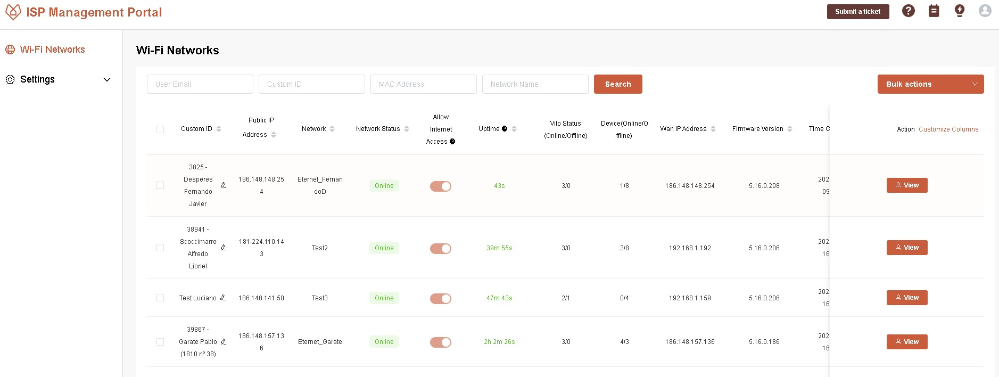

## Banda 5.8 GHz

### AX

Utiliza únicamente el estándar **Wi-Fi 6 (802.11ax)**.

**Se recomienda cuando:**
- Todos los dispositivos son compatibles con Wi-Fi 6.
- Se busca el máximo rendimiento.

### A/AC/AN Mixed

Modo de compatibilidad que permite conectar dispositivos con los estándares:

- **A (802.11a):** equipos antiguos de 5 GHz.
- **AN (802.11n / Wi-Fi 4):** amplia compatibilidad.
- **AC (802.11ac / Wi-Fi 5):** mayor velocidad y rendimiento.

**Se recomienda cuando:**
- Algún dispositivo no es compatible con Wi-Fi 6 o presenta inconvenientes para conectarse.

## Recomendación

- Mantener **AX** en ambas bandas siempre que sea posible.
- Cambiar a **B/G/GN** o **A/AC/AN Mixed** únicamente si existen problemas de compatibilidad con algún dispositivo.

> **Importante:** Los modos de compatibilidad no aumentan la velocidad ni el alcance del Wi-Fi. Su única función es permitir la conexión de dispositivos más antiguos.

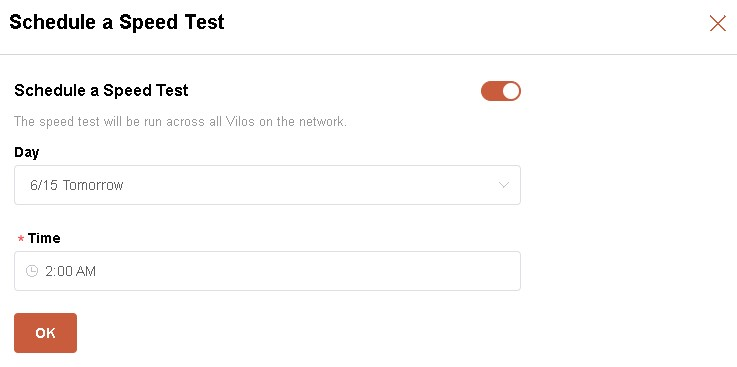

---

## Reinicio del equipo

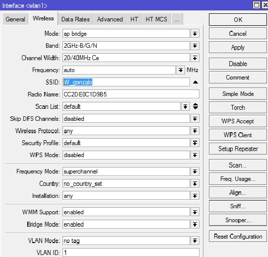

- Se realiza desde el menú “System Settings”
- Seleccionar **Reboot**
- Confirmar acción

---

## Reset de fábrica

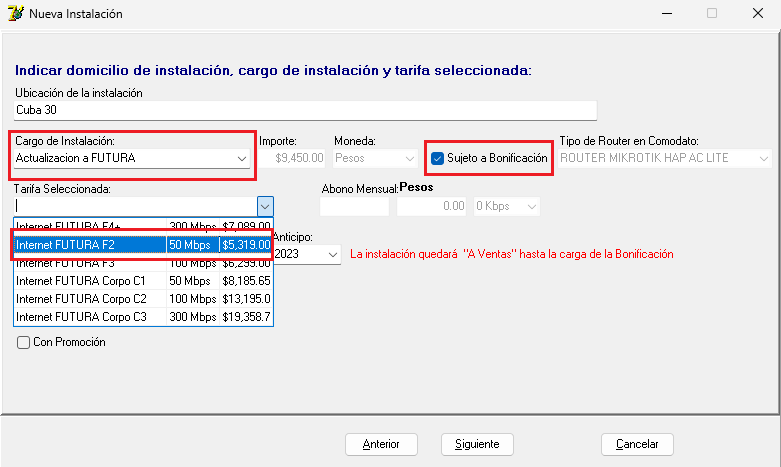

### IMPORTANTE:

- El botón de **Restore** borra toda la configuración
- **Solo usar si es estrictamente necesario**

---

## Schedule Regular Restarts
- Permite programar reinicios automáticos

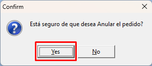

---
## Admin Password

- Permite cambiar la contraseña maestra del router
- Se utiliza en momentos que se reinicia de fabrica el router y debemos reestablecer la contraseña

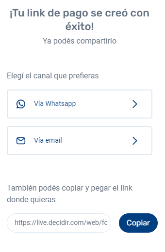
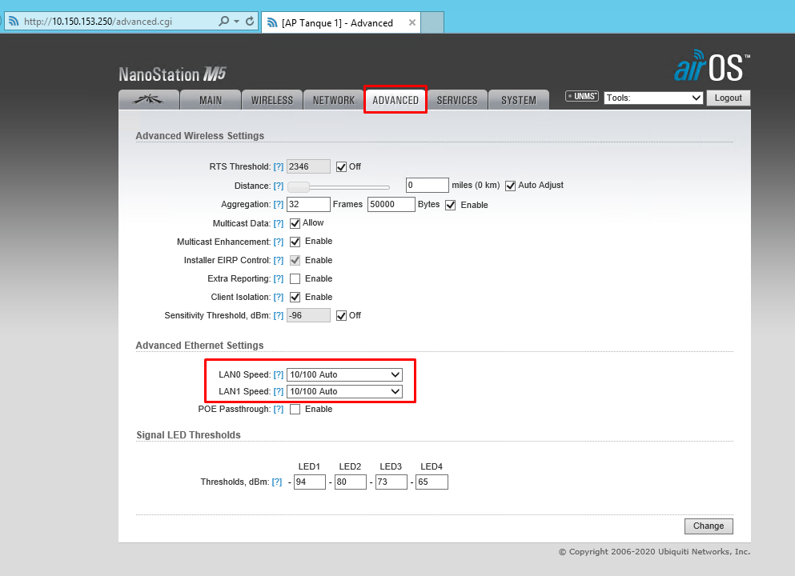

---

## WAN Settings
- Configuración del internet principal

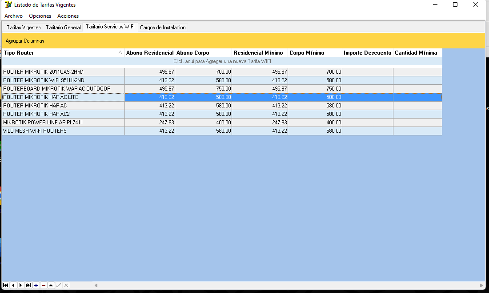

---
## Configuración LAN (LAN Settings)

Permite configurar la red local (LAN) del router y el servicio **DHCP**, encargado de asignar direcciones IP automáticamente a los dispositivos conectados.

### DHCP

Habilita o deshabilita la asignación automática de direcciones IP.

- **Enable:** El router asigna una dirección IP automáticamente a cada dispositivo que se conecta. *(Recomendado).*
- **Disable:** Las direcciones IP deben configurarse manualmente en cada dispositivo.

### LAN IP

Define la dirección IP del router dentro de la red local.

**Valor por defecto:** `192.168.1.1`

Los dispositivos utilizarán esta dirección como puerta de enlace para acceder a Internet y administrar el router.

### Netmask

Define el tamaño de la red local.

**Valor por defecto:** `255.255.255.0`

Se recomienda mantener este valor salvo que exista una necesidad específica de modificarlo.

### Start IP

Primera dirección IP que el servidor DHCP puede asignar automáticamente.

**Ejemplo:** `192.168.1.100`

### End IP

Última dirección IP que el servidor DHCP puede asignar automáticamente.

**Ejemplo:** `192.168.1.200`

En este ejemplo, el router podrá asignar direcciones desde **192.168.1.100** hasta **192.168.1.200**.

## Recomendación

- Mantener **DHCP habilitado (Enable)**.
- No modificar la **LAN IP** ni la **Netmask**, salvo que sea necesario por cambios en la red.
- Ajustar el rango **Start IP** y **End IP** únicamente si se requiere reservar direcciones IP para otros equipos o dispositivos con IP fija.

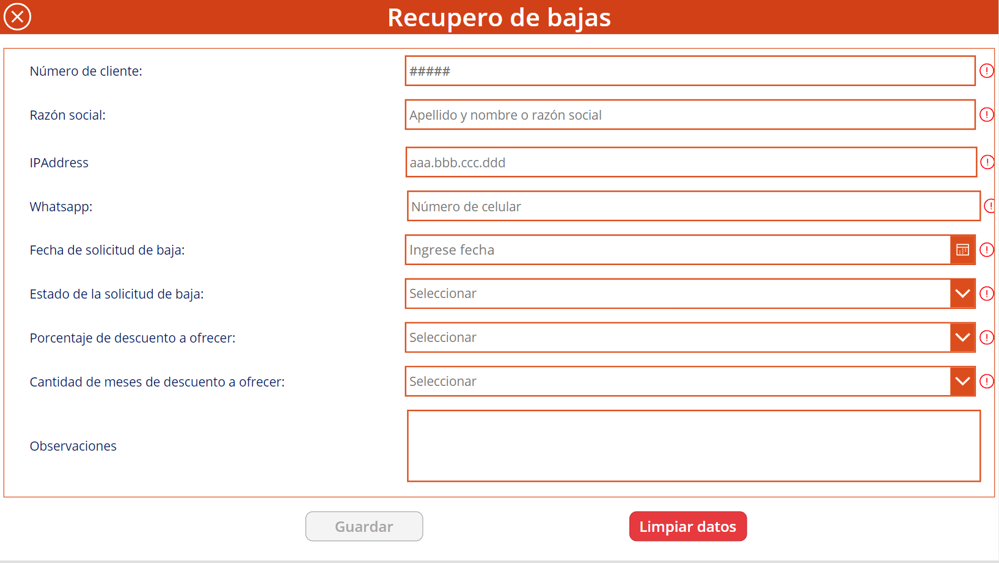

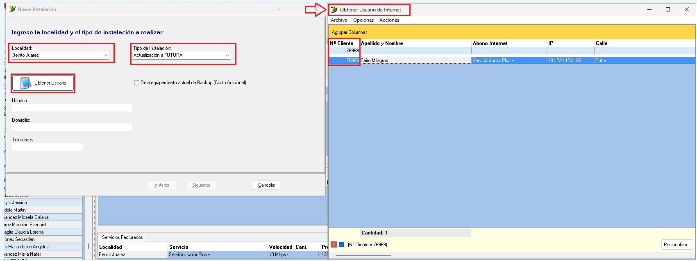

---
## Mesh

La función en esta pantalla te permite configurar el dispositivo dentro de una red de malla (Mesh).

- Al cambiar la opción en el menú desplegable "Role" (Rol), generalmente puedes definir cómo se comportará el dispositivo en tu red inalámbrica:

- Disable (Desactivado): Es la configuración actual; el dispositivo funciona como un punto de acceso independiente o router estándar sin interactuar con otros dispositivos en una red de malla.

- Otras opciones (usualmente disponibles): Si despliegas el menú, podrías encontrar roles como "Controller" (Controlador) o "Agent/Satellite" (Agente/Satélite).

- Controller: Actúa como el nodo principal que gestiona la red de malla.

- Agent/Satellite: Actúa como un nodo adicional que extiende la cobertura de la red recibiendo la señal del controlador.

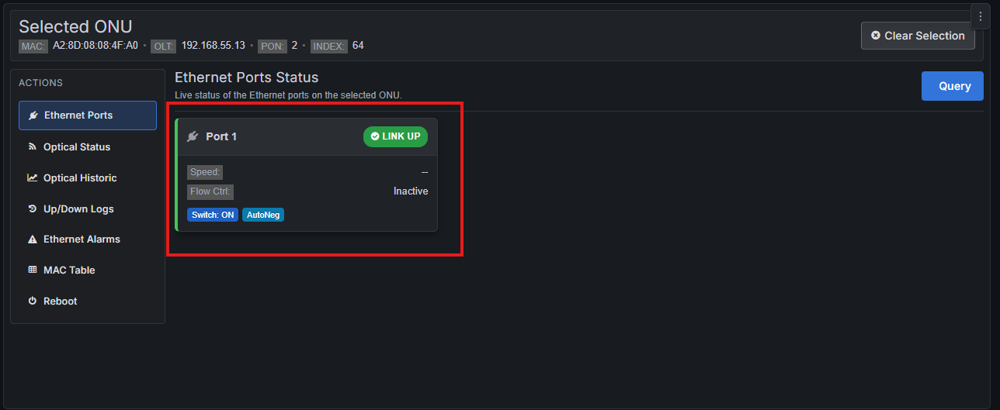
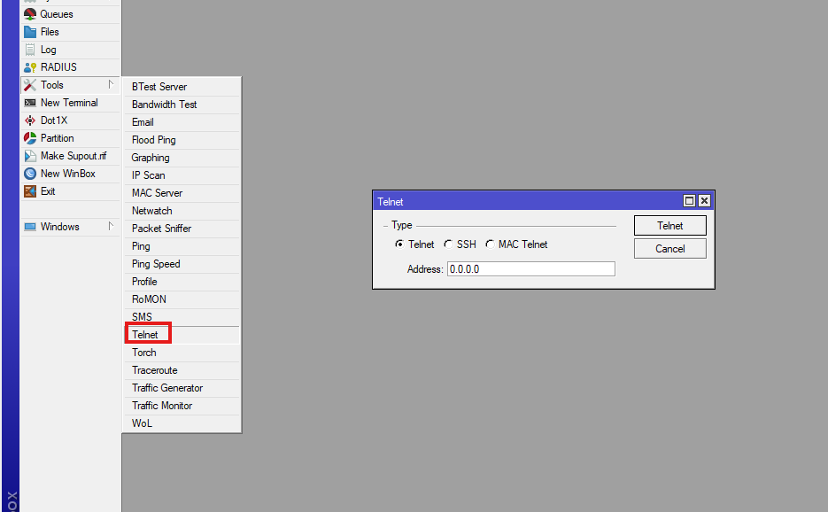

---
## Port Forwarding (Redirección de puertos)

La redirección de puertos se utiliza para permitir que dispositivos o servicios de tu red local (como servidores web, consolas de juegos o cámaras de seguridad) sean accesibles desde Internet.

- Aquí tienes una explicación de las opciones disponibles:

- Add Manually (Agregar manualmente): Te permite configurar una regla de redirección de puertos introduciendo tú mismo los detalles, como el puerto externo, el puerto interno y la dirección IP del dispositivo local al que deseas dirigir el tráfico.

- Automatically Added (Agregado automáticamente): Esta opción generalmente muestra reglas creadas automáticamente por aplicaciones o dispositivos que utilizan protocolos como UPnP (Universal Plug and Play) para abrir puertos sin intervención manual.

- Tabla de datos: Actualmente indica "No Data", lo que significa que no hay reglas de redirección configuradas en este momento.

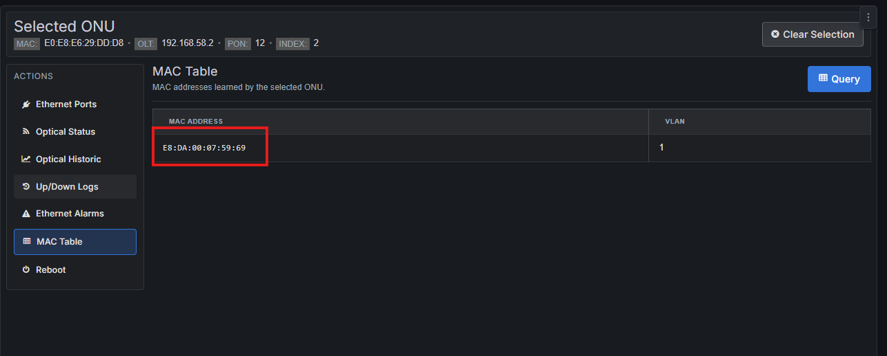
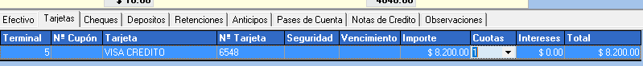

