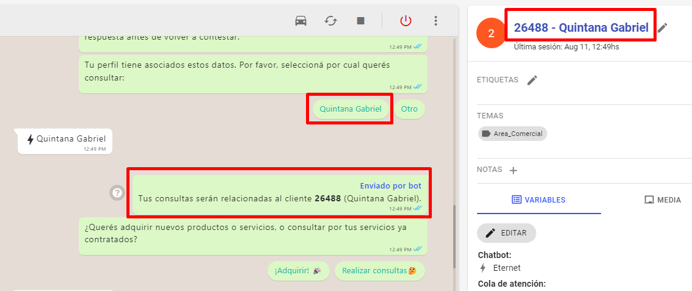
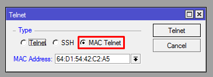
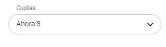
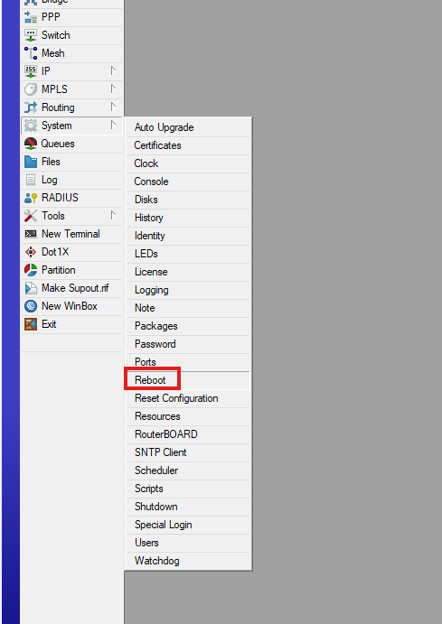
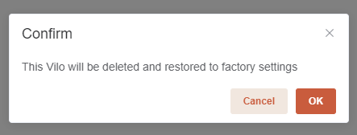
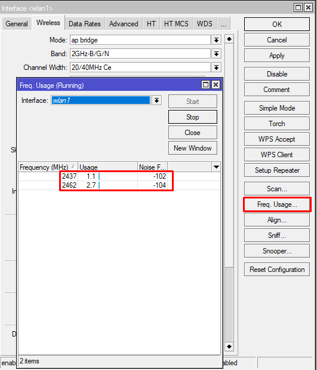
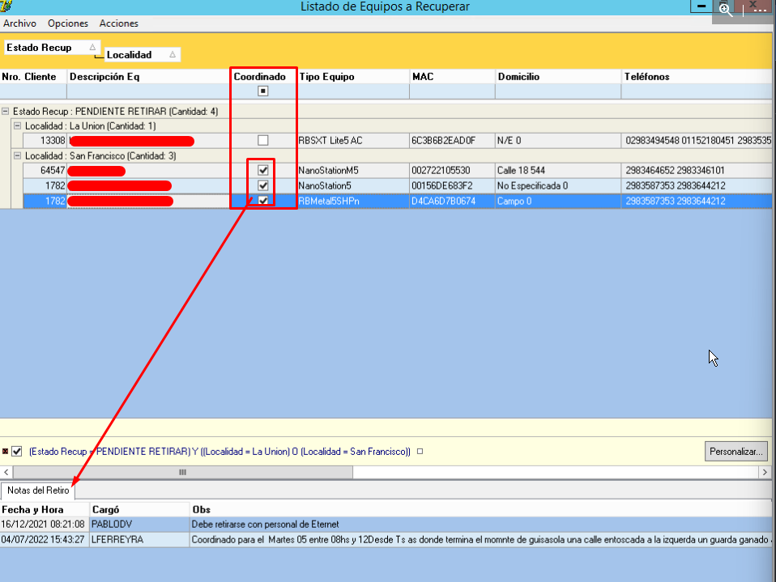
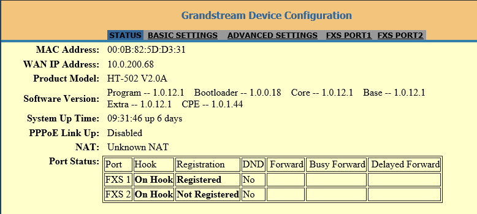
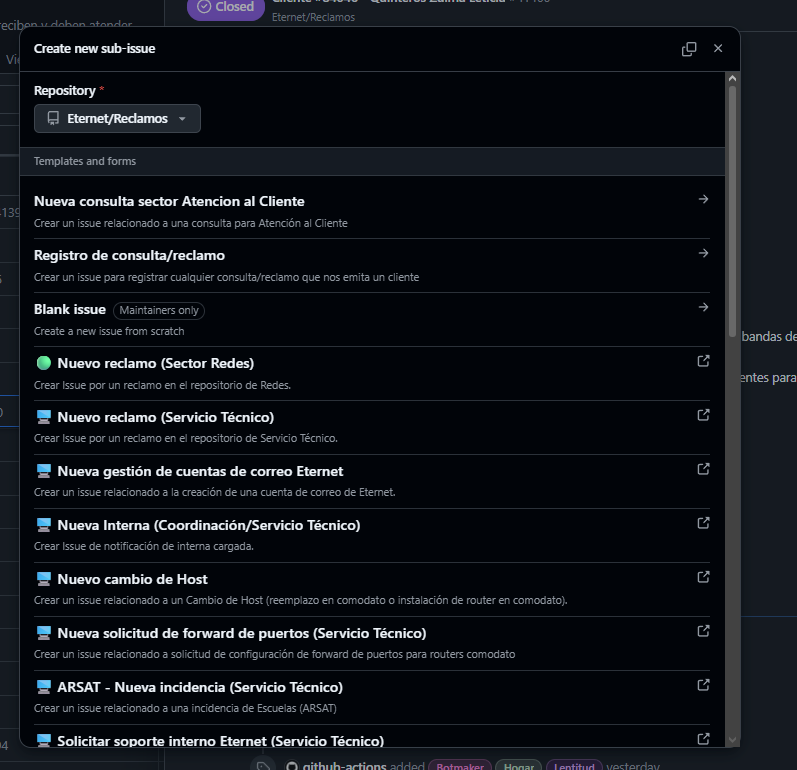
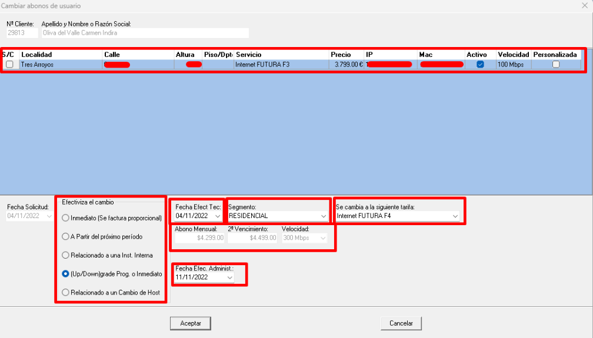

# Diagnóstico - ONU con mala señal

## Objetivo

Determinar si la falla corresponde realmente a una mala señal óptica antes de derivar el caso.

---

# Paso 1. Ingresar a la OLT

1. Ingresar a **Grafana**.
2. Abrir la carpeta **OLTs**.
3. Seleccionar la **OLT** correspondiente a la zona del cliente. (**ZTE**: Tres Arroyos. **SOPTO**: Bahia Blanca, Balcarce, Benito Juarez, Cascallares, Chaves, Claromeco, Indio Rico, Orense, Reta y San Cayetano)
4. Obtener la **MAC de la ONU** desde SSKA.
5. Ingresar la MAC en el buscador.
6. Presionar **QUERY**.
> 
> 

---

# Paso 2. Verificar que la ONU sea la correcta

Comprobar:

- La MAC corresponde al cliente.
- La ONU está registrada.
- El estado de la ONU es el esperado.

Si la ONU no está registrada, continuar con el procedimiento correspondiente y no con este diagnóstico.
Si la ONU esta registrada en Grafana figurara luego de buscarla. Como en la siguente imagen.
> 

---

# Paso 3. Revisar la señal óptica actual

Consultar los valores actuales de la ONU.

Verificar:

- RX
- TX

Comprobar si los valores se encuentran dentro de los rangos normales.

Registrar los valores obtenidos.
En el ejemplo, se verifica una señal extremadamente baja. En la mayoría de las redes GPON, una ONU deja de funcionar correctamente alrededor de -27 a -28 dBm.
> 

---

# Paso 4. Revisar el historial de señal

Abrir el gráfico de señales históricas.

Verificar:

- Si la señal se mantiene estable.
- Si presenta caídas frecuentes.
- Si empeoró con el tiempo.
- Si las caídas coinciden con el horario informado por el cliente.

Siempre comparar la señal actual con el historial antes de diagnosticar una mala señal.

En el ejemplo, se verifica flapeos en la señal optica:
> 

---

# Paso 5. Revisar el historial de eventos

Consultar los eventos registrados por la ONU.

Verificar:

- Fecha y hora de las desconexiones.
- Cantidad de eventos.
- Si las desconexiones coinciden con cambios en la señal.

Registrar los resultados.

En el ejemplo, se verifica flapeos en la señal optica:
> 

---

# Paso 6. Identificar el tipo de evento

## Evento LOSI

Indica pérdida de señal óptica.

Puede deberse a:

- Problema en la fibra.
- Conector desconectado.
- Falta de señal óptica.

Si existen eventos LOSI, registrar:

- Fecha y hora.
- Cantidad de eventos.
- Estado actual de la señal.

> 

---

## Evento Dying Gasp

Indica que la ONU perdió alimentación o se reinició.

Puede deberse a:

- Corte de luz.
- Fuente desconectada.
- Reinicio del equipo.

Este evento **no significa necesariamente** que exista una mala señal óptica.

Consultar al cliente si sufrió cortes de energía antes de continuar.

> 

---

# Paso 7. Revisar el puerto Ethernet

Verificar el estado del puerto Ethernet de la ONU.

Comprobar:

- Si el puerto tiene enlace.
- Si aparecen alarmas de conexión o desconexión.

Si la señal óptica es correcta pero el puerto Ethernet presenta problemas, continuar con el procedimiento correspondiente a red interna o router.

> 

---

# Paso 8. Revisar la tabla MAC

Abrir la tabla MAC de la ONU.

Verificar que aparezca la MAC del router del cliente.

Si no aparece y la señal óptica es correcta, la falla probablemente no sea de señal.
> 
> 

---

# Paso 9. Confirmar el diagnóstico

Considerar **ONU con mala señal** cuando se observe alguno de estos casos:

- RX o TX fuera de los valores normales.
- Señal inestable.
- Variaciones frecuentes en el historial.
- Eventos LOSI recurrentes.
- Desconexiones relacionadas con cambios en la señal.
- Comparación con otro cliente de la misma CD.

Si el problema corresponde a alimentación, router, cableado interno o Ethernet, utilizar el procedimiento correspondiente.

---

# Paso 10. Registrar la información

Antes de derivar, registrar:

- MAC de la ONU.
- OLT consultada.
- Estado de la ONU.
- Valores de RX y TX.
- Resultado del historial de señal.
- Eventos encontrados.
- Estado del puerto Ethernet.
- Resultado de la tabla MAC.
- Motivo de la derivación.

---

# Resumen rápido

1. Ingresar a Grafana y abrir la OLT.
2. Buscar la ONU por MAC.
3. Verificar que esté registrada.
4. Revisar RX y TX.
5. Comparar la señal con el historial.
6. Revisar los eventos.
7. Diferenciar LOSI de Dying Gasp.
8. Verificar Ethernet y tabla MAC.
9. Confirmar si realmente es una mala señal.
10. Registrar toda la información antes de derivar.
