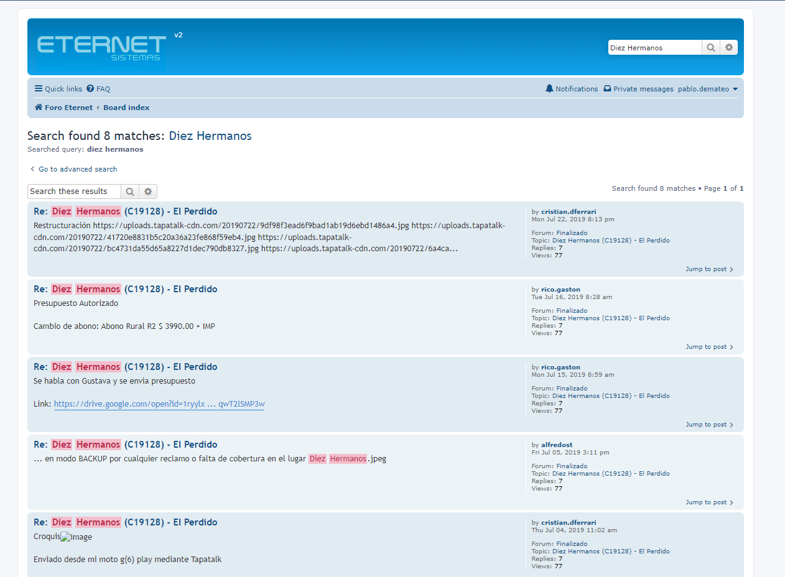
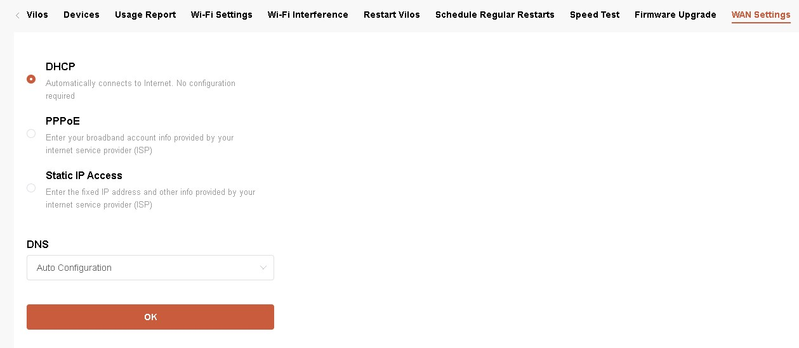
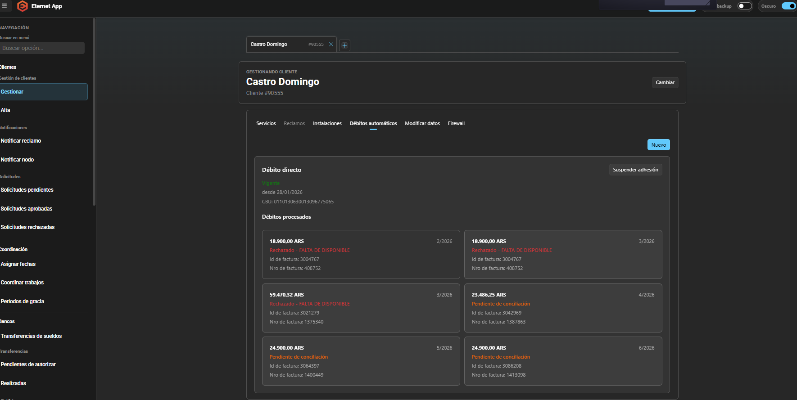
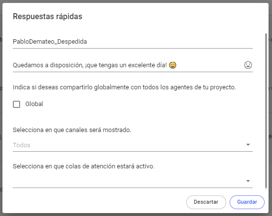
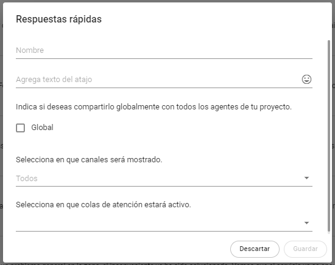
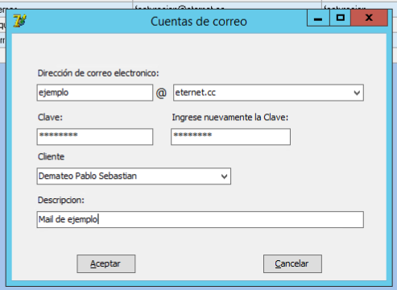
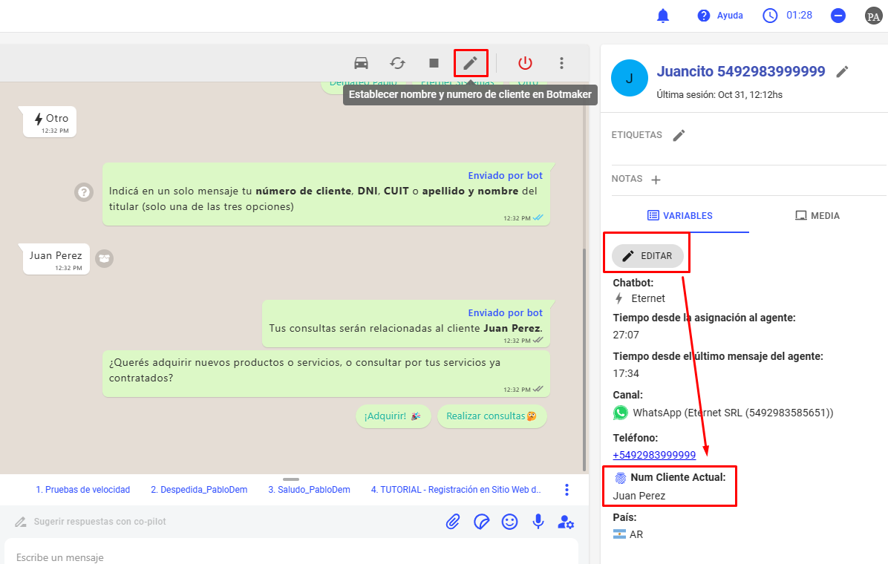

# 📦 Proceso para crear un remito de pase de stock a cliente

---

## 🔄 Proceso inicial

El procedimiento es el mismo que el de:

👉 [Pases de Stock en Sitios](https://github.com/AbutMatias/Manual-Operativo-Atencion-al-Cliente/blob/main/doc/Pases%20de%20Stock%20en%20Sitios.md)

---

## 📋 Vinculación de equipos

- Se vinculan los equipos al pase de stock
- Se accede a la pantalla de **“Pases de Stock”**

---

## 📍 Configuración del destino

Se completan los campos como en el proceso estándar, con la diferencia de que:

### 🧭 Sitio destino

- Se selecciona: **“Remitos a Clientes”**

---

## ▶️ Generación del remito

- Aparece el botón de generación del remito

---

## 👤 Selección de cliente

- Hacer clic en el botón correspondiente
- Seleccionar el cliente destinatario

---

## 📄 Datos del cliente

Se abre la siguiente pantalla:

---

## 🧩 Campos a completar

- **📍 Domicilio**
  - Ingresar domicilio del cliente

- **🏙️ Localidad**
  - Ingresar localidad correspondiente

- **👤 Recibe**
  - Nombre completo del representante que recibe el material

---

## ✅ Confirmación

- Hacer clic en **“Aceptar”**

---

## 📊 Verificación de datos

- Los datos del cliente quedan visibles en la parte derecha del pase de stock

---

## ✔️ Finalización del proceso

- Hacer clic en **“Aceptar”** en la pantalla de Pase de Stock

---

## ⚠️ Confirmación final

Aparece una pregunta de confirmación:

---

## 🎯 Resultado

- Seleccionar la opción correspondiente según el caso
- El remito queda generado

---

## 🧾 Nota importante

- El proceso de facturación del remito se realiza posteriormente
- Ver: **“Facturar un remito seleccionado”**
