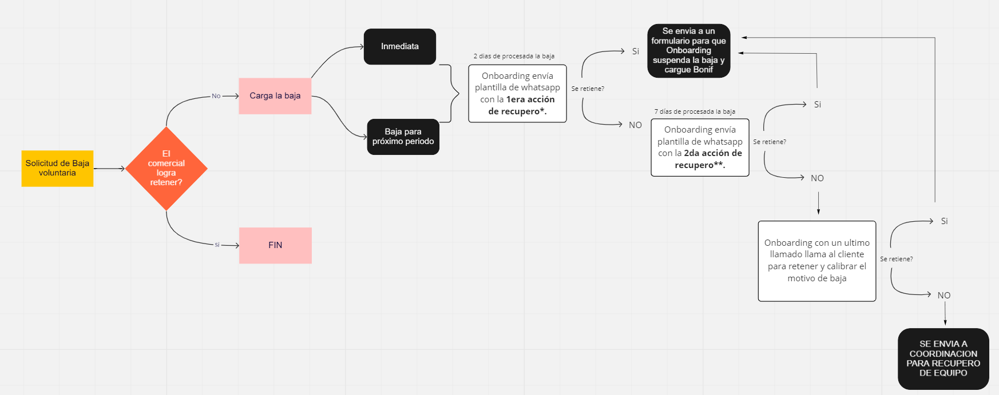
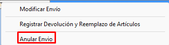
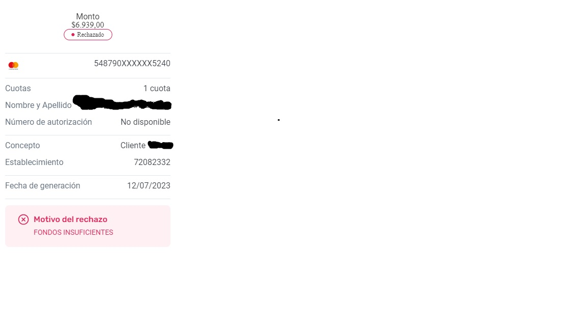
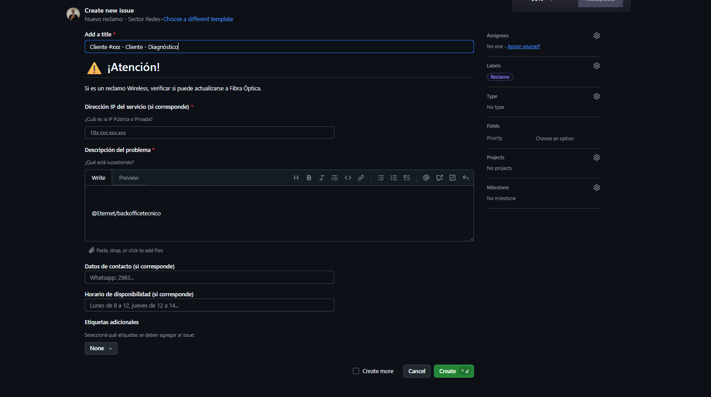
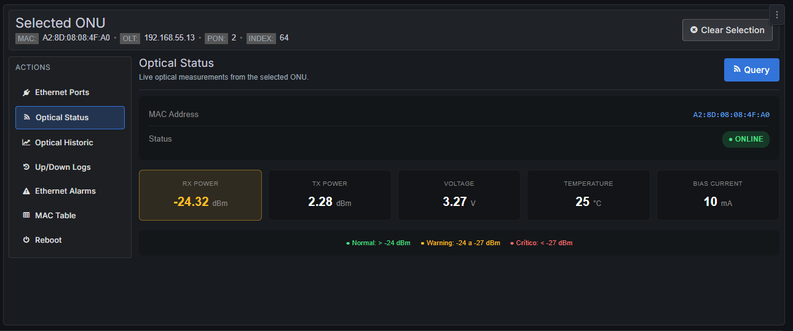
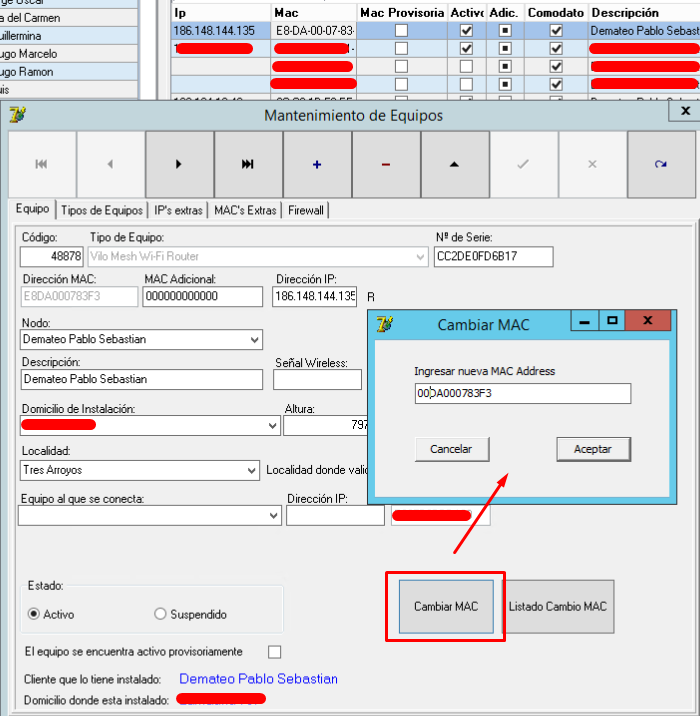
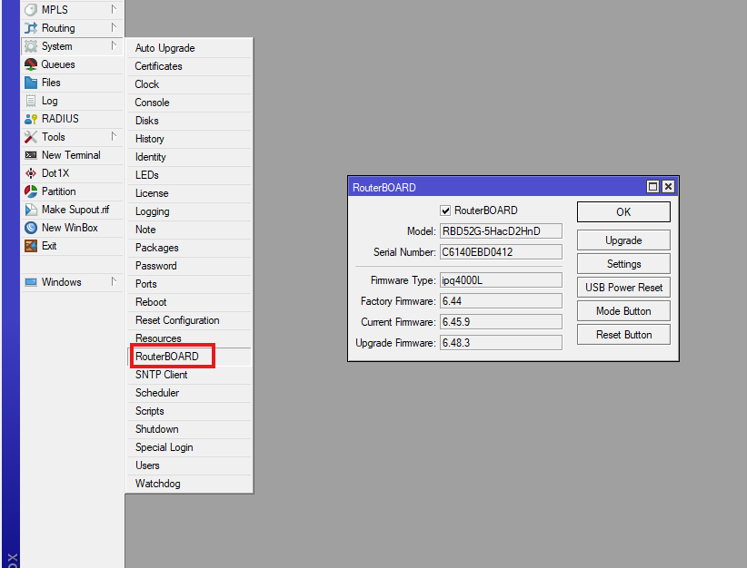
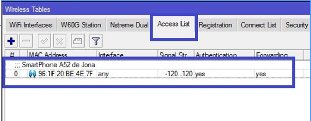

# 📦 Realizar Pases de Stock

---

## 🧭 Acceso al sistema

Dentro del sistema ingresar a:

- **1 - Artículos**
- **2 - Crear Remito o Pase de Stock**

---

## 📋 Pantalla inicial

Se visualizará la siguiente ventana:

---

## 🔢 Carga de MAC / Serie

### 📌 Campo: MAC/SERIE

- Ingresar las **MAC o números de serie** de los artículos a transferir

---

### ✔️ Ejemplo de carga correcta

---

## ▶️ Generar pase

- Hacer clic en **“Hacer Pase de Stock”**

---

## 📄 Configuración del pase

Se abre la siguiente ventana:

---

## 🧩 Campos a completar

---

### 📅 Fecha límite

- Plazo máximo para aceptación del envío
- Si no se acepta en término:
  - Los artículos vuelven al origen

---

### 🏢 Sitio destino

- Lugar al que se envía el stock

---

### 📦 Almacén destino

- Se selecciona si el sitio tiene múltiples almacenes

---

### 🚚 Transporte

- Medio por el cual se envía el stock

---

### 📝 Observaciones

- Información adicional del envío

---

## ✔️ Ejemplo completo

---

## ➕ Agregar artículos no individualizados

Si es necesario, se pueden agregar artículos sin MAC:

- Seleccionar almacén
- Elegir artículo
- Definir cantidad
- Click en **Agregar**

---

## 📊 Verificación

- Revisar en **Detalle de artículos seleccionados**

---

## ✅ Finalizar pase

- Hacer clic en **Aceptar**

---

## ⚠️ Confirmación

- Aparecerá mensaje de confirmación:

- Clic en **Aceptar**

---

## 📦 Resultado

- Se genera el remito correspondiente

📄 Ejemplo:
- Remito Ejemplo.pdf

---

# 📥 Aceptación de pases de stock

---

## 📌 Pantalla de ingreso

Al ingresar al sistema:

---

## 🔍 Selección del envío

- Seleccionar el envío recibido
- Verificar MACs

---

## ✔️ Confirmación

- Clic en **“Sí”**

---

## 📊 Resultado final

- Se descuenta stock del origen
- Se suma stock al destino
