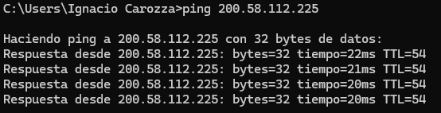
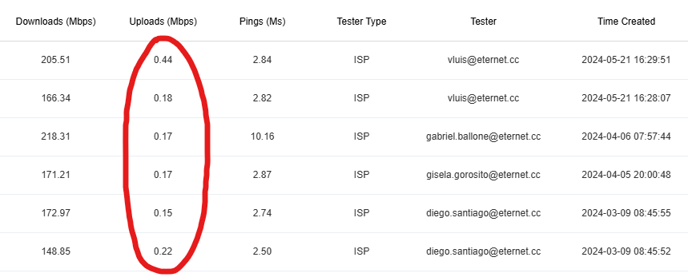

# 📦 Sistema de Pedido de Materiales

---

## 📌 Introducción

El presente documento establece el procedimiento formal para la carga y registro de pedidos de materiales por parte del personal instalador.

Con el objetivo de optimizar la organización interna, evitar solicitudes informales y garantizar un control adecuado del stock, se implementa un sistema centralizado de pedidos a través del canal oficial de Discord, vinculado a formularios estructurados en Microsoft Forms.

---

## 🧾 Tipos de pedidos

El sistema contempla dos modalidades:

- 📅 **Pedido mensual de materiales**  
  Corresponde al pedido principal que cada instalador puede realizar una vez por mes.

- ⚠️ **Pedido extraordinario de materiales**  
  Se utiliza únicamente en caso de requerir materiales adicionales dentro del mismo mes.

---

## 🎯 Objetivos del sistema

Este procedimiento permite:

- Estandarizar la carga de pedidos
- Registrar automáticamente cada solicitud
- Reducir errores en productos y cantidades
- Mantener trazabilidad completa
- Mejorar la planificación del depósito

---

## ⚙️ Procedimiento

### 1. Acceso al canal oficial

El instalador debe ingresar al servidor de Discord de la empresa.

Dentro del canal correspondiente, debe ejecutar el comando:

```
!pedido
```

El sistema responderá automáticamente con el menú de inicio del proceso.

📷 Ejemplo:



---

### 2. Selección del tipo de pedido

El sistema solicitará elegir el tipo de solicitud:

- Pedido Mensual
- Pedido Extraordinario

Luego de seleccionar la opción correspondiente, se debe presionar:

👉 **“Visitar sitio”**

Esto redirige al formulario correspondiente.

📷 Ejemplo:


---

### 3. Completar el formulario

Dentro del formulario se debe:

- Completar todos los campos requeridos
- Verificar materiales y cantidades
- Confirmar la información antes del envío

Luego presionar:

👉 **“Enviar”**

📷 Ejemplo:



---

### 4. Registro del pedido

Una vez enviado el formulario:

- El pedido queda registrado automáticamente
- Es recibido por el área de depósito
- Se inicia el proceso de validación y preparación

---

## 📌 Conclusión

La implementación del sistema de pedidos mediante Discord y Microsoft Forms mejora significativamente la organización interna y el control operativo del depósito.

Este sistema establece dos canales formales de solicitud:

- 📅 Pedido Mensual de Materiales
- ⚠️ Pedido Extraordinario de Materiales

---

## ⚠️ Importante

A partir de la entrada en vigencia de este procedimiento:

- Todas las solicitudes deben realizarse únicamente por los formularios oficiales
- Queda sin efecto cualquier canal informal de pedido
- Se garantiza trazabilidad y control total de los materiales
