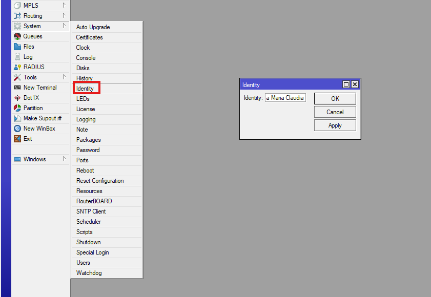
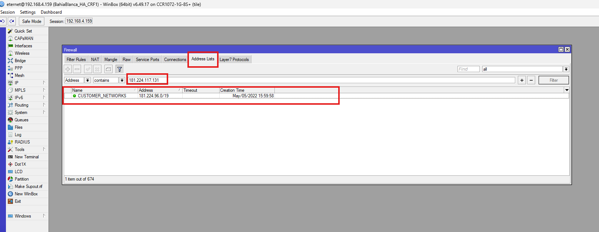
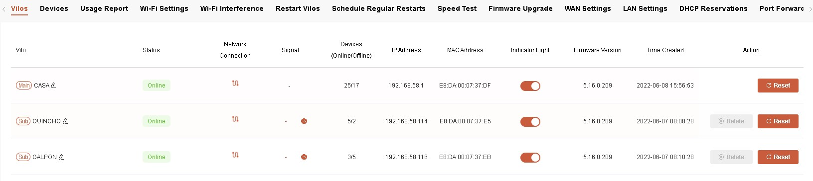
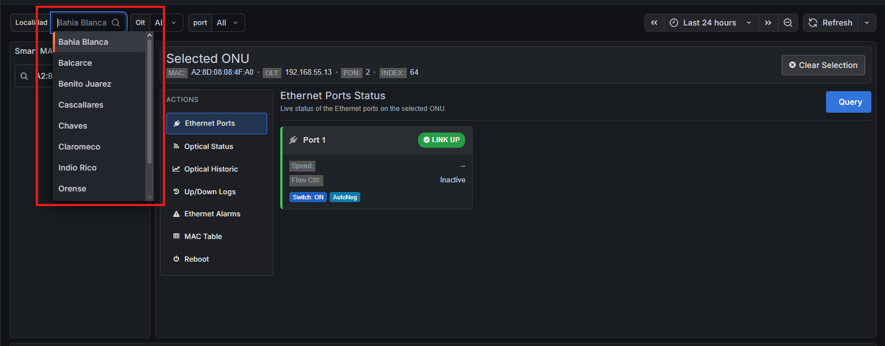

# 🔄 Proceso para aceptar pases de stock parciales

---

## 📥 Pantalla inicial

Al ingresar al sistema, se visualizará la lista de:

- **Envíos pendientes de aceptación**

---

## ⚙️ Procedimiento

### 1. Selección de opción parcial

- Hacer clic en el botón **“Parcial”**
- Se abrirá una pantalla para indicar qué **no se desea recibir**

---

### 2. Selección de artículos a devolver

Cuando el pase incluye varios artículos:

- Seleccionar la línea del artículo a devolver
- Indicar la cantidad correspondiente
- Hacer clic en **“Registrar Devolución”**

---

### 3. Ingreso de MAC

Luego:

- Ingresar las **MAC de los equipos que no se recibirán**
  - Se pueden cargar manualmente
  - O escanear/pistolear

- Confirmar las MAC ingresadas

---

### 4. Confirmación del proceso

A continuación se mostrará un mensaje de confirmación:

---

## 🔁 Resultado del proceso

- El pase se considera **aceptado**
- El sistema genera automáticamente un **pase de stock reverso**
- Los artículos rechazados se devuelven al **origen del envío**

---

## ⚠️ Importante

- El proceso queda registrado en sistema
- La devolución es automática una vez confirmada la operación
- No se puede revertir sin generar un nuevo movimiento de stock
