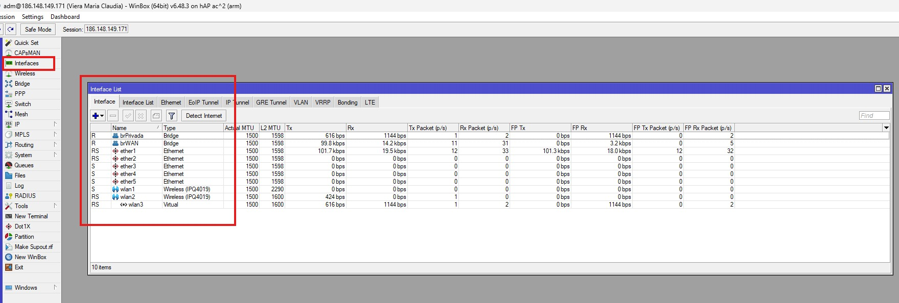
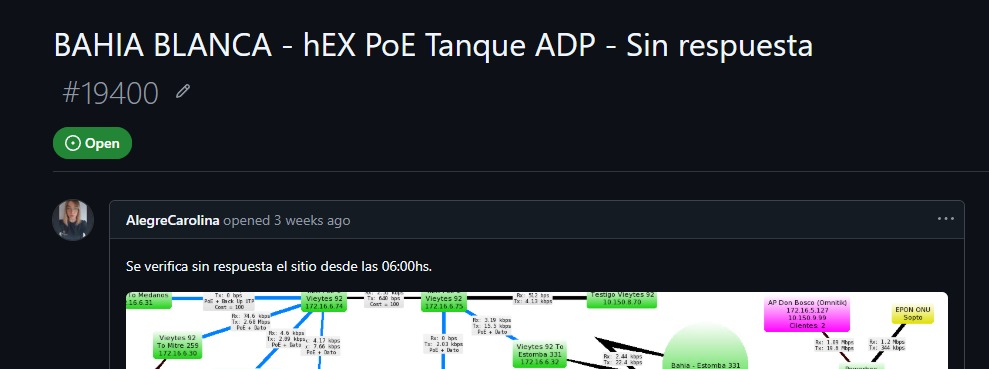
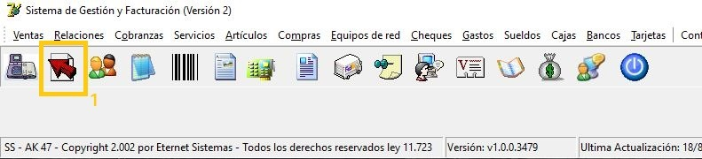
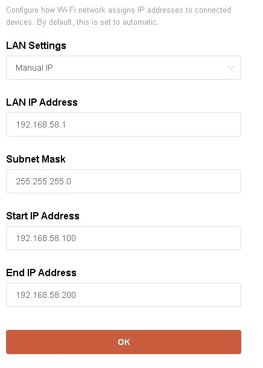
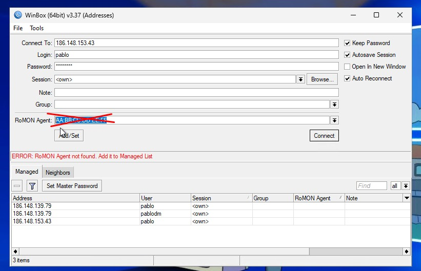

# Verificar el estado de los sitios en Power Monitor (Grafana)

Cuando un sitio no pertenece al área de cobertura de **EDES** o se desea verificar su estado eléctrico, se puede consultar **Power Monitor** en Grafana.

## 1. Ingresar a Power Monitor

Acceder al panel **Power Monitor** en Grafana.

> 
---

## 2. Abrir la sección Sitios

Seleccionar la opción **Sitios**.

> 

---

## 3. Seleccionar una localidad

Se mostrará un listado con todas las localidades monitoreadas.

Seleccionar la localidad que se desea consultar.

> 

---

## 4. Verificar los valores del sitio

Al abrir una localidad se visualizarán los datos del sistema de alimentación del sitio.

Los principales indicadores son:

- **Voltaje de entrada:** tensión de alimentación eléctrica.
- **Capacidad de baterías:** nivel de carga disponible.
- **Descarga de baterías (A):** corriente consumida por las baterías.
- **Voltaje de salida:** tensión entregada por el sistema.
- **Consumo (W):** potencia consumida por el sitio.

> 
> 

---

## Interpretación rápida

- **Hay voltaje de entrada:** el sitio posee suministro eléctrico.
- **No hay voltaje de entrada y las baterías se están descargando:** el sitio se encuentra funcionando con batería debido a un corte de energía.
- **No hay voltaje de entrada y las baterías están agotadas:** el sitio probablemente se encuentre fuera de servicio.
- **Consumo en 0 W o valores anormales:** puede indicar que el sitio está apagado o presenta una falla.

> 
