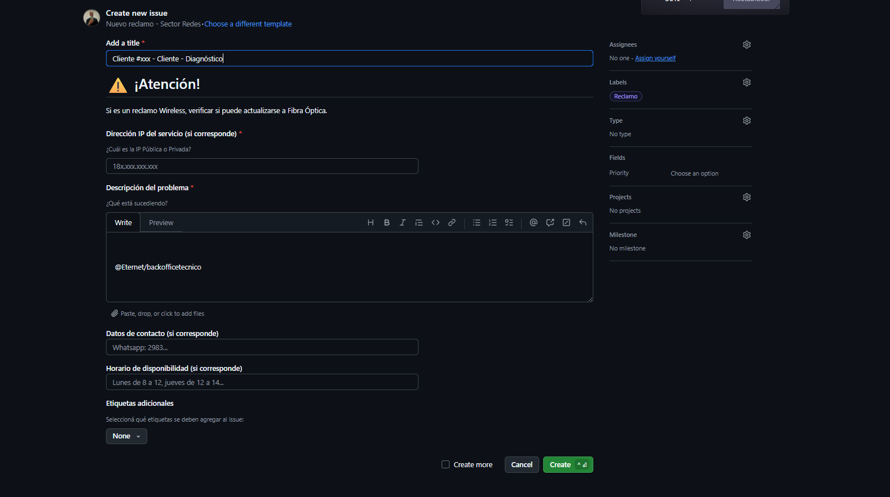
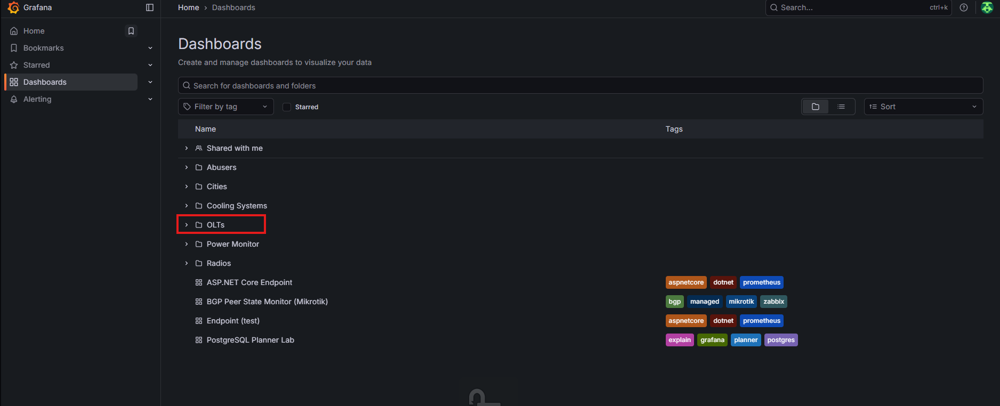
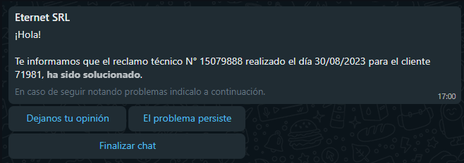
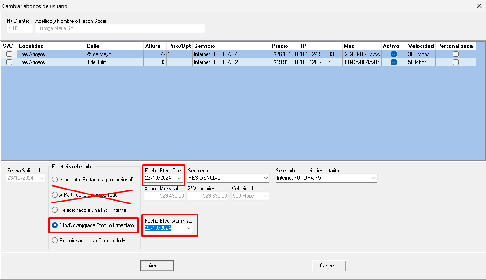
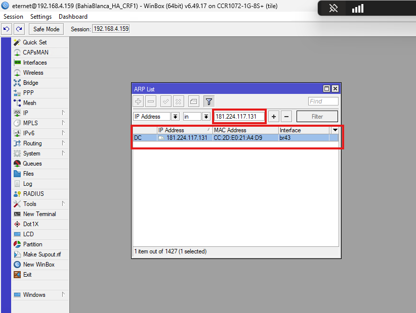
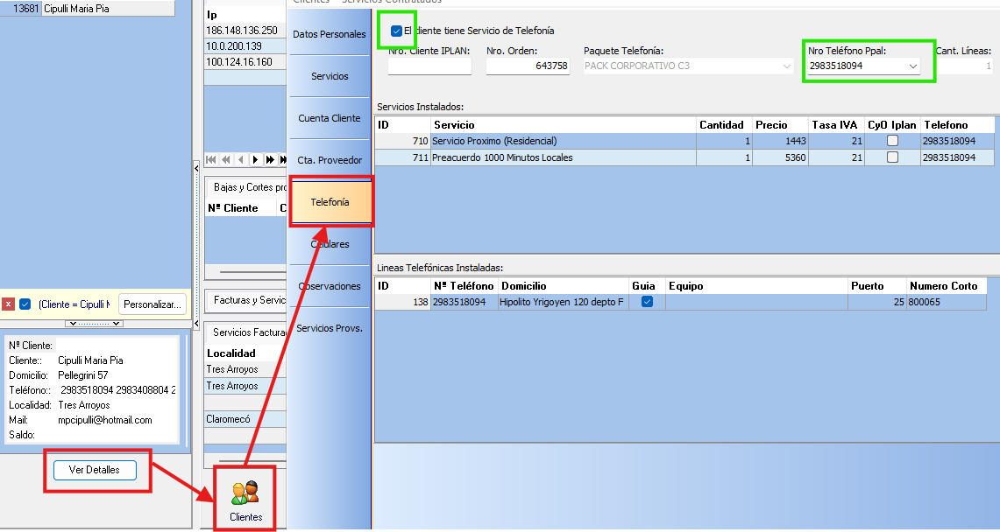
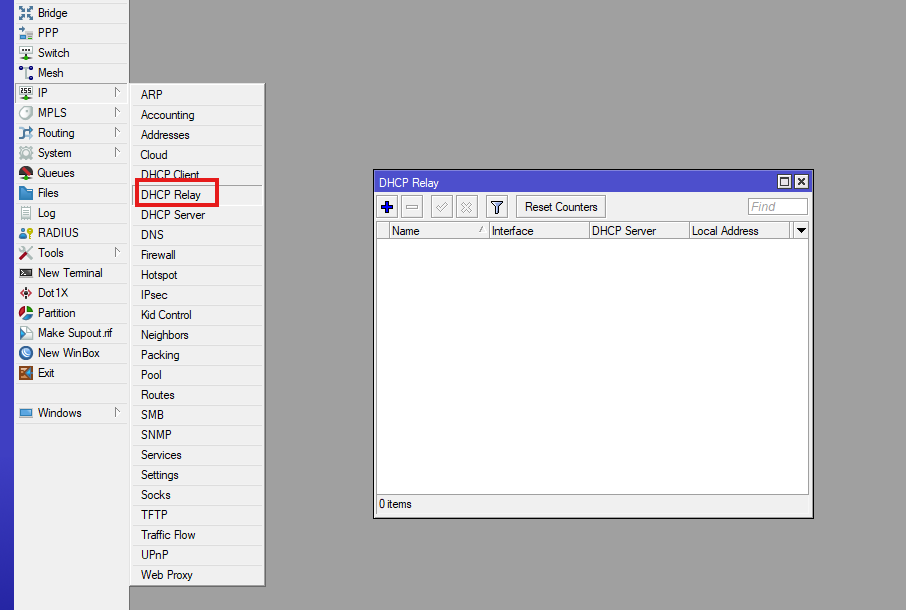

# 🧾 Proceso para la creación de un artículo

---

## 📍 Acceso al sistema

Ingresar en:

1. **Artículos**  
2. **Mantenimiento de Artículos**

Se mostrará la siguiente pantalla:

---

## ➕ Alta de nuevo registro

Hacer clic en:

- **Insertar registro**

---

## 🧩 Campos a completar

### 📌 Datos principales

- **Código**
  - Si el artículo tiene código del proveedor, utilizar ese.
  - Si no, generar un código interno identificatorio.

- **Descripción**
  - Nombre del artículo.

- **Tipo de artículo**
  - Seleccionar del listado disponible.

- **Artículo perteneciente a**
  - Hardware y Equipos  
  - Insumos para instalaciones  
  - Redes  
  - Servicio Técnico  
  - Venta Mayorista  

- **Marca**
  - Seleccionar marca correspondiente.

---

### 💰 Datos comerciales

- **Precio de venta**
  - Definir según corresponda (moneda en pesos o dólares).

- **Tipo de retención de ganancias**
  - Productos  
  - Servicios  
  - Alquileres  

- **Moneda**
  - Pesos o Dólares

- **PPP (Precio promedio ponderado)**
  - Repetir el valor del precio.

---

### ⚙️ Datos operativos

- **Activo**
  - Valor: `1`
  - Confirmar con el check de la pantalla de mantenimiento.

- **Alias**
  - Igual a la descripción.

- **Cuenta contable**
  - Seleccionar del plan de cuentas.

- **Última compra**
  - Fecha de última compra registrada.

- **Tipo de equipo (Redes)**
  - Si es equipo con MAC individual: solicitar creación al área de Redes.
  - Caso contrario: `NINGUNO`

- **Cantidad mínima**
  - Define el stock mínimo requerido.

---

## 🧾 Resultado esperado

El artículo correctamente cargado se visualizará así:

Y en el listado general:

- Artículos → Listado → búsqueda por palabras clave

---

# 📦 Proceso para agregar un artículo a un almacén

---

## 📍 Acceso

Ingresar en:

1. **Artículos**
2. **Listado de Artículos y Ubicaciones**

Se mostrará la siguiente pantalla:

---

## ➕ Alta de ubicación

Hacer clic derecho sobre el artículo y seleccionar:

- **“Agregar artículo a un almacén”**

---

## 🧩 Campos a completar

- **ID Artículo**
  - Ingresar el ID del artículo.

- **Artículo**
  - Se completa automáticamente con la descripción.

- **Sitio**
  - Seleccionar el sector del almacén.

- **Almacén**
  - Seleccionar almacén correspondiente.

- **Módulo**
  - Opcional según ubicación.

- **Estante**
  - Opcional según ubicación.

- **Plataforma**
  - Opcional según ubicación.

---

## ✅ Finalización

Hacer clic en:

- **Aceptar**

---
