# ↩️ Devoluciones, Anulaciones y RMA

Este documento describe los distintos procedimientos disponibles para gestionar devoluciones de mercadería, anulaciones de remitos, reemplazos de artículos (RMA) y emisión de Notas de Crédito.

---

# 🚫 Anulación de Remitos

## Acceso

Dentro del sistema ingresar en:

1. **Artículos**
2. **Listado de envíos pendientes de facturación**

---

## Anular un remito

Seleccionar el remito correspondiente y hacer **clic derecho**.

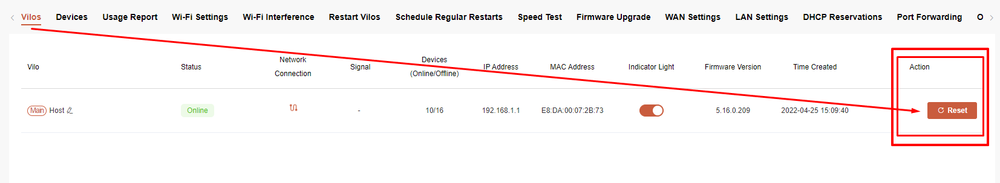

Elegir una de las siguientes opciones:

- **Anular Remito Completo**
- **Anular Ítems y Cantidades Seleccionadas**

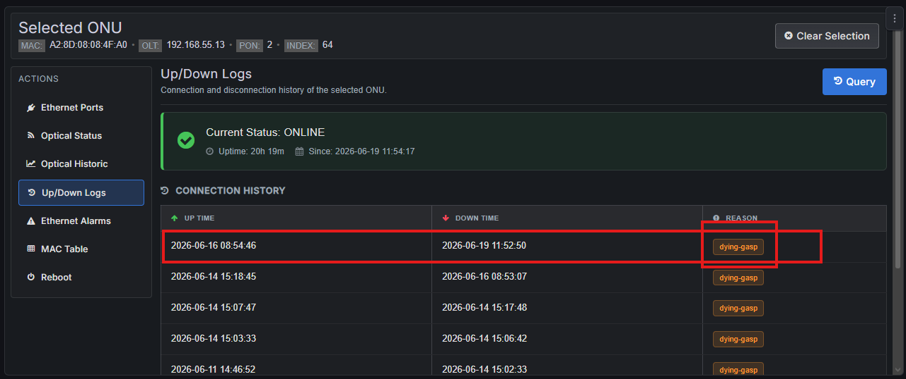

### Anular Remito Completo

Permite cancelar completamente el remito.

El sistema:

- Genera un remito inverso desde el cliente hacia el almacén de origen.
- Relaciona ambos remitos.
- Actualiza automáticamente el campo **Devuelta**, dejando en **0** la cantidad pendiente de facturar.

---

### Anular Ítems y Cantidades Seleccionadas

Permite anular únicamente determinados artículos o cantidades.

Al seleccionarlo aparecerá la siguiente ventana:

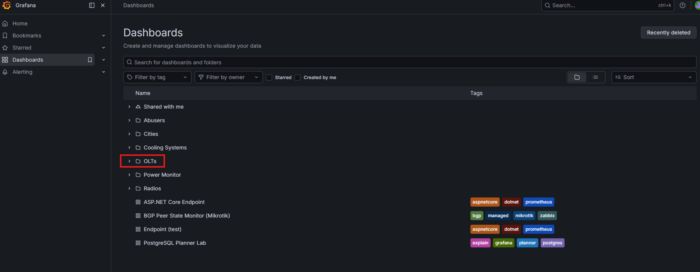

Luego:

- Ingresar las **MAC** de los equipos individualizados.
- Presionar **Confirmar MACs**.

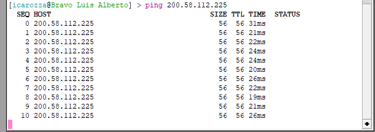

---

# 🔄 RMA con reposición del mismo artículo

## Acceso

Ingresar en:

1. **Equipos de Red**
2. **Listado de Envío de Equipos**

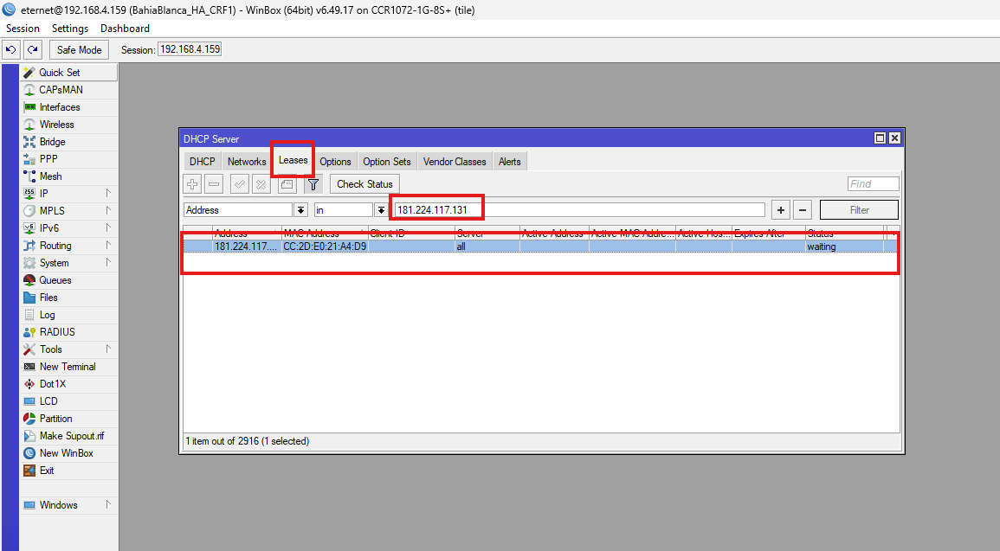

---

Seleccionar el envío correspondiente.

Clic derecho →

**Registrar Devolución y Reemplazo de Artículos**

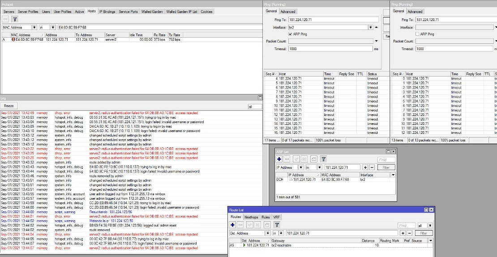

Se abrirá la siguiente pantalla:

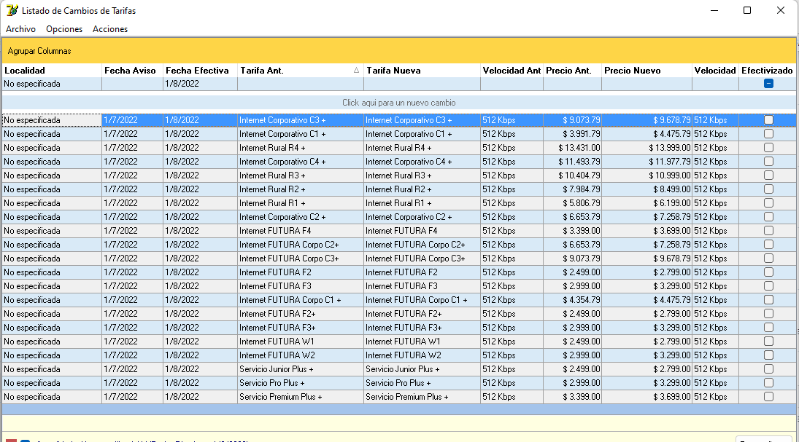

---

## Registrar el reemplazo

- Seleccionar el artículo.
- Indicar la cantidad correspondiente.

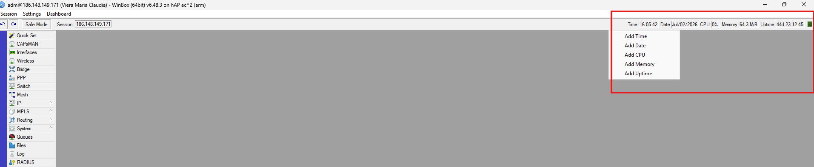

Luego hacer clic en:

**Registrar Reemplazo**

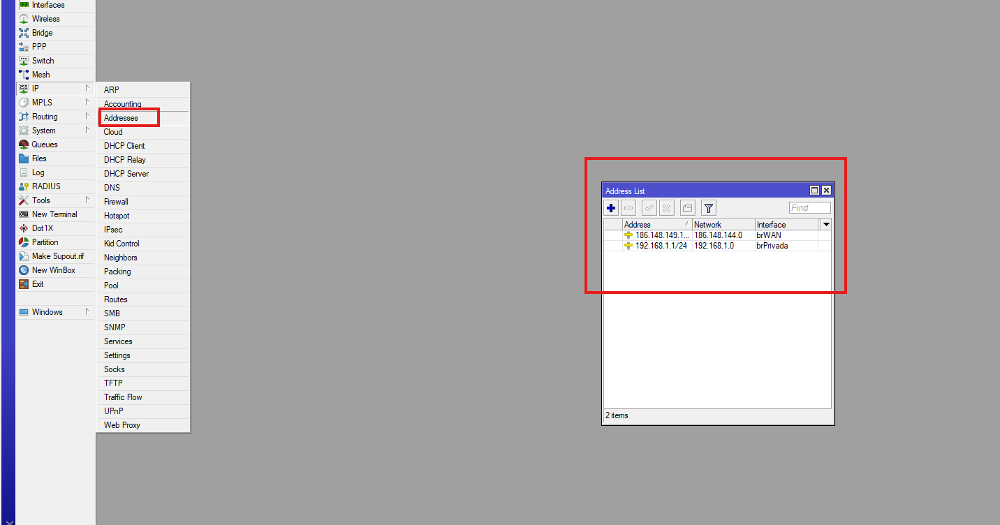

---

## Ingreso de MACs

Se abrirá la siguiente ventana:

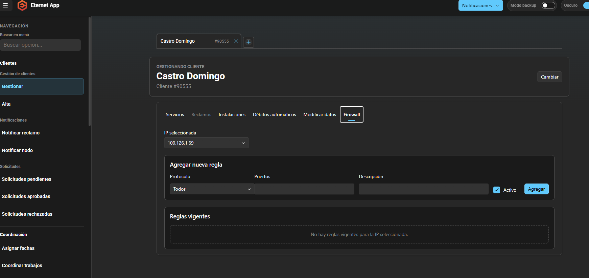

Ingresar:

- MAC de los equipos devueltos.
- MAC de los equipos de reposición.

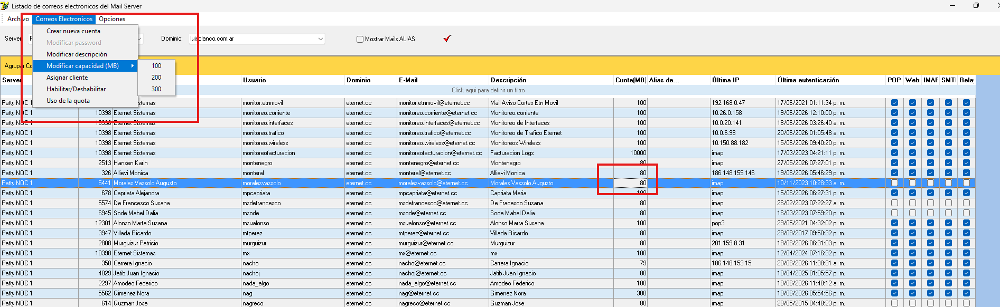

Finalmente presionar:

**Confirmar MACs**

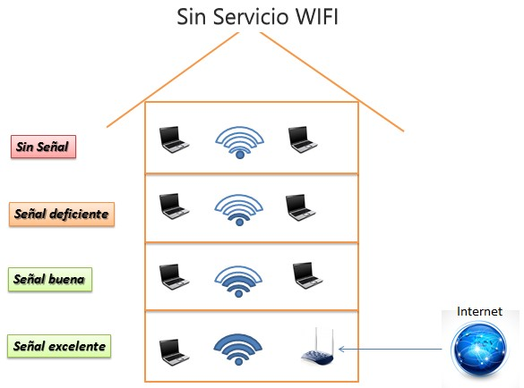

---

# 🧾 Devolución con Nota de Crédito

## Acceso

Ingresar en:

1. **Ventas**
2. **Listado de...**

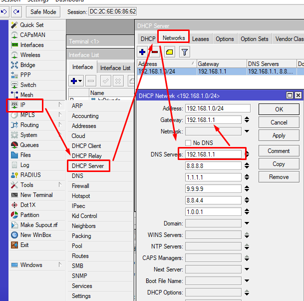

---

Seleccionar la factura correspondiente.

Clic derecho →

**NC por Devolución de Mercadería**

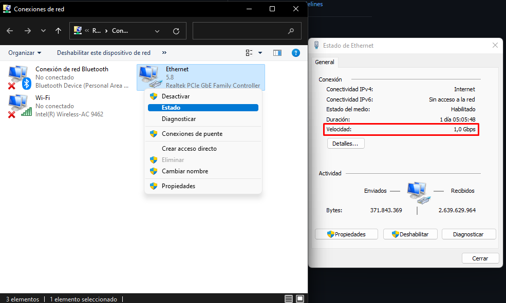

Se abrirá la siguiente pantalla:

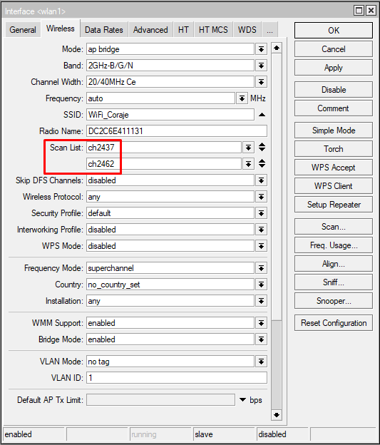

---

## Seleccionar artículos

Elegir los artículos y especificar las cantidades que formarán parte de la Nota de Crédito.

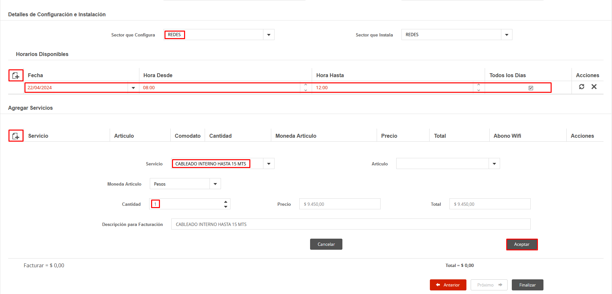

Luego hacer clic derecho sobre la selección y elegir:

**Generar NC por los ítems y cantidades seleccionadas**

---

## Confirmar devolución

Se abrirá la siguiente ventana:

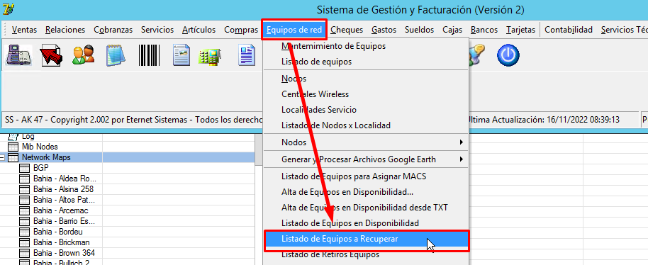

Ingresar las **MAC** de los equipos devueltos.

Finalmente hacer clic en:

**Confirmar MACs**

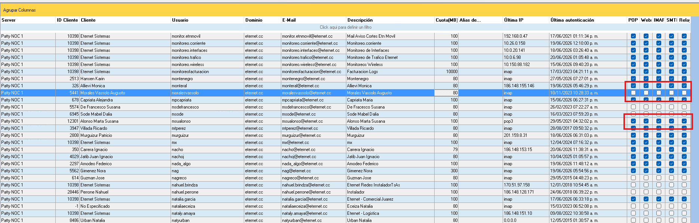
