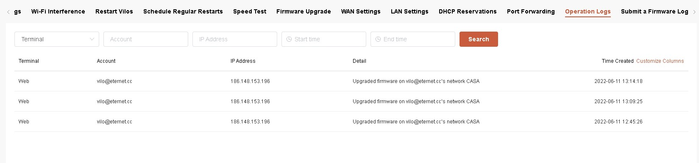
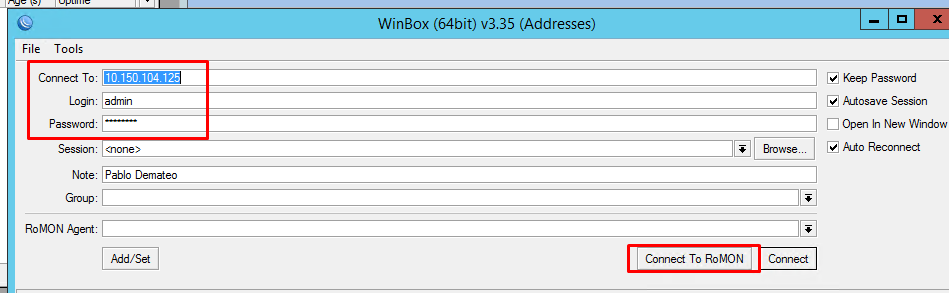
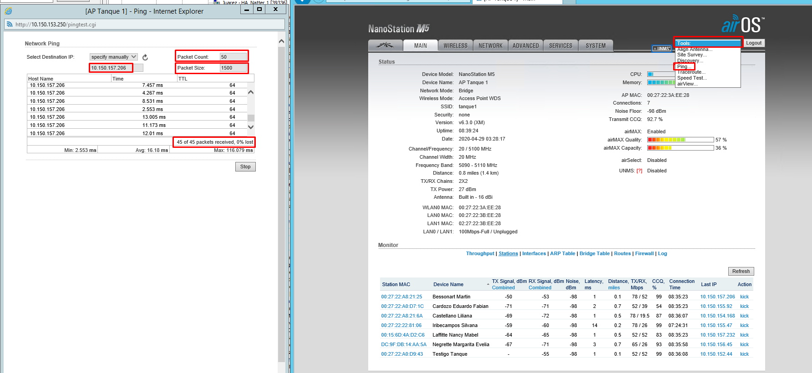

# Reconexión temporal de un cliente (72 horas)

Para otorgar una reconexión temporal de **72 horas**, seguir el siguiente procedimiento.

## 1. Ingresar a Swagger

Acceder a:

https://api.eternet.cc/swagger/index.html?urls.primaryName=Customers

Luego abrir el endpoint:

**/Customers/ReconnectServiceSuspension**

> 

---

## 2. Habilitar la edición

Hacer clic en **Try it out** para habilitar el formulario.

> 

---

## 3. Completar el formulario

Completar los siguientes campos:

- **customerId:** ingresar el número de abonado del cliente.
- **observations:** ingresar el motivo de la reconexión temporal.
- **force:** dejar el valor en **false**.

Una vez completados los datos, hacer clic en **Execute**.

> 

---

## 4. Verificar el resultado

### Reconexión exitosa

Si el cliente cumple las condiciones para recibir la reconexión temporal y no posee una reconexión previa vigente o ya utilizada, la operación se completará correctamente.

### Error

Si el cliente **ya utilizó una reconexión temporal** o **no corresponde realizarla**, el sistema devolverá un mensaje de error indicando el motivo.

> 
