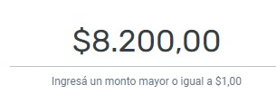
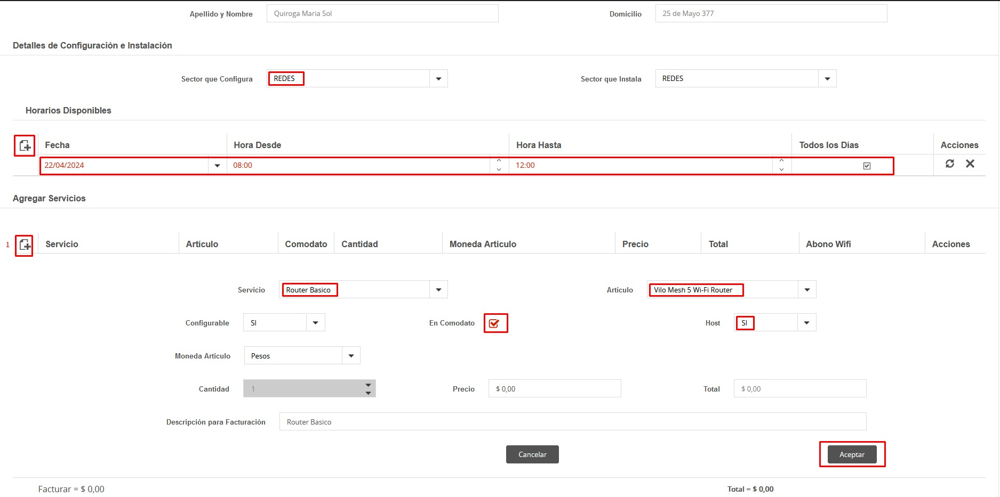
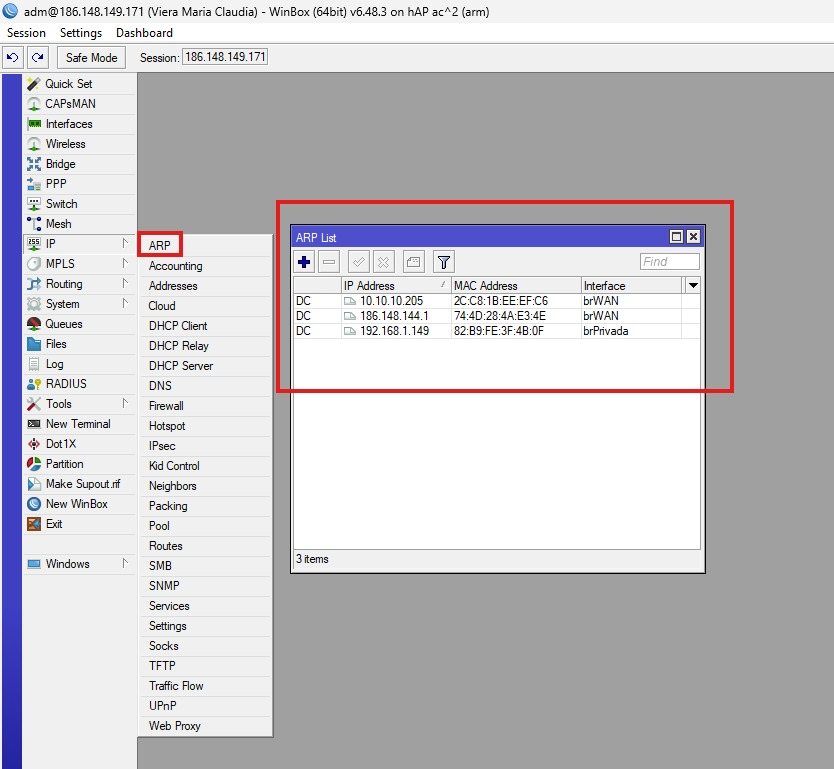
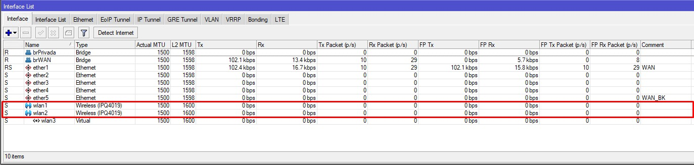
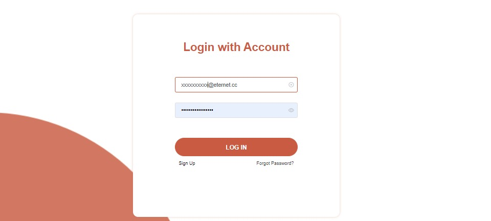
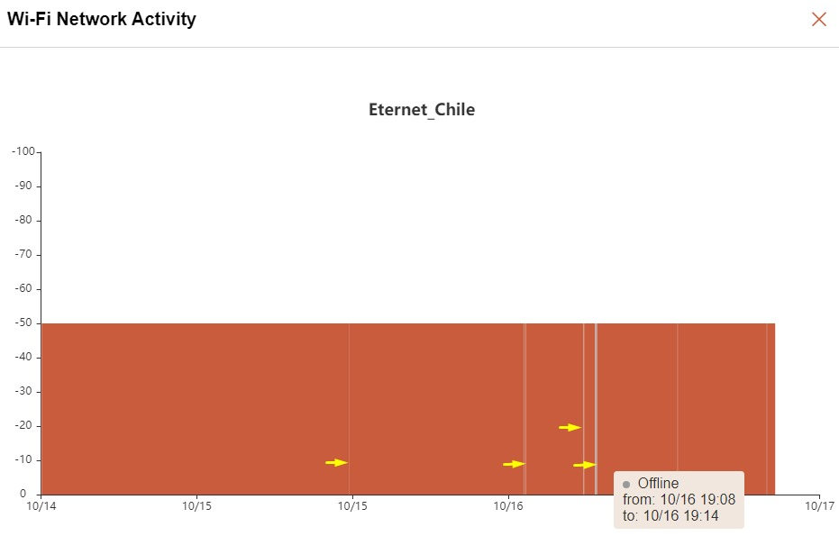
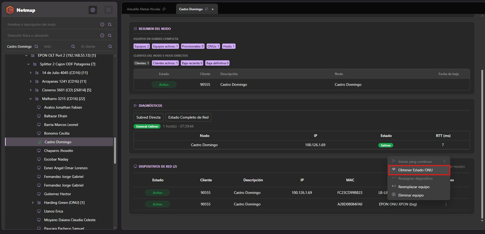

# 🔁 Proceso de Reconexión por Sistema

En esta guía se detallan los pasos a seguir cuando ingresa un pedido de reconexión del servicio por cualquier canal de comunicación.

---

## 📌 Documentación relacionada
Para ver el proceso completo de reconexión:

👉🏻 [Política de Reconexión](https://github.com/Eternet/General/tree/40ee2c125fe875350273c830c129d803154cd029/docs/Comercial%20Actualizado/Enfoque%20comercial/Protocolo%20de%20Reconexi%C3%B3n%20y%20Reutilizaci%C3%B3n%20de%20Infraestructura)

---

## 🧩 Plataformas utilizadas

Disponemos de 2 plataformas principales para registro y comunicación interna:

---

# 1️⃣ GitHub (Formulario de Reconexión)

Plataforma donde se documentan y gestionan solicitudes de reconexión.

👉🏻 [Formulario](https://github.com/Eternet/Comercial/issues/new?template=Reconexion.yml)

---

---

# 2️⃣ Procedimiento de Reconexión en SSAK

## 🔷 1. Recepción de la solicitud

1. La solicitud ingresa por Botmaker u otros canales  
2. Ingresar a `SSAK → Atención al Cliente`  
3. Buscar cliente y verificar fecha de baja en solapa **Clientes**  

---

---

✔ Verificar saldo pendiente para informar al cliente junto al costo de reconexión.

---

---

## 🔷 2. Filtrado de baja y generación de reconexión

1. Ir a `Servicios → Listado de Bajas Pendientes y Efectuadas`  
2. Filtrar por fecha de baja y cliente  
3. Confirmar estado **efectivizado**  
4. Click derecho → `Reconexión del Servicio`

---

---

## 🔷 3. Carga del importe de reconexión

En ventana de reconexión:

- 💰 Cargo: **U$D 14.80**
- 📅 Fecha límite: **3 días hábiles**
- 📡 Servicios: mantener tarifa o modificar si corresponde  
- ✔ Finalizar proceso

---

---

## 🔷 4. Verificación de pago

Verificar importe total en plataforma de pago:

https://pagar.rapipago.com.ar/

- Ingresar número de cliente  
- Confirmar saldo + reconexión  

---

---

## 🔷 5. Seguimiento en GitHub

1. Seguir issue de reconexión  
2. Cuando el cliente paga:  
   - Quitar label **Pendiente de Pago**  
   - Agregar **Revisión Atención al Cliente**

---

✔ Informar al cliente:
- Equipos conectados correctamente  
- Energía eléctrica activa  
- Condiciones listas para revisión técnica  

---

---

## 🔷 6. Cierre del proceso

Atención al Cliente:

- ✔ Verifica servicio  
- ✔ Documenta en issue  
- ✔ Cierra o deriva a técnica si corresponde  

---

## ⚠️ IMPORTANTE: Eternet Plus

Verificar si el cliente tenía **Eternet Plus**:

👉 [Template](https://github.com/Eternet/Servicio.Tecnico/issues/new?template=10+-+Reactivacion_Suspension_ServicioEternetPlus.yml)

---

✔ Si el EP no aparece:
- Dar de alta como ítem en SSAK  
- Solicitar asignación de MAC a Servicio Técnico  

---

> [!NOTE]
> Una vez finalizado el alta de Eternet Plus, dejar constancia en el issue para asignación de MAC.
