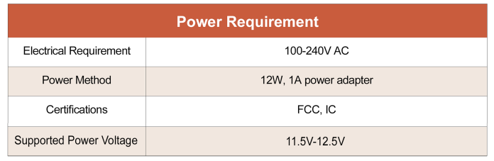
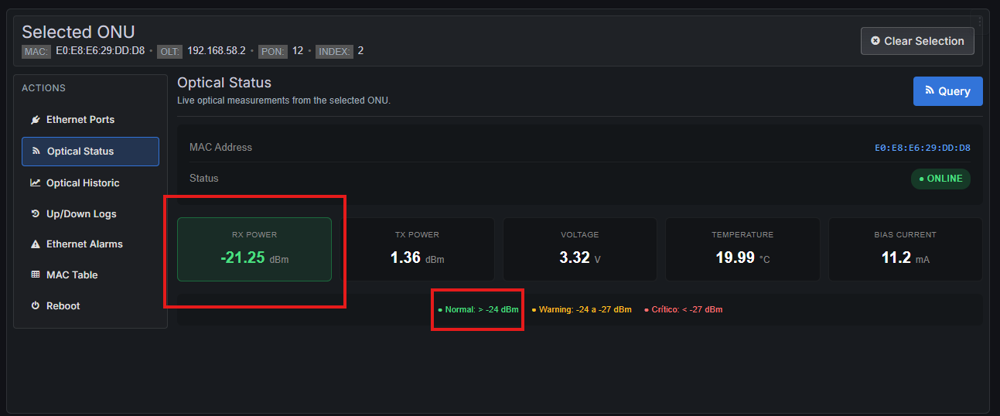
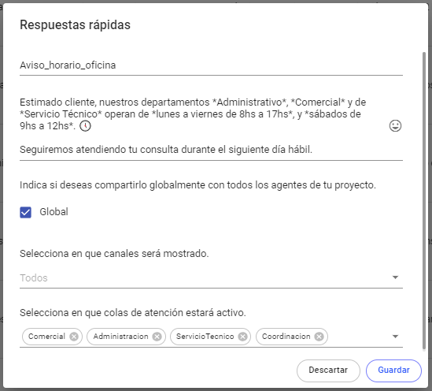
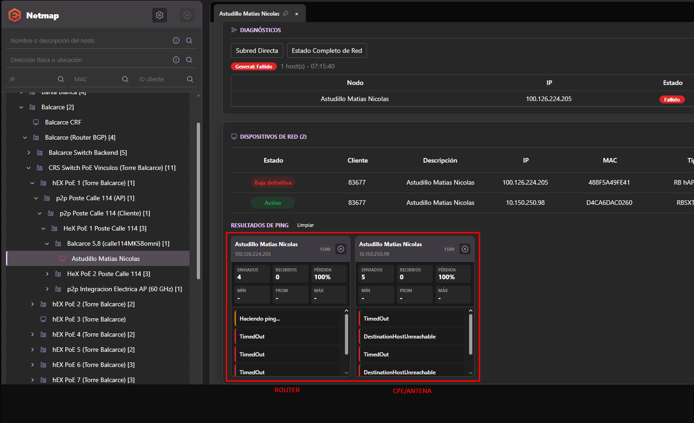
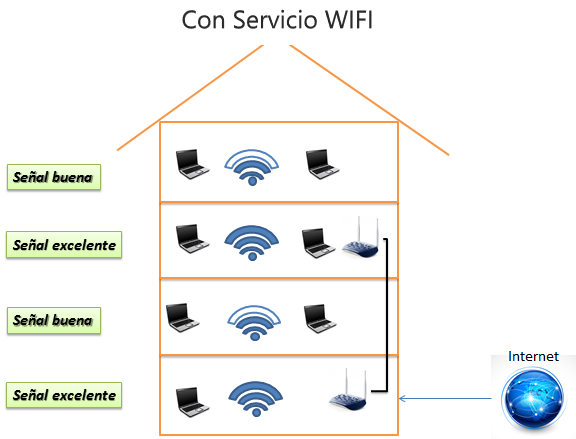
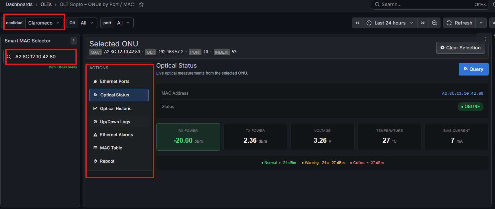

# 🔗 Relacionar una factura existente con un remito existente

Este procedimiento permite asociar un remito pendiente de facturación a una factura ya emitida, siempre que las cantidades de los artículos coincidan.

---

# Acceso

Dentro del sistema ingresar en:

1. **Artículos**
2. **Listado de envíos pendientes de facturación**

Al ingresar se visualizará la siguiente pantalla:

---

# Seleccionar el remito

Marcar (tildando) las líneas del remito que se desean relacionar con la factura existente.

Luego indicar la cantidad correspondiente para cada artículo.

---

# Relacionar con la factura

Una vez seleccionadas las líneas:

- Hacer clic derecho sobre cualquiera de ellas.
- Seleccionar la opción **Relacionar remitos a factura existente**.

---

# Seleccionar la factura

El sistema mostrará el listado de facturas disponibles.

Seleccionar la factura correspondiente haciendo **doble clic** sobre ella.

---

# Validación del sistema

Antes de completar el proceso, el sistema verificará automáticamente que:

- Las cantidades indicadas en el remito coincidan con las cantidades existentes en la factura seleccionada.
- Los artículos correspondan correctamente entre ambos documentos.

---

# Finalización

Si todas las validaciones son correctas, el sistema mostrará el siguiente mensaje:

> **"Las líneas fueron satisfactoriamente asignadas a la factura seleccionada."**

Con este mensaje, la relación entre el remito y la factura habrá quedado registrada correctamente.
