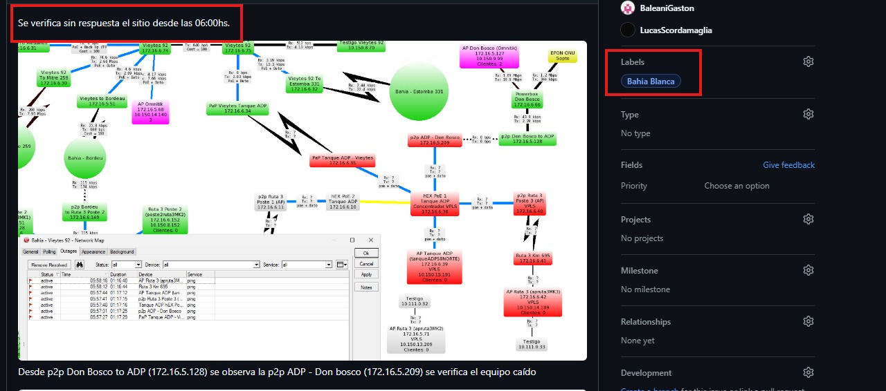
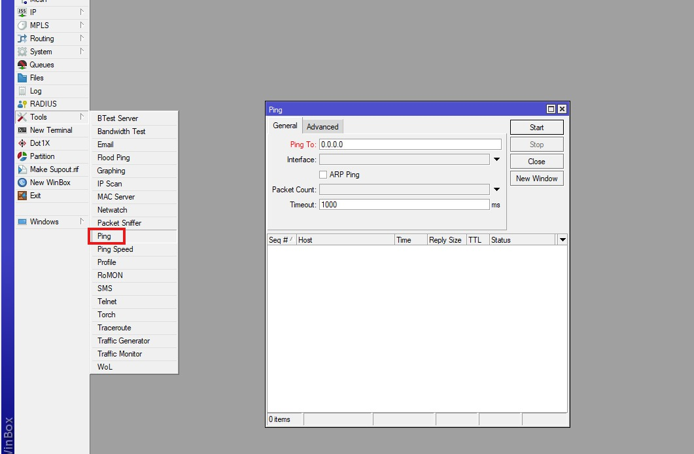
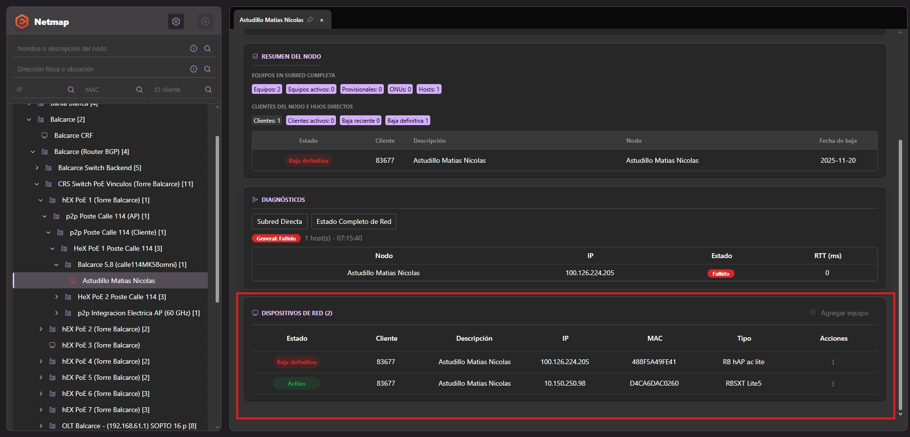
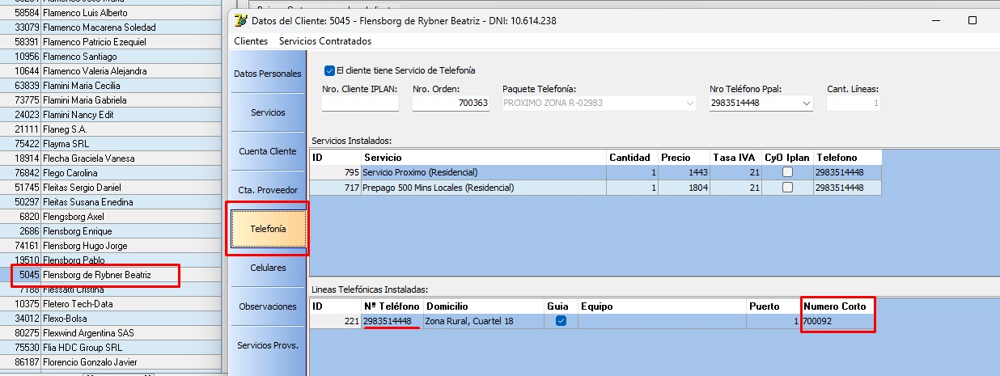
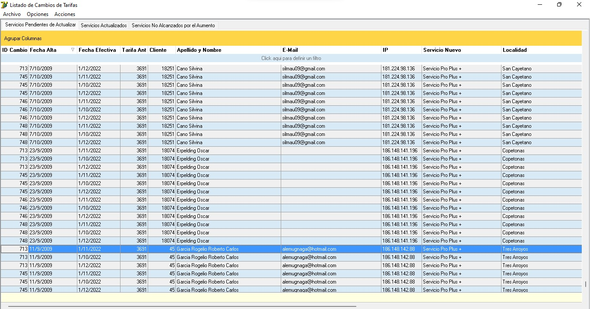
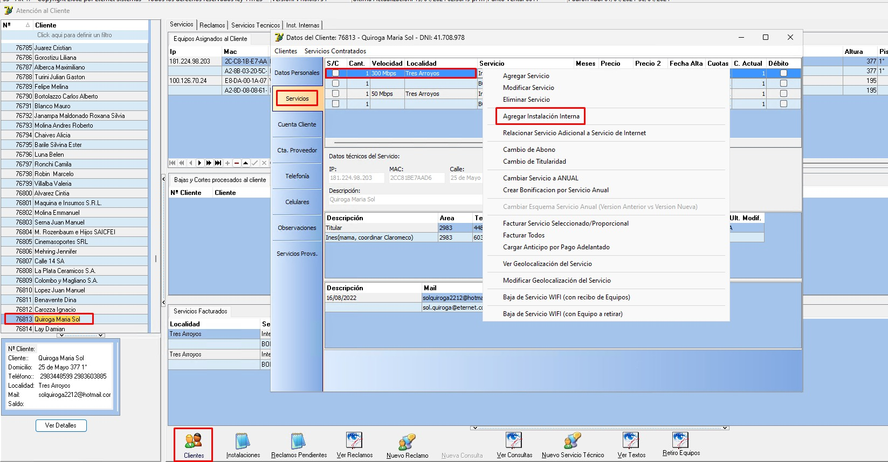

# Servicio iBGP

## Conceptos generales

El esquema de ingeniería de tráfico de **ETERNET** utiliza **BGP interno (iBGP)**:  
https://es.wikipedia.org/wiki/Border_Gateway_Protocol

Las localidades que poseen routers frontend propios (CRFs) tienen múltiples peers contra routers BGP frontend de alta disponibilidad (HA_iBGPs).

Cada peer corresponde a:

- Un **path lógico (L2 VLAN tagged)**
- Que atraviesa diferentes switches y enlaces wireless (**path físico**)
- Con IPs en ambos extremos utilizadas para levantar los peers iBGP

---

## Ingeniería de tráfico

Este diseño permite:

- Tener múltiples rutas activas en paralelo (multi-peer)
- Distribuir tráfico de forma controlada
- Aplicar **routing policies y filtros BGP**
- Asignar prioridad a redes específicas

### Ventajas principales:

- Balanceo de carga entre peers
- Control granular del tráfico
- Resiliencia ante fallos

Si un peer cae:

- Las rutas se reconvierten automáticamente a los peers restantes
- El servicio se mantiene activo

---

## Aplicación web de gestión iBGP

Para monitoreo y control se utiliza:

https://ibgp.eternet.cc/cities

Esta plataforma permite:

- Monitoreo global sin acceso directo a routers core
- Diagnóstico de salud de peers
- Control de capacidad y congestión
- Gestión manual del enrutamiento si es necesario

También integra autenticación vía M365 con dos niveles:

- **LECTURA**
- **ESCRITURA**

---

## Nivel LECTURA

Permite diagnóstico y observación.

### Capacidades:

- Visualizar todas las localidades
  - tráfico disponible
  - tráfico últimos 10 segundos
  - tráfico última hora

---

### Detalle por localidad

Permite ver:

- Cantidad de peers
- Rutas por peer
- Tráfico por peer
- Salud del peer (ICMP)
- Redes y distribución de rutas

---

## Nivel ESCRITURA

Incluye todo lo del nivel lectura, más control activo del sistema.

Acceso restringido a:

- Redes
- Servidores

---

### Capacidades:

#### 1. Reinicio del servicio
- Tarda ~10 minutos en estabilizar
- No ingresar durante ese período
- Requiere crear issue justificando el cambio (arrobando sectores involucrados)

---

#### 2. Tráfico en tiempo real

- Visualización por red
- Por path específico

---

#### 3. Movimientos de red

- Permite mover redes entre peers
- Se debe esperar confirmación de la acción

---

#### 4. Deshabilitar gestión automática

- Se puede desactivar control automático de tráfico (upload/download)
- Uso crítico y controlado
- Requiere issue obligatorio explicando el motivo

---
