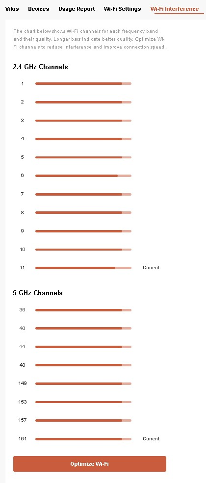
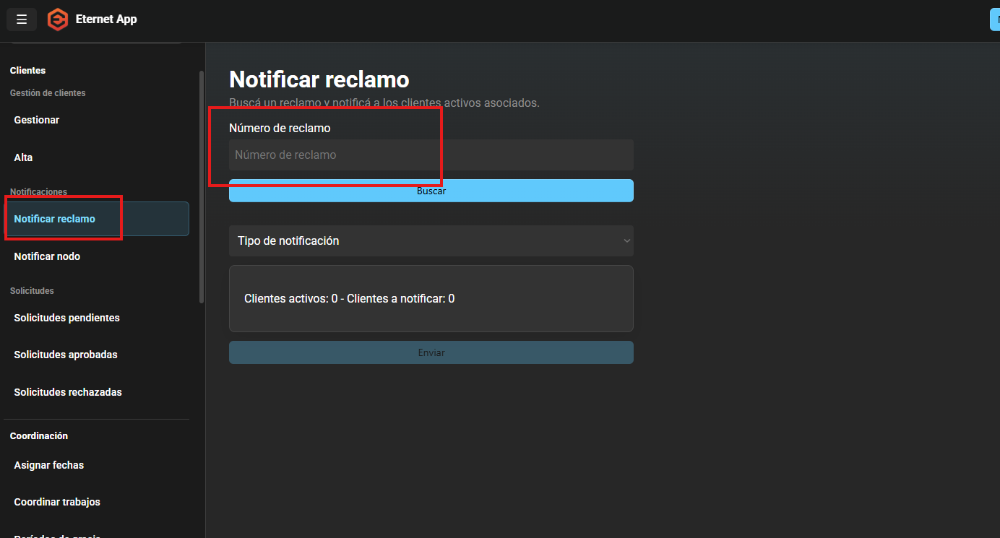
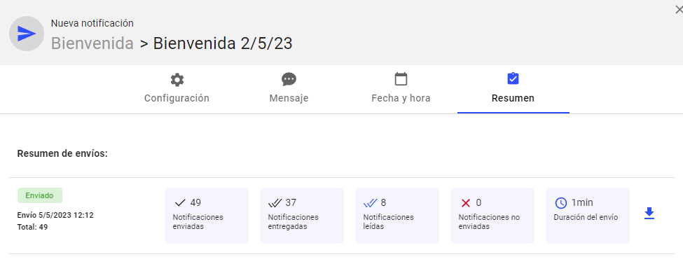
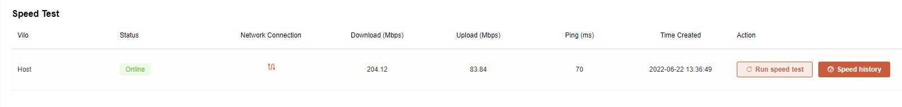
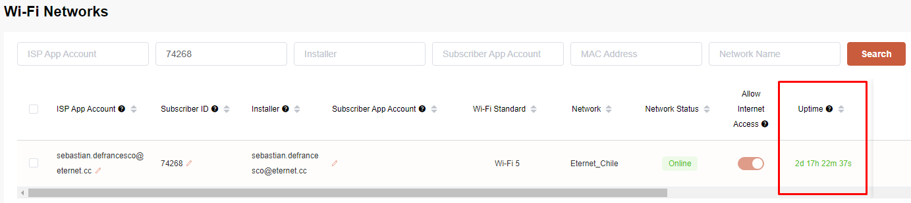

# Sin conexión FUTURA

## ¿Cuándo utilizar este diagnóstico?

Utilizar este diagnóstico cuando la ONU no responde desde la red óptica o presenta pérdida de señal.

Ejemplos:

- ONU Offline.
- ONU No Registrada.
- Luz LOS encendida.
- Luz PON apagada.
- Sin señal óptica.

> Si la ONU responde correctamente, utilizar el diagnóstico [**"Sin conexión FUTURA (ONU OK)"**](https://github.com/Eternet/Atencion.Clientes/blob/main/Documentacion/Manual-Operativo-Atencion-al-Cliente/doc/Sin%20conexión%20FUTURA%20(ONU%20OK).md).

---

## Paso 1 - Obtener el estado de la subred

1. Acceder a **CD**.
2. Seleccionar la **CD** correspondiente.
3. Hacer clic izquierdo sobre la CD.
4. Seleccionar **"Estado completo de red"**.
5. Verificar el estado de la subred antes de continuar con el diagnóstico. 

> 
> 

---

# Paso 2 - Verificar el estado de la ONU

Ingresar a Grafana y consultar la ONU desde la OLT correspondiente.

Verificar:

- Estado de la ONU.
- Señal óptica.
- Eventos recientes.
- Historial de conexión.

Registrar el resultado.
> 
> 
> 

---

# Paso 3 - Preguntar al cliente

Consultar:

- ¿Desde cuándo ocurre?
- ¿El problema es permanente o intermitente?
- ¿Hubo cortes de luz?
- ¿Se movió la ONU o el cable?
- ¿Hay agua, humedad o un cable dañado?

Registrar la información.

---

# Paso 4 - Revisar las luces

Solicitar una foto o pedir al cliente que informe el estado de las luces.

Verificar:

- PWR
- PON
- LOS
- LAN

Si la ONU no tiene luces, continuar con el siguiente paso.

---

# Paso 5 - Verificar la alimentación

Solicitar al cliente:

1. Revisar que la fuente esté conectada.
2. Probar otra toma de corriente.
3. Verificar el botón de encendido (si posee).
4. Revisar que la fuente y el cable no estén dañados.

Registrar el resultado.

---

# Paso 6 - Reiniciar los equipos

Solicitar:

1. Desconectar la ONU y el router.
2. Esperar 2 minutos.
3. Volver a conectar ambos equipos.
4. Esperar el inicio completo.

Verificar nuevamente las luces.

Registrar si el servicio volvió.

---

# Paso 7 - Solicitar evidencia

Si es necesario, pedir:

- Foto de la ONU.
- Foto de las luces.
- Foto del cableado.
- Foto de la fuente.
- Video si las luces parpadean.

---

# Paso 8 - Derivar

Derivar cuando:

- La ONU continúa Offline.
- La ONU no registra.
- LOS permanece encendida.
- PON continúa apagada.
- Existe daño físico o cable cortado.
- El servicio no se recupera luego de las pruebas.

Registrar:

- Validaciones realizadas.
- Resultado.
- Motivo técnico de la derivación.

---

# Información obligatoria

Registrar:

- Síntoma informado.
- Estado de las luces.
- Resultado del reinicio.
- Evidencia recibida.
- Estado de la ONU.
- Hallazgo técnico.
- Motivo de la derivación.
- Contacto y disponibilidad del cliente.

---

# Comunicación al cliente

Informar:

- Qué se verificó.
- Qué se detectó.
- Si el caso será derivado.
- Cuál será el siguiente paso.

No informar plazos que no hayan sido confirmados.
