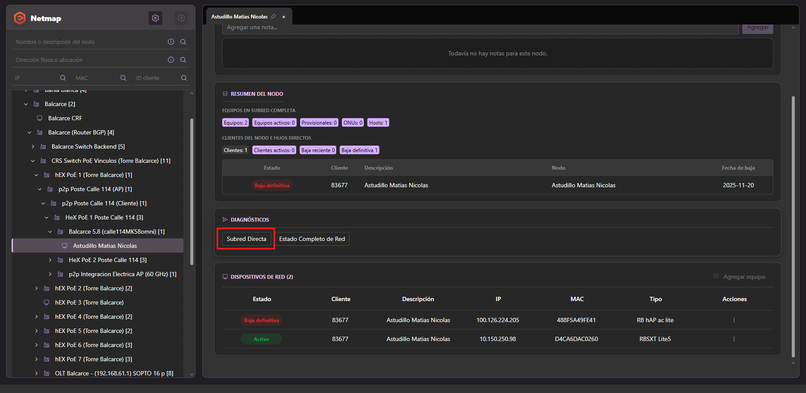
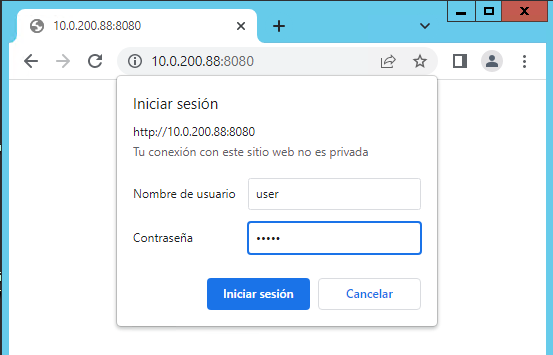
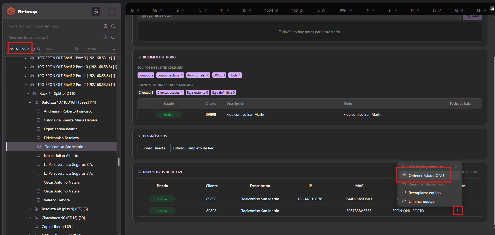
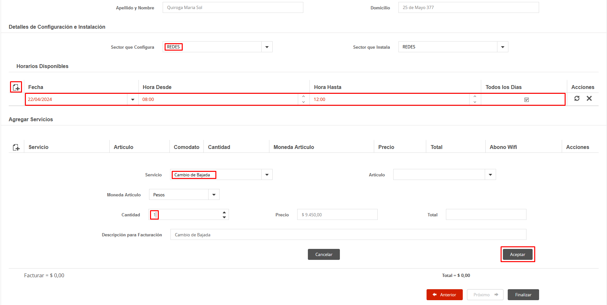
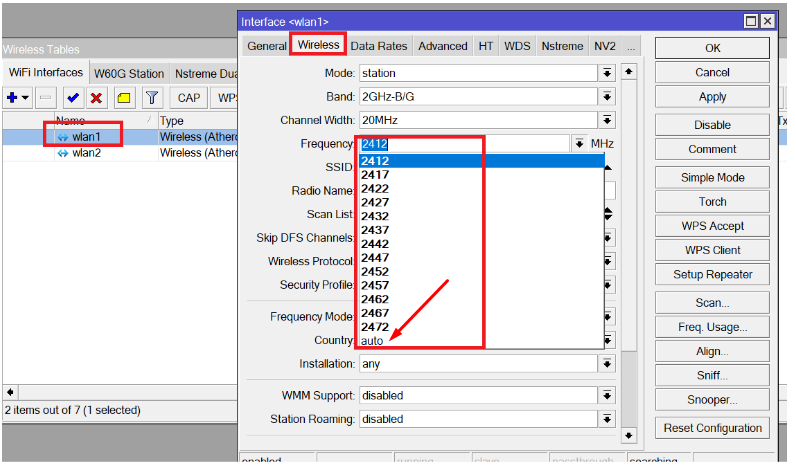
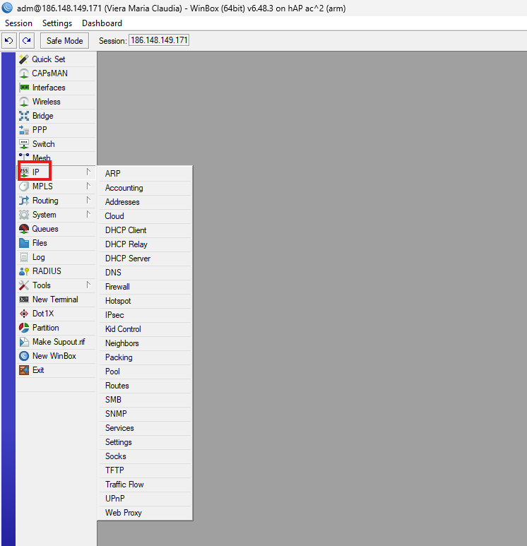

# Recepción de la Solicitud de Baja

Cuando un sector recibe una solicitud de baja por parte de un cliente, se debe:

* 👉🏻 [Acceder al formulario](https://forms.office.com/pages/responsepage.aspx?id=FA7U7Iq0YUiVhjjNye4SfYfbMjfDhn9DvaAR1nVu1QBURFZFT0MyQ0pVMEI1NFlXSjlWQ1ZRNFNJWS4u&route=shorturl) 
  

* Completar todos los campos con los datos del cliente y el motivo de la baja del servicio.

> [!IMPORTANT]
> Toda solicitud de baja debe ser registrada mediante el formulario, independientemente del canal de ingreso.

---

## Retención de nivel 1

Cuando la solicitud es recibida por el área de Atención al Cliente, se procede con la **retención de nivel 1**.

* Si se logra retener al cliente → se selecciona **“Retenida 1° Nivel”**
* Si no se logra retener → se deriva a **“Gestiones Especiales”**

---

## [Gestiones Especiales](https://github.com/AbutMatias/Manual-Operativo-Atencion-al-Cliente/blob/main/doc/Políticas%20y%20valores%20comerciales.md)

Actualmente, Federico Barrio es el responsable de recepcionar y gestionar las solicitudes derivadas a Gestiones Especiales.

---

# Beneficios alcanzados

La información obtenida mediante el formulario permite:

* Medir la intención de baja por localidad
* Identificar los principales motivos de baja
* Analizar la efectividad de las acciones de retención
* Medir el porcentaje de retención por localidad y motivo
* Obtener información sobre la competencia
* Generar métricas para la toma de decisiones comerciales

---

# Proceso de carga de la baja

> [!IMPORTANT]
> Antes de procesar una baja por sistema, debe verificarse que el caso haya sido tratado por Gestiones Especiales y que se hayan agotado las instancias de retención correspondientes.

---

## Paso 1

En el SSAK buscamos al cliente, ingresamos a **Clientes → Servicios**, seleccionamos el servicio a dar de baja y elegimos la opción:

**Servicios Contratados → Baja del Servicio**

---

## Paso 2

En la ventana de carga:

* Tipo: **Baja**
* Motivo: seleccionar el correspondiente
* Observaciones: breve descripción del caso
* Fecha efectiva: fecha de baja (misma fecha o primer día del mes siguiente)
* Marcar casillero **“Baja”**

---

## Paso 3

Se visualizan los equipos en comodato:

* Seleccionar equipos a retirar
* Aceptar
* Se genera autorización en PDF para retiro de equipos

---

## Paso 4

Se genera el comprobante de baja del servicio:

* Puede imprimirse si el cliente lo solicita
* Caso contrario, cerrar para confirmar la baja
* La baja puede verificarse en “Bajas y Cortes procesados al cliente”

---

# Consideraciones importantes

> [!IMPORTANT]
> * Las bajas se procesan hasta el día 05 de cada mes como fecha límite. Luego de esa fecha, el cliente deberá abonar el mes completo.
> * Si la baja se gestiona hasta el día 05, se deberá solicitar Nota de Crédito correspondiente.
> * No se facturan cargos parciales.
> * Si el cliente posee líneas móviles asociadas:
  > * Se debe gestionar la reversión o baja del servicio móvil.
  > * EXCEPCIÓN: en baja técnica, las líneas móviles pueden mantenerse activas.

---

# Video tutorial

Carga de baja por sistema:
https://eternet-my.sharepoint.com/:v:/g/personal/marcelo_fernandez_eternet_cc/EXbW6-d1RrFKvvcP-lppfyABx6P2ugGKny4F8aIsqkZsjg?e=ubhs9A
