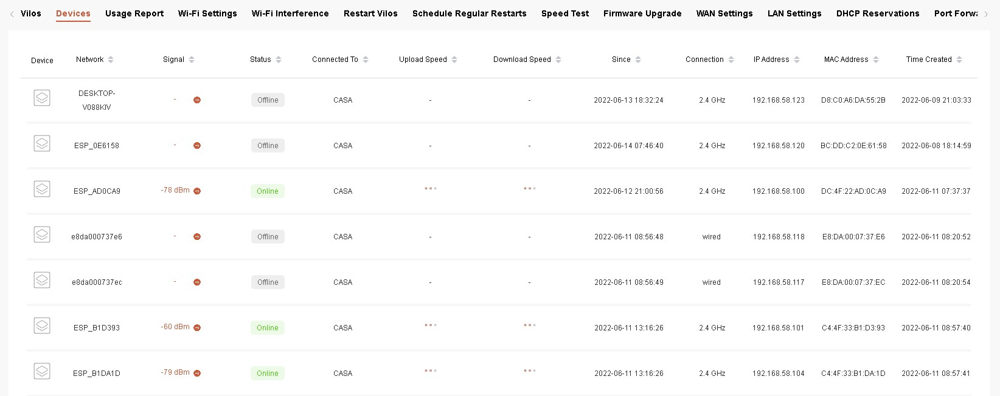
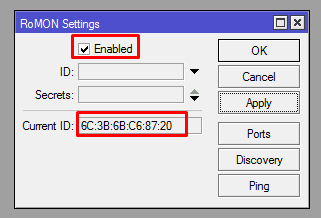
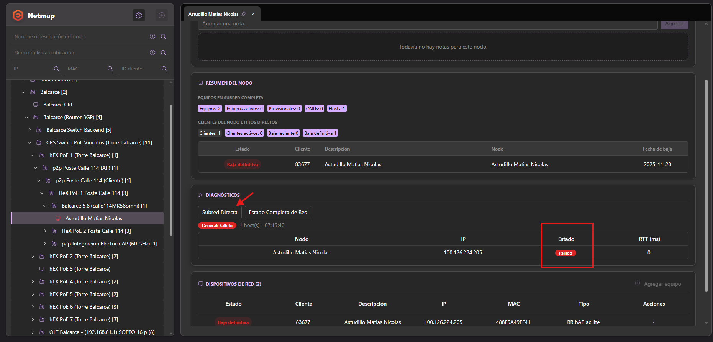
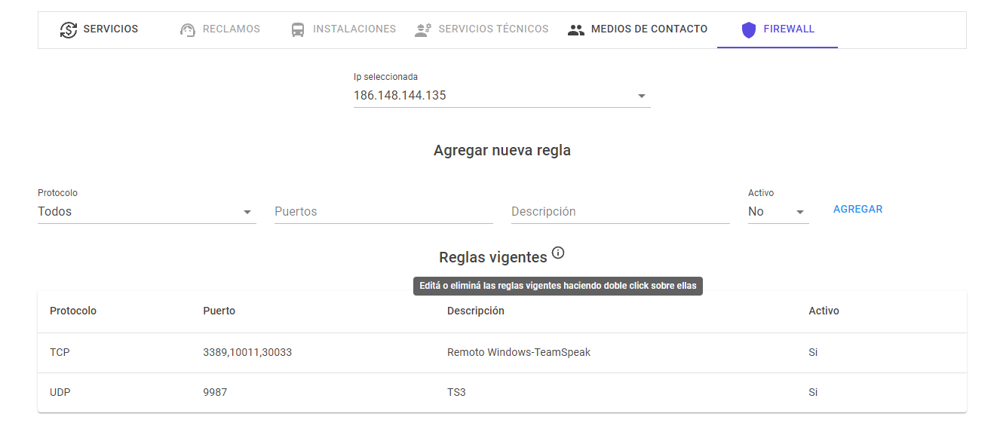
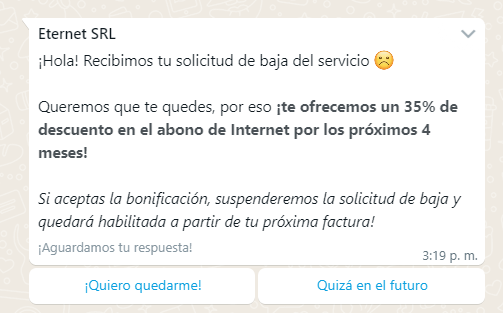

# The Dude – Monitoreo de Red

## Introducción

### ¿Qué es The Dude?

The Dude es una herramienta de monitoreo de red utilizada en Eternet para visualizar toda la infraestructura en tiempo real.

Permite ver:
- Equipos de red
- Enlaces entre equipos
- Estado general de la red
- Fallas o caídas en tiempo real

---

## ¿Para qué sirve?

The Dude se utiliza principalmente para:

- Detectar cortes o pérdida de paquetes en la red
- Ver el estado de equipos en tiempo real
- Acceder rápidamente a los equipos
- Identificar fallas en enlaces o nodos

---

## Acceso a equipos desde The Dude

Desde el mapa podemos acceder directamente a los equipos:

### Equipos Mikrotik
- Clic derecho sobre el equipo
- Seleccionar:
  - Tools → Winbox

### Equipos no Mikrotik
- Clic derecho sobre el equipo
- Seleccionar:
  - Tools → Web

---

## Estado de la red (ícono de bandera)

En la barra inferior derecha aparece un ícono de estado:

- Verde: Todo funciona correctamente  (🟢)
- Rojo: Hay equipos caídos o sin respuesta  (🔴)

También pueden aparecer enlaces en rojo:
- Puede indicar saturación
- Mala negociación
- Corte en el enlace

---

## Cómo conectarse a The Dude

Se utiliza la aplicación oficial de Mikrotik.

### Servidores disponibles

| Servidor | Dirección IP | DNS | Tipo |
|----------|-------------|-----|------|
| Principal | 192.168.0.43 | dude.eternet.cc | Main |
| Backup | 192.168.0.47 | dude2.eternet.cc | Backup |

---

### Credenciales

- Usuario: admin  
- Contraseña: diegotes  

---

### Recomendaciones

  >[!NOTE]
- Preferir conexión por IP en lugar de DNS
- Si el servidor principal falla, usar el backup
- Si ambos fallan, reportar incidencia al área de Servidores

>[!TIP]
>Otra opción más sencilla es copiar este archivo en el directorio  del Escritorio Remoto que ya tiene las dos conexiones guardadas:
>
>Directorio: `C:\Users\{usuario}\AppData\Local\VirtualStore\Program Files (x86)\Dude\Data`
>
>[Descargar archivo para Acceso a The Dude](https://github.com/Eternet/Atencion.Clientes/files/13648839/Acceso.a.The.Dude.zip)
>
> Quedará así:
>
>
>

---

## Tipos de nodos

En The Dude existen distintos tipos de elementos:

### Nodos cuadrados

Representan equipos físicos como:
- Routers
- Switches
- Antenas
- Servidores

### Círculos

Representan enlaces o accesos a otros mapas.

---

## Equipos importantes para soporte

- Access Point (AP): brinda conexión inalámbrica a clientes
- PowerBox / hEX PoE: alimenta otros equipos por cable
- Enlaces PTP (punto a punto): conectan zonas distantes

---

## Tipos de enlaces

- Inalámbrico: enlace por radio `⚫⚡`
- Cableado UTP: conexión por cable de red `⚫`
- UTP + PoE: datos + alimentación eléctrica `🔵`
- Fibra óptica: enlaces de alta capacidad `🟡`

  

  

---

## Mapas principales

### Hotspot
Acceso a equipos principales y redes de clientes

### Servidores
Red core principal (NOC 1 y NOC 2)

### Super Switch
Interconexión de red troncal

### Juárez Root
Red core de Benito Juárez (NOC 3)

### Cabase Buenos Aires
Equipos en datacenter

### Mapa General
Vista global de toda la red

### Balcarce Mapa General
Red core de Balcarce (NOC 4)

---

## Resumen

The Dude permite ver toda la red de Eternet de forma visual y detectar problemas rápidamente, facilitando el diagnóstico y la resolución de incidentes.
