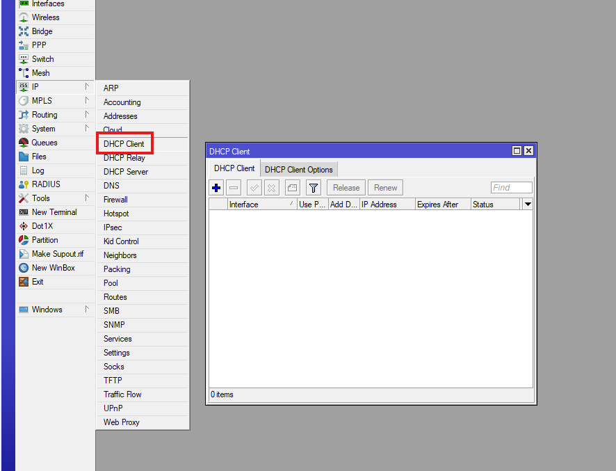
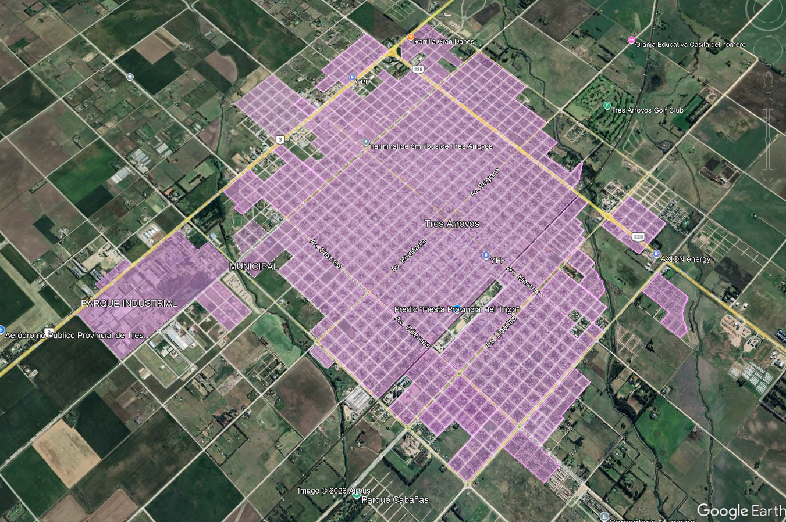
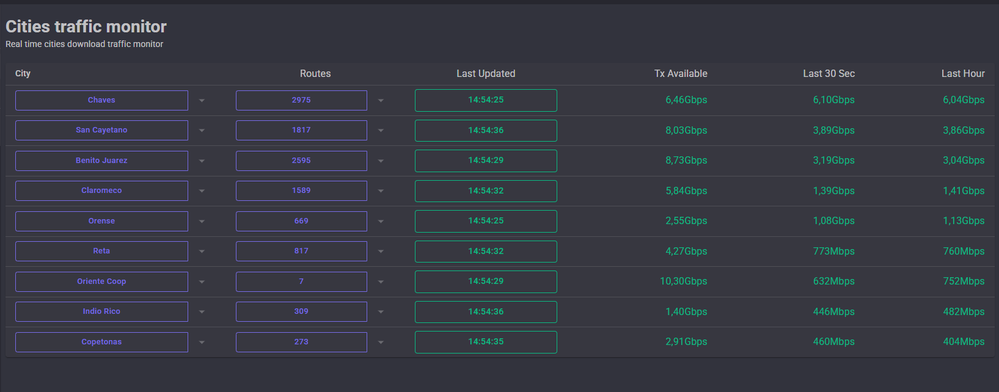

# Traceroute (Traza de red)

## Introducción

Traceroute (o traza) es una herramienta que permite ver el camino que sigue un paquete de internet desde un origen hasta un destino.

En otras palabras:
> Muestra los saltos por qué equipos pasa una conexión hasta llegar a su destino.

---

## ¿Para qué sirve?

Se utiliza para:

- Detectar cortes en la red
- Identificar dónde se pierde la conexión
- Analizar lentitud o latencia
- Ver la ruta que toma el tráfico de internet

---

## ¿Cómo funciona?

La traza muestra una lista de “saltos” (hops).

Cada salto representa un equipo por el que pasa la conexión.

En cada salto se puede ver:
- Dirección IP
- Tiempo de respuesta (latencia)
- En algunos casos, pérdida de paquetes

---

## Ejemplo de lectura en Windows

En una PC con Windows se ve así:

- Lista de IPs
- Tiempo en milisegundos por salto
- Camino completo hasta el destino

* 

---

## Ejemplo de lectura en MikroTik

En MikroTik la traza muestra:

- Saltos numerados
- IP de cada equipo intermedio
- Latencia por salto
- Posible pérdida de paquetes

 * 

---

## Cómo interpretar una traza

En la red de Eternet, cada salto representa un punto de la infraestructura:

Ejemplo típico:

1. Cliente / Hotspot
2. Router de acceso (iBGP o agregación)
3. Nodo de red (ej: Cabase / NOC)
4. Salida a proveedor (BGP / upstream)
5. Internet externo

---

## Cómo detectar un problema

Si en un salto aparece:

- Alta latencia → posible saturación o problema en ese nodo
- Pérdida de paquetes → posible falla en el equipo o enlace
- Timeout (*** ) → posible bloqueo por firewall o equipo que no responde ICMP

---

## Cómo hacer diagnóstico correctamente

Si detectamos un problema en un salto:

1. Identificar el salto anterior
2. Hacer ping desde ese punto al siguiente
3. Confirmar si el problema es:
   - Interno de Eternet
   - Del proveedor
   - O externo (internet)

---

## Casos dentro de la red de Eternet

Pueden existir variaciones en la ruta:

### Clientes con NAT
- Tienen un salto adicional (Router NAT)

### Localidades con iBGP
- Puede aparecer un salto adicional antes del BGP principal

---
### Tipos de trazas que pueden encontrarse

Dependiendo de la configuración del cliente y de la localidad, es posible encontrar diferentes recorridos dentro de la red de Eternet.

#### Cliente común

Recorrido típico:

1. Hotspot
2. BGP
3. CABASE (Peer) ETN
4. Peer por el que salimos al proveedor.

---

#### Cliente NATEADO con iBGP

Recorrido típico:

1. Hotspot
2. iBGP
3. NAT
4. BGP
5. CABASE ETN
6. Peer por el que salimos al proveedor.

---

#### Cliente con iBGP

Recorrido típico:

1. Hotspot
2. iBGP
3. BGP
4. CABASE ETN
5. Peer por el que salimos al proveedor.

---

#### Cliente NATEADO común

Recorrido típico:

1. Hotspot
2. NAT
3. BGP
4. CABASE ETN
5. Peer por el que salimos al proveedor.

> **Nota:** No todas las localidades tienen exactamente el mismo recorrido. Puede haber variaciones dependiendo de la infraestructura o cambios en el enrutamiento, pero estos son los esquemas más habituales utilizados en la red de Eternet.

---

## Importante

- No todos los saltos responden siempre (pueden estar detrás de firewall)
- Un salto sin respuesta no significa necesariamente falla
- El problema se confirma comparando saltos anteriores y posteriores

---

## Conclusión

Traceroute es una herramienta clave para diagnosticar problemas de red, ya que permite ver exactamente dónde ocurre una falla dentro del recorrido de la conexión.
